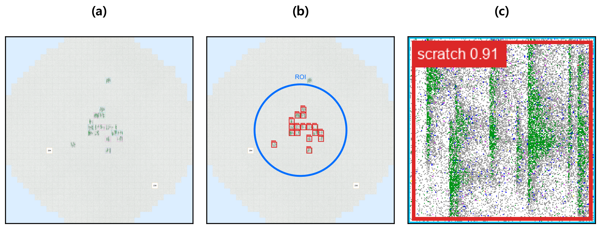
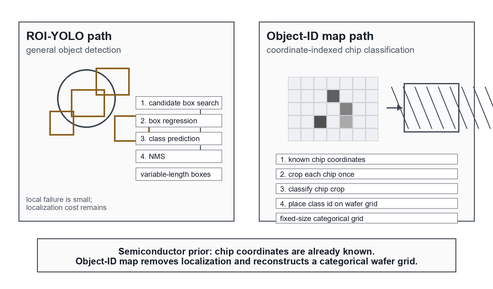
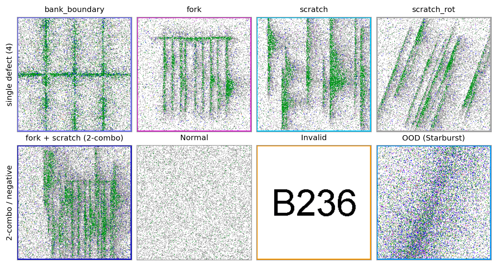

# 좌표 보존형 Failbit Map 기반 반도체 웨이퍼·칩 불량 분석 파이프라인

**Coordinate-Preserving Failbit Map Pipeline for Wafer- and Chip-Level Semiconductor Failure Analysis**

최호길1, 홍지훈1, 김성호2

1 메모리사업부 메모리제조기술센터 QIE그룹, Samsung Electronics
2 메모리사업부 메모리제조기술센터 DRAM YE팀, Samsung Electronics

---

**Abstract** - **반도체 EDS(Electrical Die Sorting) 결과를 공간적으로 보존한 Failbit Map은 수율 진단의 핵심 자료지만, 현업 분석은 measure value와 소량 map 조회에 의존해 대량 반복 패턴과 신규 failure를 놓치기 쉽다. 본 연구는 Failbit Map 이미지·chip 좌표·chip measure value·모델 출력·검토 라벨을 하나의 좌표 보존형 wafer 단위 자산으로 정렬하는 운영형 분석 파이프라인을 제안한다. Known fail은 ConvNeXtV2-Base와 저신뢰 표본 한정 ROI(Region of Interest)-YOLO(You Only Look Once) 2-stage로 field validation weighted F1 0.95를 확인했고, object-id map은 generated-chip development extension으로 분리하였다. Unknown fail은 대조 학습과 HDBSCAN으로 운영 wafer를 13개 candidate group으로 압축했고, 이 가운데 7개가 신규 failure로 확인되었다. 이 13→7은 분류 정밀도가 아니라 field review 후보 압축 결과다. chip 수준에서는 FCM-PM(Full-Cover CutMix + Pair Mask)을 설계해 controlled synthetic benchmark에서 micro-F1(bit-F1) 0.9927과 false alarm 0.00%를 확인하였다. 이로써 Failbit Map을 사후 시각화가 아니라 검토·라벨 되먹임·재학습이 가능한 좌표 보존 분석 자산으로 전환하였다.**

**Keywords:** Wafer Failure Analysis, Failbit Map, EDS Test, ConvNeXtV2, ROI-YOLO, Object-ID Map, Contrastive Learning, HDBSCAN, Palette PNG, Multi-label Classification, CutMix

## 1. 서론

DRAM(Dynamic Random Access Memory)은 데이터를 저장하는 최소 단위인 cell과, 다수 cell이 묶여 검사 단계에서 한 번에 동작하고 평가되는 cell block으로 구성된다. 양산 라인은 EDS(Electrical Die Sorting) 검사에서 각 cell block이 정상 동작하는지, 얼마나 빠르게 동작하는지, 반복 동작이 안정적인지를 전기적으로 측정한다. block 내부 cell들의 불량 정도를 하나의 값으로 나타낸 것이 failbit이며, 본 파이프라인은 이를 Grade 0(정상)부터 7(최대 불량)까지로 양자화한다. wafer 위 모든 block 위치의 failbit를 좌표계에 모은 것이 Failbit Map이다. EDS는 동작 속도·반복 안정성 등을 chip별 수치 feature로 요약한 measure value(FTN·QTN 등 계측 항목)도 함께 산출하므로, 한 wafer는 공간 이미지인 Failbit Map과 chip별 계측값이라는 두 형태의 정보를 동시에 가진다. 이 cell에서 Failbit Map까지의 관계를 Figure 1에 정리하였다.

**Figure 1.** From DRAM cell to Failbit Map. EDS converts cell-block failure into grade 0-7 and chip-level measures, then places each block grade on wafer coordinates.

Failbit Map이 단순한 불량률 집계와 다른 점은, 같은 불량률이라도 불량이 가장자리 환형인지, 중앙 밀집인지, 특정 방향 편중인지에 따라 설비·공정 원인이 달라진다는 데 있다. 위치·분포·방향·형태가 그 자체로 진단 정보이며, Failbit Map은 웨이퍼 전역 형상·zone 위치·chip 내부 형태라는 세 층위를 담아 measure value만으로 보이지 않는 공간 패턴과 layout·structure 연관성을 드러낸다.

현장 분석은 오랫동안 measure value를 축으로 이루어졌다. 담당자는 chip별 수치로 fail 여부를 확인하고, 수식과 임계값을 직접 구성해 고질 불량을 분류했으며, 이는 일종의 수동 machine learning에 가깝다. 의심스러운 wafer는 Failbit Map이나 TEM(Transmission Electron Microscopy)으로 시료를 잘라 CD(Critical Dimension)나 miss-alignment 같은 pattern을 확인하고 공정 structure·layout 원인을 해석했다. 이 방식은 빠르고 rule 기반이라 근거가 분명하나, 수동 임계값에 의존해 누락 위험이 있고 chip을 단일 수치로 환원하는 탓에 주변 chip 관계나 반복 pattern 같은 공간 정보를 놓치며, 기존 도구로는 한 번에 약 48매까지만 조회할 수 있어 전수 검토가 어려웠다. 원인 해석에는 Failbit Map 확인이 사실상 필수였지만, 대용량 raw log 처리·이미지 생성 속도·저장 용량·chip 좌표 정합 같은 기술 문제로 Failbit Map을 매번 분석 자산으로 만들기는 쉽지 않았다.

Failbit Map 위에서 다루는 불량은 Known과 Unknown으로 나뉜다. Known fail은 이미 등록된 16-class 라벨 체계 안에 있어 지도학습이 가능한 불량이고, Unknown fail은 등록되지 않았거나 아직 라벨 합의가 끝나지 않은 신규 후보다. 기존 분류기는 신규 패턴을 인접 class로 흡수하거나 낮은 신뢰도로 기각해 담당자에게 단서를 주지 못한다. 그래서 엔지니어는 Known 판정, 다수 후보의 압축, 이미지와 chip 계측 근거의 동시 확인, 신규 라벨 등록 여부 판단, 양산 noise와 진성 불량의 분리를 서로 분리된 채 한꺼번에 떠안는다.

본 연구는 대량 Failbit Map 생성의 기술 한계와 수작업 판정 의존을 데이터 파이프라인과 Failbit Map 기반 인공지능 분석으로 함께 푼다. 기여는 다섯 가지다. 첫째, Failbit Map·chip 좌표·chip measure value를 같은 좌표계로 묶는 coordinate-preserving FBM data asset이다. 둘째, ConvNeXtV2-Base와 선택적 ROI-YOLO로 Known fail field validation weighted F1 0.95를 확인하고, Unknown fail은 자기지도 대조 학습과 HDBSCAN으로 13→7 candidate compression을 수행한 wafer-level analysis loop이다. 셋째, known chip coordinate를 쓰는 object-id map과 single 불량 chip만으로 2-combo를 학습하는 FCM-PM이다. 넷째, 검색·map view·chip overlay·measure 확인·label 관리를 통합한 web application review layer이다. 다섯째, operation impact, field validation, field review, generated development, controlled synthetic benchmark를 합산하지 않는 validation-scope separation이다. 이 다섯 기여는 data asset layer(1) / Artificial Intelligence analysis layer(2,3) / operation layer(4,5)의 3층으로 묶인다.

이 다섯 기여의 중심축은 개별 모델 성능이 아니라 분석 자산이며, 새로 실증한 핵심 설계 기여는 두 가지다. 하나는 categorical object-id를 자연 해상도 one-hot으로 좌표 보존 인코딩하면, 보간 입력을 받은 대형 backbone보다 이 데이터에 더 적합한 inductive bias를 제공한다는 점이다. 이 결과는 모델 용량 경쟁이 아니라 fixed chip coordinate라는 반도체 prior가 localization을 제거하고 categorical spatial representation을 제공한 효과로 해석한다(측정 근거는 2.2.1). 다른 하나는 정답 2-combo 라벨이 없는 환경에서 단일 불량 chip만으로 중복 불량을 학습하는 FCM-PM으로, Pair Mask가 합성 background의 false alarm을 억제하는 직접 원인임을 ablation으로 분리해 보인다(2.2.3). object-id map은 미양산 generated-chip development result다(2.2.1).

### 1.1. 기술 개요

제안 구조의 일관된 설계 기준은 웨이퍼의 공간 의미를 손상시키지 않는다는 것이다. 무손실 palette 표현, flip 증강 배제, 국소 수용장 backbone과 선택적 2-stage 검증, 격자 고정 structured sampling, categorical one-hot 인코딩은 모두 이 원칙에서 나온다. RGB 대신 palette, flip 대신 배제, Mixup 대신 영역 보존 CutMix, SwAV random-crop 대신 grid 고정, 정수 보간 대신 one-hot을 택했다. Table 1은 이를 데이터 표현, Known 판정, chip 단위 object-id map, Unknown 후보 압축, 검토 되먹임으로 정리한다. Unknown 경로의 InfoNCE(Information Noise-Contrastive Estimation)는 라벨 없이 같은 wafer는 가깝게 다른 wafer는 멀게 임베딩을 학습하는 대조학습 목적함수이고, HDBSCAN(Hierarchical Density-Based Spatial Clustering of Applications with Noise)[7]은 밀도 군집과 noise를 함께 분리하는 군집화 방법이다.

**Table 1. Proposed pipeline layers and validation scope.**

| Layer | Method | Validation scope |
|------|------|------|
| Data layer | Cython parser, palette PNG, chip annotation | internal implementation |
| Known recognition | ConvNeXtV2, selective ROI-YOLO | field validation |
| Chip evidence | object-id map | generated development |
| Unknown discovery | InfoNCE, HDBSCAN | field review |
| Chip multi-label | FCM-PM, val_margin, NB reject | controlled synthetic benchmark |
| Review layer | web UI, label feedback | operation |

전체 데이터 흐름은 다음과 같다(Figure 2).

**Figure 2.** Coordinate-preserving analysis pipeline. EDS raw logs and chip-level measures are aligned into one wafer unit, then branched into a Known validation path (ConvNeXtV2 → selective ROI-YOLO → object-id map [under development]) and an Unknown candidate-compression path (InfoNCE → HDBSCAN), with web review feeding labels back as training data.

위 흐름은 wafer 수준 Known/Unknown 분석 경로이며, 같은 데이터 파이프라인에서 생성한 chip crop을 입력으로 하는 chip 수준 multi-label 분류 구조는 2.1.4에서 함께 다룬다. 이하 2장(본론)은 제안 방법(2.1)에서 설계 근거를, 그 정량 결과·운영(2.2)에서 측정 결과를 나누어 서술한다.

### 1.2. 관련 연구

웨이퍼 맵 불량 분석은 규칙 기반·고전 ML을 거쳐 CNN 분류로 발전해 왔다. 공개 데이터셋 WM-811K를 CNN으로 분류한 연구 [1][2]는 die 단위 wafer-level 패턴 분류에 무게가 있고, wafer-level 라벨만으로 chip 불량을 추정하는 [18]도 chip 형태를 좌표에 복원하지는 않는다. 본 연구의 object-id map은 chip 분류 id를 wafer 격자 제자리에 categorical로 되돌려 형태(morphology)와 위치를 함께 보존한다. 한 chip에 둘 이상이 겹치는 혼합형 불량은 bin map에서 CNN으로 분류된 바 있으나 [19] 이는 wafer 단위 혼합 패턴을 실제 mixed 라벨로 학습하며, 본 연구는 chip 단위에서 단일 불량만으로 2-combo를 합성 학습(FCM-PM)해 mixed 라벨 부족을 푼다. 라벨 없는 신규 패턴 탐색은 대조 학습·군집화 [3][6], open-set recognition [20], 대조 deep clustering [21], open-world 군집화·decision fusion [4]로 이어졌고 대개 공개 bin map에서 ARI(Adjusted Rand Index)·NMI(Normalized Mutual Information)·silhouette로 평가하나, 본 연구의 Unknown 경로는 같은 대조-군집 계열이되 정답 라벨이 없는 양산 운영의 좌표 보존 FBM에서 동작해 합성 평가셋에서만 이 관례를 따르고 실전에서는 정량 metric 대신 후보 압축(13→7)으로 검증하며, 다수 선행의 단일 run 점추정과 달리 채택 구성과 합성 트랙 모두에서 seed 분산을 제시한다.

요약하면 선행은 chip 형태를 좌표에 복원하지 않고[1][2][18], 혼합 불량을 실제 mixed 라벨에 의존하며[19], 신규 탐색을 공개 bin map의 정량 metric에서만 검증해 왔으나[3][4][20][21], 본 연구는 형태 복원(object-id map)·무라벨 합성 학습(FCM-PM)·라벨 없는 운영 검증(13→7)을 한 좌표계에서 결합한다. 모델 용량보다 입력 표현이 성능을 좌우한다는 [13]의 관점을 이어, categorical 신호에서는 정수 보간이 신호를 손상시키므로 [11] 자연 해상도 one-hot이 보간 입력의 더 큰 backbone보다 적합함을 확인하였다(정량 근거 2.2.1). 2-stage 보정은 coarse-to-fine cascade 검출 [10][12]을 wafer의 chip 단위 class 검증에 맞게 재구성한 것이다. 구성요소(ConvNeXtV2, YOLO, InfoNCE, HDBSCAN)는 기성 방법이지만, 공간 의미를 손상시키지 않는다는 단일 제약에서 palette 표현·flip 배제·backbone·structured sampling·one-hot 인코딩을 도출하고 이를 라벨 없는 운영에서 동작시키며 검토 결과를 학습으로 되먹임한 것이 본 연구의 무게중심이다.

## 2. 본론

본론은 제안 방법(2.1)과 그 정량 결과·운영(2.2)을 나누어, 설계 근거와 측정 결과를 분리해 서술한다.

### 2.1. 제안 방법

#### 2.1.1. 데이터 표현과 정합 적재

Failbit Map은 Grade 0~7과 chip 경계 등 약 20개의 이산 색상만 쓴다. 24-bit RGB 대신 8-bit palette PNG로 재구성하면 파일 크기가 약 75% 줄고 양자화 손실이 사실상 없으며, 색상 scheme도 PLTE(PNG palette) 청크 교체만으로 반영된다. DRAM은 투입부터 fab-out까지 약 120일이 걸려 장기 보관이 필요하고, palette PNG로도 약 20TB가, 24-bit RGB였다면 약 80TB가 필요하다. wafer 한 장은 약 1천만 픽셀이고 하루 약 2만 매가 유입되므로, raw hex 페이로드는 256-entry lookup과 memoryview stride 접근의 Cython 파서로 복원해 순수 Python 대비 약 100배 빠르게 처리한다. 두 원천(주 fail-map·chip별 Measure)은 wafer 식별자와 ±10초 오프셋으로 매칭하고, 복원 grade는 FTN/QTN/BIN 등 chip annotation과 병합한다. 이렇게 동일 좌표계로 적재하면 UI overlay·chip crop·Known/Unknown 모델 입력이 같은 자산을 공유한다.

#### 2.1.2. Known fail 분류 구조

**Backbone 선정.** 16-class closed-set(약 1,500 labeled, 4:1 stratified split)에서 backbone을 비교하였다. 이 규모에서는 전역 self-attention보다 국소 수용장과 계층적 특징 추출을 가진 CNN 계열이 안정적이었고, FCMAE(Fully Convolutional Masked Autoencoder) 사전학습은 국소 공간 패턴 복원과 384 해상도 보존에 적합했다 [5]. MaxViT-T와 ConvNeXtV2-Base가 동일 split에서 같은 수준이었으나, 모델 효율을 기준으로 parameter 약 26%(119.5M→88.6M)·FLOPs 약 39%(74.2G→45.1G) 적고 개발 측정에서 chip당 약 26.9 ms인 ConvNeXtV2-Base를 선택했다. flip 증강은 edge 방향의 공정 의미를 손상시키므로 배제했고, Optuna와 LinearLR warmup 뒤 CosineAnnealing으로 튜닝하였다.

**ROI-YOLO 2-stage 보정.** 전역 분류 위에 영역 한정 검출을 부가해 어려운 표본만 재검토하는 cascade는 검출 품질을 높이는 일반 전략이며 [10][12], 본 연구는 이를 wafer의 chip 단위 검증에 맞게 구성하였다. CNN 오분류는 형태가 유사하거나 발생 영역이 겹치는 class 쌍에 집중되어, wafer 전역 문맥만으로는 부족한 chip 단위 미세 패턴 검증이 필요했다. 다만 전수 검출은 처리량을 떨어뜨리고 전역 분포 class에는 맞지 않으므로 선택적으로만 적용하였다.

ROI 보정은 1-stage 예측 confidence가 0.80 미만이거나 예측 class가 difficult class에 속할 때만 적용한다. difficult class는 학습 validation에서 클래스별 precision 또는 recall이 0.80 미만으로 측정돼 미리 등록한 집합이다. 두 조건 모두 추론 시 예측 confidence와 예측 class만으로 판정되어 정답 라벨이 필요 없으며, 둘 다 아닌 wafer는 Stage 2를 건너뛰어 처리량 부담이 없다.

ROI 위치는 train split에서만 적합한 클래스별 chip 좌표 KDE(Kernel Density Estimation)와 chip-object 개수 GMM(Gaussian Mixture Model)으로 정해 누수를 차단한다. KDE는 class별 불량 chip이 자주 나타나는 wafer 위치를 확률 밀도로 만들고, GMM은 한 wafer 안의 chip-object 개수 분포를 모델링해 ROI 후보 개수와 위치를 제한한다. ROI 영역에 YOLO[9]를 적용해 내부 불량 chip을 검출하고 class 일관성으로 1-stage 예측을 보정한다. ROI 내부 fail 객체는 1~2개라 box 회귀보다 형태 유사 객체의 class 구분이 중요하므로, YOLO를 일관성 검증 역할로 쓰고 classification loss 가중을 강화하였다. ROI 내부 chip은 200×200 px로 확대되어 wafer 전역에서 작던 scratch가 뚜렷해진다.

**Figure 3.** ROI-YOLO 2-stage cascade. Panels show (a) the Failbit Map, (b) the ROI region set by the class prior (blue circle) with YOLO detection boxes inside (red), and (c) the detected chip's scratch detail (confidence 0.91). Failures that look small and scattered globally become distinct under ROI-limited detection and chip-level inspection, while regions outside the ROI are skipped.

**chip-CNN object-id map 인코딩.** ROI-YOLO 2-stage는 검증된 양산 경로이나 wafer 전역에서 box를 회귀하는 detector 추론 비용이 크고 클래스를 늘릴수록 검출 난도가 오른다. 이를 줄이려고 Stage 2를 chip-CNN 기반 object-id map으로 진화시키는 후속 모듈을 설계하였다(생성 데이터셋 기준 개발 중). wafer를 chip 격자(제품마다 다르며 본 제품군은 약 1,024개, 각 200×200 px)로 나누고, 생성 단계에서 확보한 chip 좌표로 고정 crop을 만들어 작은 chip-CNN으로 각 chip을 5-class로 분류한 뒤 그 id를 같은 격자에 되돌린다. 결과 격자의 색 패턴이 wafer 클래스의 지문이 되어 box 검출 없이 형태와 위치를 동시에 유지한다(Figure 4).

**Figure 4.** chip-CNN object-id map generation. The wafer is partitioned into a chip grid using precomputed chip coordinates, and each chip is classified into 5 classes by the chip-CNN and its id is placed back at its grid position. The resulting color pattern acts as a fingerprint that discriminates the wafer class. [Generated data, under development]

ROI-YOLO와 object-id map의 Stage-2 구조·연산 효율을 Table 2에 비교하였다. ROI-YOLO는 ROI 추출·box 회귀·NMS를 수행하며 512px 이상 입력을 요구한다(공개 detector YOLO11x 기준 56.9M params·194.9 GFLOPs@640 [22]; ROI 한정 crop의 실제 연산은 이보다 작다). 반면 object-id map은 chip 좌표로 확정된 32×32 격자를 1.16M chip-CNN에 입력하고, 아키텍처 산출 연산량은 약 0.31 GFLOPs다.[^1] 입력 스케일(32×32 vs 640)이 달라 이는 동일 조건 속도 비교가 아니라 좌표 보존 표현이 입력 자체를 chip 격자로 줄인 결과다. 정확도도 생성 평가셋 기준 val 0.9946 / test 0.9872로, ROI-YOLO field weighted F1 0.95와 직접 비교하지 않는다. 핵심은 모델 크기 경쟁이 아니라 formulation 전환이다. ROI-YOLO는 위치를 모르는 detection이지만 wafer chip 좌표는 product layout으로 이미 정해져 있으므로, object-id map은 localization을 제거하고 각 chip을 한 번 crop·분류한 뒤 class id를 격자에 복원한다. full wafer image에서는 local chip failure가 작은 영역으로 희석될 수 있지만, chip crop에서는 모델이 local failure morphology를 직접 관찰한다. 이후 class id를 원래 grid에 되돌리면 class별 공간 패턴이 categorical map으로 드러난다. 따라서 이득은 작은 모델이 큰 detector를 이긴 것이 아니라, fixed chip coordinate와 natural-resolution one-hot representation이 제공하는 semiconductor-specific inductive bias로 해석한다.

**Table 2. Stage-2 chip evidence - ROI-YOLO detector vs chip-CNN object-id map. Public detector spec (640-input upper bound; ROI-limited use is smaller) for reference; the object-id classifier FLOPs is analytically computed from the 32×32-grid architecture, and because the input scales differ, this is not a same-scale speed comparison but evidence that coordinate-preserving representation shrinks the input into a chip grid; accuracy is validated on different scopes (field vs generated). [object-id map: generated-data development]**

| Stage-2 structure | Params | FLOPs (G) | Input res. |
|------|:--:|:--:|:--:|
| ROI-YOLO detector (YOLO11x, public [22]) | 56.9M | 194.9 | 640 px |
| chip-CNN object-id map (ours) | 1.16M | 0.31 | 32×32 grid |

이 구조의 설계 전제는 categorical 신호 보존이다. 정수 object-id를 BICUBIC으로 보간하면 1.3, 2.7 같은 무의미한 실수가 생겨 신호가 손상되므로, 격자 해상도를 obj-id의 자연 해상도(제품별 chip 격자 수)로 두어 보간을 원천 제거하였다. one-hot이 categorical 입력에 적합하다는 원칙 [11]에 따라 obj-id를 5채널 one-hot으로 인코딩하고(R/G/B 픽셀값 제외) 정수 block-expand만 적용해 BICUBIC 대비 복원 오차가 약 75% 줄었다(이 75%는 복원 오차로, palette 재구성의 파일 크기 약 75% 절감과는 별개 측정값이다). 이 표현은 정수 압축의 ordinal 오류와 단일 class 이진 표시의 정보 손실을 모두 피하며, R을 뺀 단독(in_ch=5)을 채택해 정확도·입출력 비용을 함께 줄였다(정량 비교 2.2.1).

#### 2.1.3. Unknown fail 군집화 구조

운영에는 기존 16-class에 없는 신규 불량이 드물게 나타나며 정답 라벨이 거의 없다. 지도 대조학습(SupCon[3])은 known manifold만 첨예해져 새 패턴을 기존 class로 흡수할 위험이 있어, 라벨에 종속되지 않는 자기지도 InfoNCE를 채택하였다. global 항은 같은 wafer의 두 증강본을 당기고 다른 wafer를 밀며, local 항은 6×6 structured grid의 대응 patch를 정렬해 random crop류가 위치 의미를 훼손하는 문제를 피한다. 작은 batch의 negative 부족은 MoCo(Momentum Contrast)[8] queue(4096)로 보완하고, 유사도 임계(0.72)로 false-negative를 줄였다. 증강은 flip을 배제하고 소규모 회전(±7°)·이동·스케일(±5%)·가우시안 노이즈(σ=0.02)만 적용하였다.

학습 임베딩은 HDBSCAN(1.1)으로 군집화한다. 운영 구성은 queue를 16K로 키운 Global·Local InfoNCE를 쓰고, noise wafer는 최근접 이웃 투표가 임계를 넘을 때만 흡수한다. 불량 누락을 false alarm보다 위험하게 보아 capture를 우선하며, 담당자는 각 군집의 medoid만 검토해 신규 불량이면 라벨링 후 spec에 추가한다.

#### 2.1.4. chip 수준 multi-label 분류 구조

wafer-level FBM 경로가 전역 반복 패턴을 다룬다면, chip-level 경로는 한 chip 안에서 여러 불량 신호가 같이 나타나는 상황을 다룬다. 실제 EDS 수치 기반 자동판정은 주로 single failure를 기준으로 설계되어 있어, 2-combo failure에서는 한쪽 신호가 다른 신호에 가려 false negative가 생기기 쉽다. 따라서 chip 라벨을 softmax처럼 하나만 고르는 문제가 아니라, 4개 불량 bit가 동시에 켜질 수 있는 multi-label 문제로 정의하였다. 어려운 점은 실제 2-combo 정답 라벨이 충분하지 않다는 데 있다.

원천 데이터는 현업 EDS Failbit Map에서 얻은 single failure 4종(bank_boundary·fork·scratch·scratch_rot) chip이다. 평가셋은 single 4종, 2-combo 6종, Normal·Invalid·OOD(out-of-distribution) chip으로 구성하였다. OOD는 등록 불량 profile에는 없지만 운영 중 같이 유입될 수 있는 외곽 분포 chip으로, false alarm 억제를 확인하기 위한 negative다. 데이터 누수를 막기 위해 single 원천 chip을 먼저 train/test로 나누고, 학습 합성은 train 원천만, 평가 표본은 test 원천만 사용하였다. 학습용 2-combo는 online CutMix로 매 step 생성하고, 평가용 2-combo는 offline min-blend로 고정 생성해 두 경로를 분리하였다. backbone은 ConvNeXtV2(FCMAE 사전학습)를 chip 이미지에 맞게 재학습했고, head는 클래스별 독립 sigmoid 확률을 출력한다.

**Figure 5.** Label space of chip-level multi-label classification. Top row: four single failures with distinct shapes (bank_boundary, fork, scratch, scratch_rot). Bottom row: a 2-combo (fork+scratch) and the negative samples that co-arrive in operation (Normal, Invalid, OOD/Starburst). [Field chip source + domain synthesis]

2-combo 라벨 부족은 augmentation 설계로 보완하였다. Grade 0~7로 양자화된 chip에서 Mixup은 존재하지 않는 중간 Grade를 만들 수 있고, Diffusion은 실제 2-combo 라벨 부족과 연산 부담이 동시에 남는다. 그래서 원래 Grade 값을 영역 단위로 보존하는 CutMix[14] 계열을 선택하였다. 다만 random rectangle CutMix만 쓰면 불량 영역이 잘리거나, 합성 후 남는 background가 false-positive 신호로 학습될 수 있다.

FCM-PM은 이 문제를 full-cover 합성과 source별 mask loss로 나누어 처리한다(Figure 6). Full-Cover CutMix(FCM)는 chip grid 전체를 두 single source의 상보 mask로 채워 A+B target을 만든다. Pair Mask(PM)는 같은 합성 chip에서 A-only와 B-only view를 별도로 만들고, 상대 source 영역을 source-specific loss에서 제외한다. 학습 objective는 mixed chip의 BCE(Binary Cross-Entropy)와 masked view의 BCE를 함께 쓰는 구조다. false alarm rate(FAR)는 negative 중 오검출 비율(FP_neg/N_neg)로 계산하고, checkpoint는 validation에서 val_margin = mean(p_pos) - max(p_neg)이 가장 큰 epoch로 선택한다.

출력이 4-bit sigmoid 확률이므로 핵심은 class별 probability를 원하는 방향으로 제어하는 것이다. ASL[16]만으로는 negative 억제가 강해 일부 weak-positive bit가 같이 눌렸고, target 분리(positive 0.85 / negative 0.15)가 더 안정적이었다. single-only 학습에서 2-combo의 둘째 bit 평균은 약 0.42까지 낮았지만, FCM 합성 후 약 0.54로 올라갔다. PM은 이 과정에서 synthetic background가 negative-tail false alarm으로 학습되는 것을 막는다. 이후 val_margin은 validation에서만 positive/negative 확률 간격이 넓은 checkpoint를 고르는 기준으로 사용하고(Figure 7a), Gaussian Naive Bayes reject는 최대 bit 하나가 아니라 4-bit probability shape 전체로 OOD tail을 걸러낸다(Figure 7b). bit 다수결 ensemble과 Knowledge Distillation(KD)[17] student는 각각 upper-bound와 추가 경량화 후보로 두었다.

**Figure 6.** FCM-PM augmentation for chip multi-label learning. Full-Cover CutMix makes an A+B mixed chip, while Pair Mask trains A-only/B-only views to suppress synthetic-background false positives. [Field chip source + domain synthesis]

**Figure 7.** Probability control in chip multi-label learning. (a) val_margin selects the checkpoint with wider positive/negative separation and lower FAR in the development sweep. (b) NB-reject scores the whole 4-bit probability shape rather than only the maximum bit, accepting a registered profile and rejecting an OOD-shaped vector. [Field chip source + domain synthesis]

#### 2.1.5. 분석 UI와 web app 구조

전체 경로는 분석 UI에서 하나로 모인다. 뷰어는 피라미드 타일·디스크 캐시로 약 1천만 픽셀 map의 줌·팬을 가속하고, chip overlay 기반 BIN/FTN/QTN 시각화와 composite map으로 패턴 분류 결과 위에 계측값을 중첩한다. 검토 결과는 불량 등록·학습 레이블로 되먹임되어 데이터 적재부터 재학습까지 하나의 운영 흐름으로 묶인다.

### 2.2. 결과

이후 결과는 검증 단계가 서로 다르므로, 각 수치를 Table 3의 scope 안에서 읽는다. 운영 효과는 viewer/data pipeline이 현업 검토 방식을 바꾼 결과이고, 모델 metric은 각 모델·benchmark의 성능 지표다. 두 축은 합산하거나 같은 classifier metric처럼 비교하지 않는다.

**Table 3. Validation scope of reported results.**

| Result | Anchor value | Validation scope |
|------|------|------|
| Known classification | weighted F1 0.95 | Field validation |
| Unknown 13→7 | candidate compression | Field review, not classifier metric |
| object-id map | val 0.9946 / hold-out 0.9872 | Generated dev., not deployed |
| FCM-PM chip multi-label | bit-F1 0.9927 · FAR 0.00% | Controlled synthetic |
| FBM generation · storage | Cython hex-to-grade 약 100× · palette PNG 약 75% · 20TB/120 d | Internal measurement |
| Operational impact | ~123억 quantified | Internally certified quantified contribution |

#### 2.2.1. Known 결과

Known fail 분류는 단계별로 성능을 분리해 관리하였다. 먼저 16-class closed-set(약 1,500 labeled, 4:1 stratified split)에서 backbone을 비교하였다(Table 4). MaxViT-T와 ConvNeXtV2-Base가 weighted F1 0.87로 같았으나 동일 split 단일 run이라 모델 효율을 기준으로 ConvNeXtV2-Base를 택했고, 단독 0.87에서 Optuna 탐색으로 validation weighted F1 0.92에 이르렀다.

**Table 4. Backbone selection and stage-wise Known classification (same split, validation weighted F1, single run). [Field-validated]**

| 구성 | Params | Val weighted F1 |
|------|:------:|:------:|
| baseline CNN | - | 0.78 |
| ViT-B/16 | 86M | 0.81 |
| Swin-B | 88M | 0.84 |
| EffNetV2-M | 54M | 0.85 |
| MaxViT-T | 119.5M | 0.87 |
| ConvNeXtV2-Base (선정) | 88.6M | 0.87 |
| + Optuna (1-stage) | 88.6M | 0.92 |
| + selective ROI-YOLO (채택, 2-stage) | - | 0.95 |

ROI-YOLO를 일관성 검증 역할로 쓰고 classification loss 가중을 강화하자 보정 precision과 최종 weighted F1이 향상되어 최종 0.95에 도달하였다(Table 4). 사내 실전 데이터로 검증을 마친 최종 채택값은 2-stage 0.95뿐이며, 앞 세 값(0.78·0.87·0.92)은 1-stage(또는 이전) 단계값이다.

object-id map 인코딩(2.1.2)은 두 반례를 거쳐 채택 구성에 도달하였다(Table 5). raw grade만 쓴 구성(0.4359)에 obj-id를 정수 1채널로 압축하면 0.9505로 크게 오르나, 정수 인코딩은 class id에 1<2<3 같은 존재하지 않는 순서를 부여하는 ordinal 오류가 있다. 한 class만 이진으로 표시한 구성(0.6543)은 그 class만 보존하고 나머지 신호를 잃는다. 두 오류를 모두 피하는 one-hot 5채널은 R과 함께 쓰면(in_ch=6) 0.9689, R 없이 단독이면(in_ch=5, 채택) 0.9946이다. obj-id 채널이 지배적 신호이고 one-hot 보존이 정수 압축보다 우위임을 보인다. in_ch=6이 in_ch=5보다 낮은 것은 chip-CNN이 이미 grade로 obj-id를 결정한 뒤라 raw 채널이 중복 정보로 작용하기 때문이며, R을 뺀 채택 구성은 정확도와 입출력 비용을 함께 줄인다.

**Table 5. Input-encoding ablation for the object-id map (validation/hold-out F1-score; the adopted in_ch=5 reports the best seed). [Generated data, under development]**

| 입력 구성 | 표현 | Val / Hold-out |
|------|------|:------:|
| Raw grade only | raw grade map | 0.4359 / 0.4385 |
| Integer-compressed id | obj-id 정수 1채널 | 0.9505 / 0.9726 |
| Binary single-class | 단일 obj 이진 1채널 | 0.6543 / - |
| Raw + identity (in_ch=6) | raw + obj-id one-hot | 0.9689 / 0.9879 |
| Object identity only (in_ch=5, 채택) | obj-id one-hot | 0.9946 / 0.9872 |

채택 구성은 raw grade를 뺀 obj-id one-hot 단독(in_ch=5)으로, 동일 chip-원천 split에서 seed 5회 반복해 validation 0.9905±0.0045 / hold-out 0.9831±0.0050, 최고 seed에서 validation 0.9946 / hold-out 0.9872에 도달한다(n=220/cls; anchor).[^2] 같은 ablation에서 약 88M compound backbone(R과 obj-id를 384로 BICUBIC 보간한 입력)의 validation reference upper bound는 0.9784였고, 채택 구성은 5-seed 평균에서도 더 높았다. 이는 용량 경쟁이 아니라 입력 표현 차이로 해석한다. 88M backbone은 384 해상도 사전학습 모델이라 native one-hot 격자를 보간 확대해야 하므로 categorical 신호 손상이 생기며, 용량과 표현의 완전 분리는 native 격자용 대형 모델 학습이 필요한 후속 과제다. 추가 구조의 실익은 disagreement로 판단했는데, R-only backbone과 obj-id 두 모델의 동시 오답은 합성 평가셋에서 0.78%에 그쳤고 대부분을 obj-only 단독이 이미 확보해 mid-fusion·cross-attention 여지는 작았다. 학습 비용도 R-only 88M의 약 12.5시간 대비 1.16M chip-CNN은 1분 미만으로 파라미터 약 76배·학습 약 750배 차이다. 비채택 in_ch=6도 seed 5회 0.9838±0.0092로 일관돼 이 우위가 입력 표현에서 옴을 교차 확인한다. 이 결과의 무게는 경량화 자체가 아니라, categorical wafer 격자에서는 모델 용량보다 입력의 inductive bias가 성능을 좌우한다는 점을 실측 뒷받침한 데 있다.

약점도 데이터 측면에서 분석하였다. Edge-Bottom·Edge-Top 식별이 다른 분포(1.0000)보다 다소 낮은데, 이는 해당 공간 한정 클래스의 불량 chip이 6개뿐인 데이터 한계이지 알고리즘 한계가 아니다. mid-fusion·cross-attention과 KDE/GMM late fusion을 모두 시험했으나 obj-only 단독을 넘지 못해, 이 약점은 표본 확충으로 다룬다. 이 모듈은 DRAM YE(Yield Enhancement)팀과 chip-object 라벨 체계를 확정한 뒤 실제 현업 데이터로 최종 평가한다.

#### 2.2.2. Unknown 결과

운영 적용에서 대조 임베딩과 HDBSCAN(2.1.3)은 수천 장의 운영 wafer를 13개 후보 군집으로 좁히고, 그중 7개가 전문가 검토로 신규 불량으로 확인되었다. 실전 Unknown은 정답 라벨이 없고 양산 noise가 커 F1·ARI 같은 정량 metric이 성립하지 않는다. 따라서 13→7은 classifier precision이 아니라, 현업이 요구하는 실제 불량 그룹 검출·압축 능력을 보인 field review 결과다. Unknown embedding 경로의 측정값은 frozen encoder forward가 wafer당 약 14.3 ms, HDBSCAN 포함 end-to-end가 약 24 ms였으나, 이는 모델 경로의 개발·검증 측정값이다. Table 3의 FBM generation/storage는 Cython 변환 속도와 palette 저장 효율만 요약하며, 이 값을 model serving throughput처럼 해석하지 않는다.

후속 개발과 metric 관리를 위해 정답 라벨이 있는 별도 합성 평가셋에서 Local DenseCL, MoCo queue, NV-Retriever, NeCo를 단계적으로 비교하였다(Table 6). 이 표는 실전 13/7과 분리된 component-isolation 평가셋(per class 500, normal 2000)의 단일 run 값이다. 대조 head는 noise를 15.78%에서 0.00%로 낮췄고, Completeness는 0.9679로 높였다. 가장 큰 단일 감소는 MoCo queue에서 나타나 noise가 13.87%에서 9.45%로 줄었다. Completeness와 n_cluster는 generated-development recipe 관리 지표이며 field Unknown 13→7과 합산하지 않는다.

**Table 6. Component-isolation benchmark for Unknown clustering (single run). Completeness = backbone-level cluster separability metric used for generated-development recipe management, and n_cluster is the number of candidate groups after clustering. The operational 13→7 result is candidate compression confirmed by field review, not a classification precision. [Generated data, under development]**

| Recipe | Capture | Noise(%) | Completeness | n_cluster |
|------|:------:|:------:|:------:|:------:|
| Global InfoNCE only | 0.9337 | 15.78 | 0.9468 | 40 |
| + Local DenseCL | 0.9361 | 13.87 | 0.9502 | 37 |
| + MoCo Queue | 0.9356 | 9.45 | 0.9474 | 41 |
| + NV-Retriever NEG | 0.9250 | 8.23 | 0.9485 | 40 |
| + NeCo (5-tool) | 0.9559 | 6.66 | 0.9660 | 35 |
| 최종 + tau=0.5 후처리 | 0.9619 | 0.00 | 0.9679 | 35 |

#### 2.2.3. chip multi-label 결과

Table 7은 학습 recipe별 기여를 분리한다. BCE+label smoothing(0.1093·FAR 99.47%), Focal[15], ASL[16]처럼 손실만 바꾼 변형은 FAR를 억제하지 못했고, 단순 CutMix(FAR 42.05%)에 Pair Mask를 더해야 24.62%로 낮아졌다. FCM-PM과 val_margin을 결합한 단일 모델은 bit-F1 0.9927·Total FAR 0.00%에 도달하였다. 이는 val_f1 기준 대비 single 1.0000→0.9996의 미세 손실 대신 2-combo 0.9517→0.9871, FAR 0.15%→0.00%를 얻은 trade-off다. ensemble은 bit-F1 0.9956의 upper-bound를 보였지만 비용이 약 5배이고, KD student는 compression candidate로 0.9799에 머물러 후속 과제다. Table 7에서 CM은 CutMix, C+PM은 CutMix+Pair Mask, FCM-F는 FCM-PM+val_f1, FCM-M*은 채택한 FCM-PM+val_margin, Ens.는 upper-bound ensemble, KD는 compression candidate student를 뜻한다.

**Table 7. Stage-wise performance of chip multi-label training recipes (2,000 per class). Controlled synthetic benchmark based on field failure-chip source and domain probability-distribution synthesis; not a production deployment result.**

| # | Recipe | bit-F1 | single | 2-combo | Total FAR |
|---|--------|:--:|:--:|:--:|:--:|
| 1 | BCE | 0.1093 | 0.1896 | 0.0668 | 99.47% |
| 2 | Focal | 0.7980 | 0.8724 | 0.7050 | 45.72% |
| 3 | ASL | 0.6435 | 0.5379 | 0.7320 | 100% |
| 4 | CM | 0.9359 | 0.9566 | 0.9070 | 42.05% |
| 5 | C+PM | 0.9491 | 0.9728 | 0.9281 | 24.62% |
| 6 | FCM-F | 0.9652 | 1.0000 | 0.9517 | 0.15% |
| 7 | FCM-M* | 0.9927 | 0.9996 | 0.9871 | 0.00% |
| 8 | Ens. | 0.9956 | 1.0000 | 0.9921 | 0.00% |
| 9 | KD | 0.9799 | 1.0000 | 0.9638 | 0.00% |

Pair Mask를 제거하면(다른 모든 설정·reject 게이트 동일) 합성 background가 불량 신호로 누설되어 Total FAR가 0.00%에서 100%로 역전된다. 게이트가 아니라 Pair Mask 구조 자체가 false alarm 억제의 단일 인과임을 통제된 ablation으로 분리해 보였다.

여기서 bit-F1은 한 chip 라벨을 클래스 수만큼의 bit vector로 보고 각 bit를 독립 측정해 micro-average한 값으로, positive 집합은 single 4종과 2-combo 6종을 포함한다. Total FAR 0.00%는 Normal·Invalid와 OOD 4종을 합한 negative 약 2,640 chip에서 오검출이 없던 값이다. 단일 불량만으로 중복 불량을 검출하며 false alarm을 0으로 억제한 것은 라벨이 부족한 운영 환경을 위한 방법론 수준의 검증이며, 본 수치는 controlled synthetic benchmark로만 해석한다.

#### 2.2.4. 시스템·운영

구축한 viewer/data pipeline은 2025년부터 DRAM D1a~D1d 관련 제품 파트의 FBM review infrastructure로 사용된다. 여기서 사용 범위는 FBM 생성·조회·overlay·label review를 지원하는 review infrastructure에 한정되며, Known/Unknown/chip model serving이나 object-id map 양산 적용 완료를 의미하지 않는다. 1시간 주기 자동 적재로 기존 도구의 한 번에 약 48매 열람이 일 약 2만 wafer 누적 비교로 확장되었다(Table 8). 운영에서 13개 후보 중 7개가 신규 불량으로 확인되어 검토→라벨→재학습 폐루프가 동작했다(Figure 8). 이 전환의 운영 효과는 분석 공수 약 90% 절감, P3WN 제품 사례의 수율 약 0.02%p 개선, 메모리제조기술센터 내부 성과 인정 기준 약 123억 규모로 집계·인정되었다.[^3] 또한 Flash YE에서 본 분석 구조의 확산 요청이 접수되어, Flash/NAND 계열 bin map review와 chip multi-label 분석으로의 적용을 검토 중이다. 다만 본 논문의 운영 정량 성과는 DRAM viewer/data pipeline 기준으로 한정한다. 이 값들은 viewer/data pipeline의 운영 효과이며, Table 4~7의 모델 metric과 합산하지 않는다.

**Figure 8.** Screenshot of the deployed web application. Search panel, wafer map viewer, chip overlay, measurement panel, navigator thumbnails, and label review are integrated in one screen for large-volume FBM review. [Real operation screenshot]

**Table 8. As-is → to-be of map analysis work.**

| 항목 | as-is | to-be |
|------|------|------|
| 1회 열람 규모 | 약 48매 | 일 약 2만 wafer 누적 |
| composite 집계 | 사실상 불가 | 사전 적재 자산 즉시 합성 |
| Unknown 신규 패턴 | 수동 산발 발견 | 후보 군집 자동 압축 |
| 확산 수요 | DRAM 중심 | Flash YE 확산 요청, Flash/NAND 적용 검토 |

### 2.3. 논의 및 한계

object-id map 결과는 생성 데이터셋의 미양산 개발값이다. 공개 wafer 데이터는 die 단위 bin map이라 chip 내부 형태·계측을 한 좌표계에서 다루는 본 연구와 직접 비교하기 어렵고, 타 제품군·라인 일반화와 외부 검증은 후속 과제다.

**측정으로 기각한 설계 선택.** 채택하지 않은 선택도 측정해 결정하였다. Unknown은 구성요소 위계를 비교해 불필요한 요소를 제외했고(2.1.3), backbone 일부 해제는 소규모 데이터에서 supervised collapse를 일으켜 배제하였다. Isotonic 보정은 in-sample F1 0.9931로 높았으나 두 모델 oracle 상한 0.9923을 넘어 검증셋 과적합으로 판단했다.

**평가 무결성.** 모든 비교는 같은 wafer 수·chip 수·epoch·best-model 기준으로 통일하였다. ROI prior의 KDE/GMM은 train split에서만 적합했고, object-id 개발 평가도 chip-원천을 먼저 split한 뒤 합성해 train↔test 누수를 차단하였다.

### 2.4. 향후 연구

향후 연구는 네 축으로 제한한다. 첫째, DRAM YE팀과 object-id map 라벨 체계를 확정한 뒤 실제 데이터로 평가하고, Flash YE 확산 요청은 별도 적용 범위·권한·데이터 차이를 확인한 뒤 추진한다. 둘째, 같은 좌표계의 wafer 이미지와 chip 계측값을 융합해 패턴·계측 근인을 함께 추적한다. 셋째, 대조 임베딩을 검색 인덱스로 재활용해 과거 유사 사례와 담당자 note를 찾는 진단 보조 기능을 검토한다. 넷째, 이미지·trend·이력 정보를 요약하는 LLM 기반 기능은 담당자 승인과 이력 관리가 있는 decision-support 범위로 한정한다.

## 3. 결론

본 연구의 핵심 기여는 개별 모델 성능 경쟁이 아니라, wafer 이미지·chip 좌표·measure value·모델 출력·검토 라벨을 하나의 좌표 보존형 분석 자산으로 묶고 Known 불량, Unknown 불량, chip multi-label 검증을 운영 구조로 연결한 데 있다. Known 경로는 ConvNeXtV2와 선택적 ROI-YOLO로 field validation weighted F1 0.95를 확인했고, object-id map은 known chip coordinate로 localization을 제거하는 generated development extension으로 정리하였다. Unknown 경로는 라벨 없는 운영 wafer를 13개 후보군으로 압축하고 그중 7개 신규 불량 group을 field review로 확인했다. FCM-PM은 단일 불량 chip만으로 2-combo 학습 신호를 만들고 Pair Mask로 false alarm을 억제해 controlled synthetic benchmark에서 bit-F1 0.9927과 FAR 0.00%를 확인하였다. 운영 측면에서는 viewer/data pipeline이 약 48매 단위 조회를 일 약 2만 wafer 누적 비교로 확장했으며, Flash YE 확산 요청은 별도 적용 검토 범위로 분리하였다.

[^1]: 약 0.31 GFLOPs(307.9 MFLOPs)는 obj-id 분류기 ChipGridCNN(5채널 one-hot × 32×32 격자 입력, conv 6단 + 분류 head) 아키텍처에서 레이어별 MAC를 합산해 결정론적으로 산출한 값으로, parameter 약 1.16M과 정합한다.

[^2]: 채택 in_ch=5와 비채택 in_ch=6을 동일 chip-원천 split에서 seed 5회(42/1/7/100/234) 반복하였다. in_ch=5는 validation 0.9905±0.0045 / hold-out 0.9831±0.0050이며, 최고 seed가 0.9946 / 0.9872이다.

[^3]: 약 90% 공수 절감은 현업 운영 성과 집계·인정값, 약 0.02%p 수율 개선은 P3WN 단일 사례 기준(연환산 아님), 약 123억은 메모리제조기술센터 성과 인증값이다.

## 참고문헌

[1] Nakazawa, T. et al., "Wafer map defect pattern classification and image retrieval using convolutional neural network," *IEEE Trans. Semicond. Manuf.*, Vol. **31**, no. 2, pp. 309-314, 2018.

[2] Alawieh, M. B. et al., "Wafer map defect patterns classification using deep selective learning," in *Proc. 57th ACM/IEEE Design Automation Conf. (DAC)*, pp. 1-6, 2020.

[3] Khosla, P. et al., "Supervised contrastive learning," in *Advances in Neural Information Processing Systems (NeurIPS)*, Vol. **33**, pp. 18661-18673, 2020.

[4] Jang, J. et al., "Decision fusion approach for detecting unknown wafer bin map patterns," *Expert Syst. Appl.*, Vol. **213**, 2023.

[5] Woo, S. et al., "ConvNeXt V2: Co-designing and scaling ConvNets with masked autoencoders," in *Proc. IEEE/CVF Conf. on Computer Vision and Pattern Recognition (CVPR)*, pp. 16133-16142, 2023.

[6] Chen, T. et al., "A simple framework for contrastive learning of visual representations," in *Proc. Int. Conf. on Machine Learning (ICML)*, PMLR 119, pp. 1597-1607, 2020.

[7] Campello, R. J. G. B. et al., "Density-based clustering based on hierarchical density estimates," in *Proc. Pacific-Asia Conf. on Knowledge Discovery and Data Mining (PAKDD)*, pp. 160-172, 2013.

[8] He, K. et al., "Momentum contrast for unsupervised visual representation learning," in *Proc. IEEE/CVF Conf. on Computer Vision and Pattern Recognition (CVPR)*, pp. 9729-9738, 2020.

[9] Redmon, J. et al., "You only look once: Unified, real-time object detection," in *Proc. IEEE Conf. on Computer Vision and Pattern Recognition (CVPR)*, pp. 779-788, 2016.

[10] Ren, S. et al., "Faster R-CNN: Towards real-time object detection with region proposal networks," *IEEE Trans. Pattern Anal. Mach. Intell.*, Vol. **39**, no. 6, pp. 1137-1149, 2017.

[11] Guo, C. and Berkhahn, F., "Entity embeddings of categorical variables," *arXiv preprint* arXiv:1604.06737, 2016.

[12] Cai, Z. and Vasconcelos, N., "Cascade R-CNN: Delving into high quality object detection," in *Proc. IEEE/CVF Conf. on Computer Vision and Pattern Recognition (CVPR)*, pp. 6154-6162, 2018.

[13] Shi, B. et al., "When do we not need larger vision models?," in *Proc. European Conf. on Computer Vision (ECCV)*, pp. 444-462, 2024.

[14] Yun, S. et al., "CutMix: Regularization strategy to train strong classifiers with localizable features," in *Proc. IEEE/CVF Int. Conf. on Computer Vision (ICCV)*, pp. 6023-6032, 2019.

[15] Lin, T.-Y. et al., "Focal loss for dense object detection," in *Proc. IEEE Int. Conf. on Computer Vision (ICCV)*, pp. 2980-2988, 2017.

[16] Ridnik, T. et al., "Asymmetric loss for multi-label classification," in *Proc. IEEE/CVF Int. Conf. on Computer Vision (ICCV)*, pp. 82-91, 2021.

[17] Hinton, G. et al., "Distilling the knowledge in a neural network," *arXiv preprint* arXiv:1503.02531, 2015.

[18] Lee, H. et al., "Classification of chip-level defect types in wafer bin maps using only wafer-level labels," *J. Manuf. Sci. Eng.*, Vol. **146**, no. 7, 2024.

[19] Kyeong, K. and Kim, H., "Classification of mixed-type defect patterns in wafer bin maps using convolutional neural networks," *IEEE Trans. Semicond. Manuf.*, Vol. **31**, no. 3, pp. 395-402, 2018.

[20] Shin, J.-S. et al., "Enhanced detection of unknown defect patterns on wafer bin maps based on an open-set recognition approach," *Comput. Ind.*, Vol. **155**, 2024.

[21] Baek, I. and Kim, S. B., "Contrastive deep clustering for detecting new defect patterns in wafer bin maps," *Int. J. Adv. Manuf. Technol.*, Vol. **130**, pp. 3561-3571, 2024.

[22] Jocher, G. and Qiu, J., "Ultralytics YOLO11," 2024.
