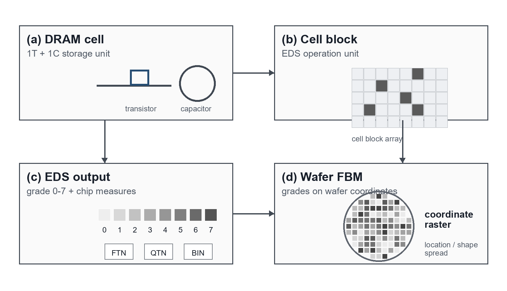
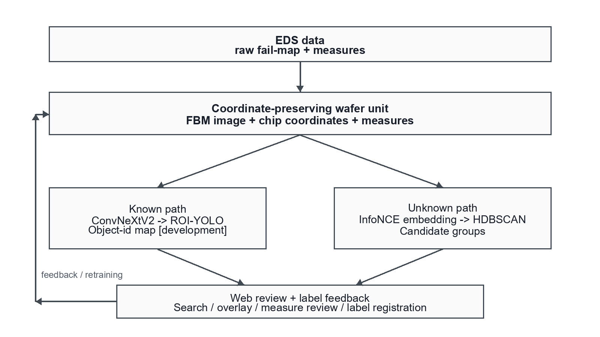
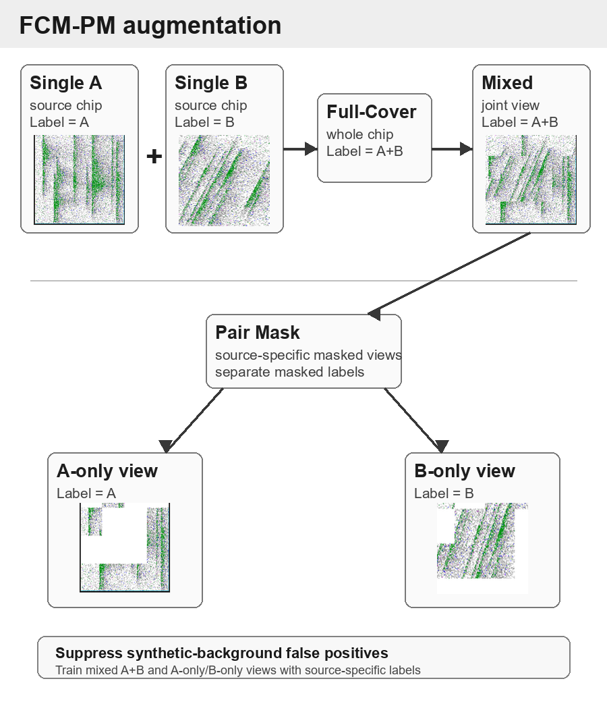
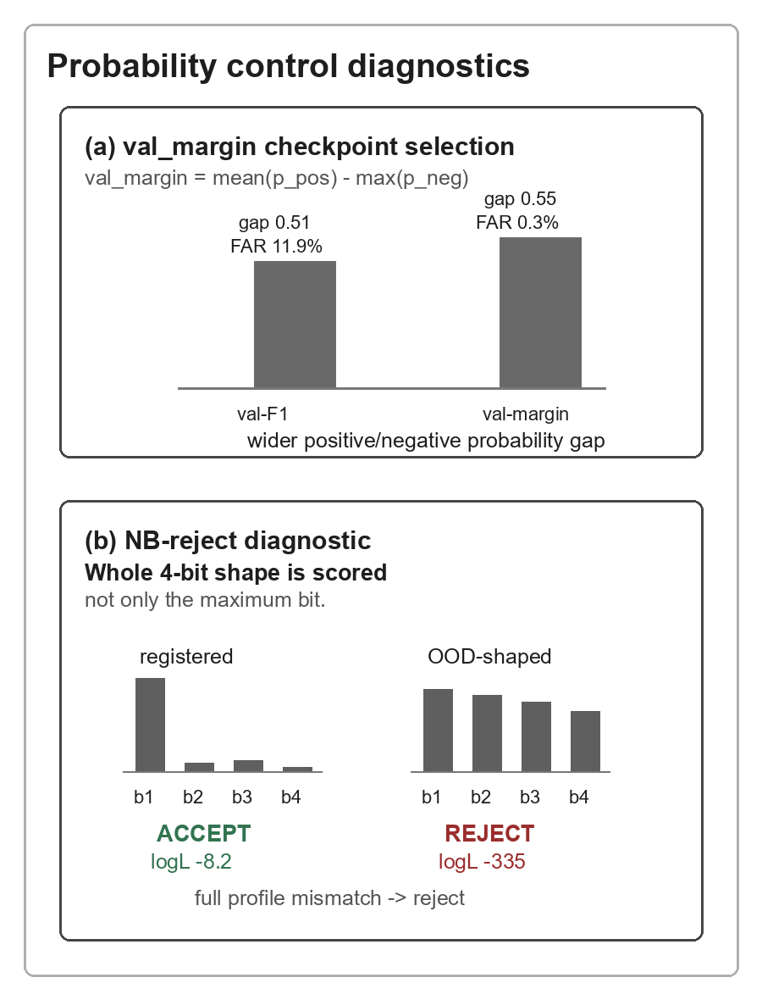
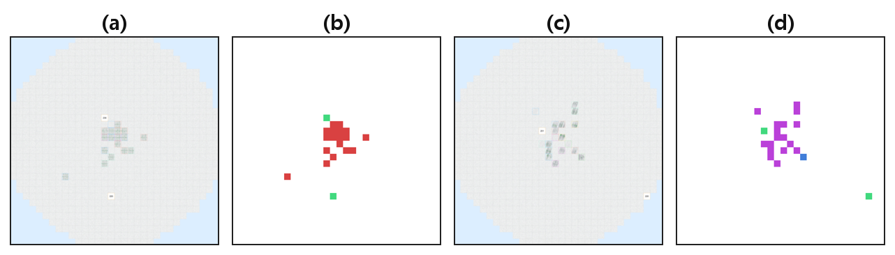
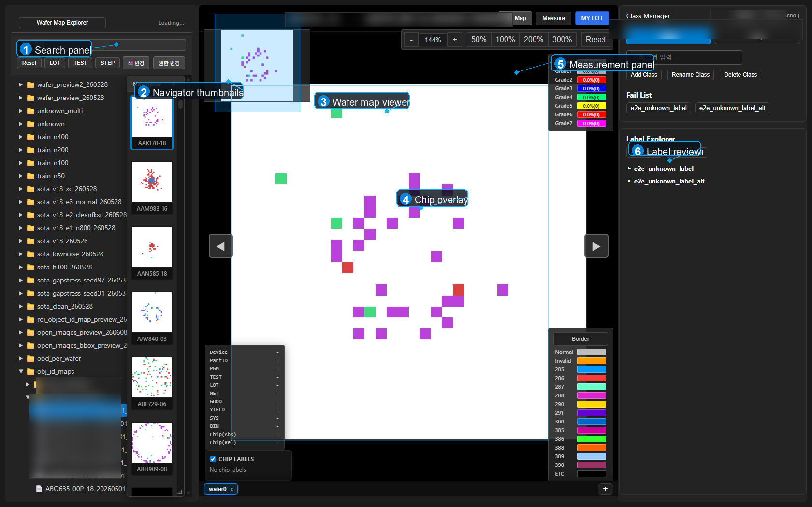

# 좌표 보존형 Failbit Map 기반 웨이퍼·칩 불량 분석 파이프라인

**Coordinate-Preserving Failbit Map Pipeline for Wafer- and Chip-Level Semiconductor Failure Analysis**

최호길1, 홍지훈1, 김성호2

1 메모리사업부 메모리제조기술센터 QIE그룹, Samsung Electronics
2 메모리사업부 메모리제조기술센터 DRAM YE팀, Samsung Electronics

---

**Abstract** - **Failbit Map은 반도체 EDS(Electrical Die Sorting) Test에서 생성되는 wafer당 약 1,000만 pixel 수준의 고해상도 진단 자료로, 불량의 위치와 형태를 함께 보여 준다. 그러나 실제 현업에서는 대량 Failbit Map 조회가 어렵고, 조회 가능한 일부 map도 엔지니어의 수작업 판정에 의존하는 경우가 많았다. 본 논문은 이를 해결하기 위해 raw log를 Failbit Map 이미지와 chip 좌표, chip별 계측값으로 변환하는 데이터 파이프라인을 구축하고, 이미 알려진 불량인 Known failure는 2-stage supervised classification으로, 신규 불량인 Unknown failure는 대조 embedding과 HDBSCAN(Hierarchical Density-Based Spatial Clustering of Applications with Noise)으로 다루었다. 변환 속도는 Cython 적용으로 약 100배 향상되었고, 이미지 용량은 32-color palette PNG 적용으로 약 75% 절감되었다. Known failure 분류는 ConvNeXtV2-Base 1차 분류와 저신뢰 sample에 대한 ROI(Region of Interest)-YOLO(You Only Look Once) 2차 보정을 결합했으며, class 비중을 반영한 weighted F1 score 0.95를 field validation에서 얻었다. Unknown failure 분석은 현업 wafer 이미지 2,000장에 적용했을 때 13개 그룹을 만들었고, 이 중 7개가 현업 엔지니어 검토에서 실제 불량으로 확인되었다. 추가로 chip multi-label 평가는 single-failure chip만으로 2-combo 합성 평가를 구성하고, FCM-PM(Full-Cover CutMix with Pair Mask)으로 bit-F1 score 0.9927과 FAR(False Alarm Rate) 0.00%를 얻었다. 각 결과는 field validation, field review, generated development, controlled synthetic benchmark로 구분해 제시한다.**

**Keywords:** Wafer Failure Analysis, Failbit Map, EDS Test, ConvNeXtV2, ROI-YOLO, Object-ID Map, Contrastive Learning, HDBSCAN, Palette PNG, Multi-label Classification, CutMix

## 1. 서론

DRAM(Dynamic Random Access Memory)은 데이터를 저장하는 최소 단위인 cell과, 다수 cell이 묶여 검사 단계에서 한 번에 동작하고 평가되는 cell block으로 구성된다. 양산 라인은 EDS 검사에서 각 cell block이 정상 동작하는지, 얼마나 빠르게 동작하는지, 반복 동작이 안정적인지를 전기적으로 측정한다. block 내부 cell들의 불량 정도를 하나의 값으로 나타낸 것이 failbit이며, 본 파이프라인은 이를 Grade 0(정상)부터 7(최대 불량)까지로 양자화한다. wafer 위 모든 block 위치의 failbit를 좌표계에 모은 것이 Failbit Map이다. EDS는 chip별 계측값도 함께 산출한다. FTN, QTN, BIN은 불량 수, 검사 수, bin 판정처럼 현장에서 chip 상태를 빠르게 확인할 때 쓰는 대표 계측 항목이다. 따라서 한 wafer는 공간 이미지인 Failbit Map과 chip별 계측값이라는 두 형태의 정보를 동시에 가진다. 이 cell에서 Failbit Map까지의 관계를 Figure 1에 정리하였다.

**Figure 1.** From DRAM cell to coordinate-preserving Failbit Map. EDS converts cell-block failure into grade 0-7 and chip-level measure values, then places the grades on wafer coordinates.

Failbit Map은 단순한 불량률 집계와 다르다. 같은 불량률이라도 불량이 가장자리 환형인지, 중앙 밀집인지, 특정 방향 편중인지에 따라 설비와 공정 원인이 달라진다. 위치와 분포, 방향, 형태가 그 자체로 진단 정보다. Failbit Map은 웨이퍼 전역 형상, zone 위치, chip 내부 형태라는 세 층위를 담아 measure value만으로 보이지 않는 공간 패턴과 layout-structure 연관성을 드러낸다.

현장 분석은 오랫동안 measure value를 중심으로 이루어졌다. 담당자는 chip별 수치로 불량 여부를 먼저 확인하고, 수식과 임계값을 조합해 반복되는 고질 불량을 분류했다. 이 방식은 빠르고 근거도 분명하다. 또 기존 환경에서는 대량 Failbit Map 생성과 저장, 빠른 조회가 어려웠고, 이미지 기반 분석 도구도 충분하지 않았다. 그래서 현업은 먼저 계측값을 볼 수밖에 없었다. 다만 chip을 몇 개의 수치로 줄여 보는 순간, 주변 chip과의 관계나 wafer 안에서 반복되는 형태는 함께 사라진다. 같은 fail rate라도 edge-ring, center-cluster, directional pattern은 전혀 다른 공정 원인을 가리킬 수 있다. 그래서 원인 해석 단계에서는 결국 Failbit Map을 다시 확인해야 한다. 의심스러운 wafer는 Failbit Map이나 TEM(Transmission Electron Microscopy)으로 시료를 잘라 CD(Critical Dimension)나 miss-alignment 같은 pattern을 확인하고 공정 structure와 layout 원인을 해석했다. 기존 도구로는 한 번에 약 48매까지만 조회할 수 있어 전수 검토도 어려웠다.

Failbit Map에서 다루는 불량은 크게 두 가지다. 하나는 이미 알려진 불량인 Known failure이고, 다른 하나는 신규 불량 후보인 Unknown failure이다. Known failure는 현업에서 우선 관리할 대표 유형으로 전달된 16-class 기준 안에서 지도학습으로 다룰 수 있다. 이 범위면 당시 검증 목적에서 주요 반복 불량을 충분히 다룰 수 있다고 판단했다. 반면 Unknown failure는 아직 분류 기준이 정리되지 않았으므로 바로 F1 score나 recall로 평가하기 어렵다.

이 논문의 1차 목표는 개별 모델을 하나 더 붙이는 것이 아니라, 현업에서 Failbit Map을 실제로 반복 사용할 수 있게 만드는 것이었다. 이를 위해 첫째, raw log를 빠르게 Failbit Map과 chip annotation으로 변환하고 wafer ID와 chip 좌표를 유지하는 데이터 구조를 만들었다. 둘째, Known failure는 저신뢰 sample만 다시 보는 2-stage 구조로 다루고, Unknown failure는 담당자가 확인할 그룹 수를 줄이는 방식으로 다루었다. 셋째, 실제 데이터와 통제된 평가셋에서 각 결과를 따로 검증했다. 운영에서 줄어든 일과 모델 평가에서 얻은 숫자는 같은 종류가 아니므로, Known failure의 F1 score, Unknown failure의 13→7 결과, object-id map, FCM-PM, 운영 효과는 Table 3에서 출처를 따로 표시했고 같은 지표로 합산하지 않았다.

핵심 아이디어는 단순하다. Failbit Map, chip 좌표, chip별 계측값, 모델 결과가 같은 wafer ID와 chip 위치 기준으로 남아 있어야 한다. 그래야 담당자가 같은 wafer를 다시 열었을 때 map과 수치, 모델 결과를 바로 대조할 수 있다. 기존 불량의 Stage-2에서는 chip 위치가 제품 layout으로 이미 정해져 있다는 점도 사용했다. 이 좌표를 그대로 쓰면 detector가 다시 위치를 찾을 필요가 줄어든다. object-id map은 이 가능성을 생성 데이터 기준으로 확인한 항목이며, 양산 적용 성과로 쓰지 않는다. 중복 불량은 별도 chip multi-label 문제로 두고 3.2.4에서 다룬다.
## 2. 관련 연구

### 2.1. 공개 연구와 본 논문의 위치

웨이퍼 맵 불량 분석은 규칙 기반 방법과 고전 ML을 거쳐 CNN 분류로 발전해 왔다. 공개 데이터셋 WM-811K를 CNN으로 분류한 연구 [1][2]는 die 단위 wafer-level 패턴 분류에 중심을 두고, wafer-level 라벨만으로 chip 불량을 추정하는 [3]도 chip 형태를 좌표에 복원하지는 않는다. 여기서 쓰는 object-id map은 기존 불량 Stage-2에서 chip 분류 id를 wafer 격자 제자리에 categorical로 되돌려, ROI detector의 box 탐색 부담을 줄이는 방식이다. 한 chip에 둘 이상이 겹치는 혼합형 불량은 bin map에서 CNN으로 분류된 바 있으나 [4] 이는 wafer 단위 혼합 패턴을 실제 mixed 라벨로 학습한다. 본 논문의 chip multi-label 평가는 별도 절에서 다루며, 단일 불량 chip만으로 2-combo를 합성 학습(FCM-PM)해 mixed 라벨 부족을 다룬다. 정답이 없는 신규 패턴 탐색은 대조 학습과 군집화 [5][6], open-set recognition [7], 대조 deep clustering [8], open-world 군집화와 decision fusion [9]로 이어졌고 대개 공개 bin map에서 ARI(Adjusted Rand Index), NMI(Normalized Mutual Information), silhouette로 평가된다. Unknown 경로도 대조-군집 계열을 쓰지만, 정답 라벨이 없는 양산 운영의 좌표 보존 FBM에서 동작하므로 합성 평가셋에서만 이 관례를 따르고 실전에서는 현업 wafer 이미지 2,000장에 적용해 13개 그룹을 만들었고, 그중 7개가 실제 불량으로 확인되었다.

chip 분류 결과를 원래 wafer 위치에 다시 놓으면 기존 불량의 Stage-2 해석 방식이 달라진다. object-id map은 ROI-YOLO의 detector 부담과 class 확장 부담을 줄이기 위해 본 방식이다.

2-combo는 실제 mixed 라벨이 부족한 별도 chip multi-label 조건이며, 3.2.4의 합성 학습 구조로 다룬다. 정답이 없는 운영 wafer에서는 분류 점수를 낼 수 없어서, 현업 wafer 이미지 2,000장을 적용했을 때 만들어진 13개 그룹을 담당자가 확인했고 그중 7개가 실제 불량이었다. 모델 용량보다 입력 표현이 성능을 좌우한다는 [10]의 관점에서 보면, categorical 신호에는 정수 보간보다 자연 해상도 one-hot이 더 적합했다(정량 근거 4.2). 2-stage 보정은 coarse-to-fine cascade 검출 [11][12]을 wafer의 chip 단위 class 검증에 맞게 재구성한 것이다. ConvNeXtV2, YOLO, InfoNCE, HDBSCAN은 모두 기존 방식이다. 다만 그대로 가져다 쓰지 않고, wafer 좌표가 바뀌지 않도록 골라서 맞춰 썼다.

## 3. 본론

### 3.1. 기술 개요

설계할 때 가장 먼저 둔 조건은 웨이퍼의 공간 의미를 손상시키지 않는 것이었다. 그래서 저장은 RGB가 아니라 palette로 했고, 방향 의미가 바뀌는 flip 증강은 쓰지 않았다. backbone은 국소 수용장과 선택적 2-stage 검증을 기준으로 골랐다. Unknown 학습에서는 random crop 대신 격자를 고정했고, object-id 입력은 정수 보간 대신 categorical one-hot으로 두었다. Table 1에는 이 선택들이 실제로 어느 단계에 쓰였는지 정리했다. palette PNG는 map 저장에 쓰이고, fixed chip crop은 chip 단위 분류에 쓰인다. web 화면은 map, 계측값, 모델 결과를 한 화면에서 보여 준다. Unknown 경로의 InfoNCE contrastive loss는 라벨 없이 같은 wafer는 가깝게, 다른 wafer는 멀게 임베딩을 학습시키는 목적함수이고, HDBSCAN[13]은 밀도 군집과 noise를 함께 분리하는 군집화 방법이다.

**Table 1. Proposed pipeline layers and validation scope.**

| Layer | Method | Validation scope |
|------|------|------|
| Data layer | Cython parser, palette PNG, chip annotation | internal implementation |
| Known recognition | ConvNeXtV2, selective ROI-YOLO | field validation |
| Known Stage-2 evidence | object-id map | generated development |
| Unknown discovery | InfoNCE, HDBSCAN | field review |
| Chip multi-label | FCM-PM, val_margin, NB reject | controlled synthetic benchmark |
| Review layer | web UI, new failure registration | operation |

전체 데이터 흐름은 다음과 같다(Figure 2).

**Figure 2.** Coordinate-preserving analysis pipeline. EDS raw logs and chip-level measures are aligned into one wafer unit, then branched into a Known validation path (ConvNeXtV2 → selective ROI-YOLO → object-id map [under development]) and an Unknown grouping path (InfoNCE → HDBSCAN). Confirmed cases from the web screen can be saved for later training data.

위 흐름은 wafer 수준 Known/Unknown 분석 경로다. 같은 데이터 파이프라인에서 나온 chip crop은 chip 수준 multi-label 분류에도 들어가며, 그 구조는 3.2.4에서 다룬다.

### 3.2. 제안 방법

#### 3.2.1. 데이터 표현과 정합 적재

Failbit Map은 Grade 0~7과 chip 경계 등 약 20개의 이산 색상만 쓴다. 24-bit RGB 대신 8-bit palette PNG로 재구성하면 파일 크기가 약 75% 줄고 양자화 손실이 사실상 없으며, 색상 scheme도 PLTE(PNG palette) 청크 교체만으로 반영된다. DRAM은 투입부터 fab-out까지 약 120일이 걸려 장기 보관이 필요하고, palette PNG로도 약 20TB가, 24-bit RGB였다면 약 80TB가 필요하다. wafer 한 장은 약 1천만 픽셀이고 하루 약 2만 매가 유입되므로, raw hex 페이로드는 256-entry lookup과 memoryview stride 접근의 Cython 파서로 복원해 순수 Python 대비 약 100배 빠르게 처리한다. 두 원천(주 fail-map과 chip별 Measure)은 wafer 식별자와 ±10초 오프셋으로 매칭하고, 복원 grade는 FTN/QTN/BIN 등 chip annotation과 병합한다. 이렇게 적재하면 같은 wafer와 chip 좌표에서 UI overlay, chip crop, Known/Unknown 모델 입력을 만들 수 있다.

#### 3.2.2. Known failure 분류 구조

**Backbone 선정.** 16-class closed-set(약 1,500 labeled, 4:1 stratified split)에서 backbone을 비교하였다. 이 규모에서는 전역 self-attention보다 국소 수용장과 계층적 특징 추출을 가진 CNN 계열이 안정적이었고, FCMAE(Fully Convolutional Masked Autoencoder) 사전학습은 국소 공간 패턴 복원에 적합했다 [14]. MaxViT-T와 ConvNeXtV2-Base가 동일 split에서 같은 수준이었으나, parameter 약 26%(119.5M→88.6M)와 FLOPs 약 39%(74.2G→45.1G)가 적고 개발 측정에서 chip당 약 26.9 ms인 ConvNeXtV2-Base를 선택했다. edge 방향의 공정 의미를 보존하기 위해 flip 증강은 배제하였다.

**ROI-YOLO 2-stage 보정.** 전역 분류 위에 영역 한정 검출을 붙여 어려운 표본만 재검토하는 cascade는 검출 품질을 높이는 일반 전략이다 [11][12]. 여기서는 이를 wafer의 chip 단위 검증에 맞게 구성하였다. CNN 오분류는 형태가 유사하거나 발생 영역이 겹치는 class 쌍에 집중되므로, 전수 검출 대신 낮은 confidence와 difficult class에만 선택적으로 적용하였다.

ROI 보정은 1-stage 예측 confidence가 0.80 미만이거나 예측 class가 difficult class에 속할 때만 적용한다. difficult class는 학습 validation에서 클래스별 precision 또는 recall이 0.80 미만으로 측정돼 미리 등록한 집합이다. 두 조건은 추론 시 예측값만으로 판정되므로 정답 라벨이 필요 없고, 나머지 wafer는 Stage 2를 건너뛴다.

ROI 위치는 train split에서만 적합한 클래스별 chip 좌표 KDE(Kernel Density Estimation)와 검출 chip 개수 GMM(Gaussian Mixture Model)으로 정해 누수를 차단한다. KDE는 class별 불량 chip이 자주 나타나는 위치를 만들고, GMM은 한 wafer 안에서 나올 chip 개수 분포로 ROI 후보를 제한한다. ROI 영역에 YOLO[15]를 적용해 내부 불량 chip을 검출하고 class 일관성으로 1-stage 예측을 보정한다. ROI 내부 chip은 200×200 px로 확대되어 wafer 전역에서 작던 scratch가 뚜렷해진다.

**Figure 3.** ROI-YOLO 2-stage cascade. Panels show (a) the Failbit Map, (b) the ROI region set by the class prior (blue circle) with YOLO detection boxes inside (red), and (c) the detected chip's scratch detail (confidence 0.91). Failures that look small and scattered globally become distinct under ROI-limited detection and chip-level inspection, while regions outside the ROI are skipped.

**chip-CNN object-id map 인코딩.** ROI-YOLO 2-stage는 검증된 양산 경로이나, wafer 전역에서 box를 회귀하는 detector 추론 비용이 크다. 이를 줄이려고 Stage 2를 chip-CNN 기반 object-id map으로 바꾸는 방법을 생성 데이터셋에서 보았다. wafer를 chip 격자(본 제품군 약 1,024개, 각 200×200 px)로 나누고, 생성 단계에서 확보한 chip 좌표로 고정 crop을 만든다. 작은 chip-CNN이 각 chip을 5-class로 분류한 뒤 그 id를 같은 격자에 되돌리면, 색 패턴이 wafer 클래스의 지문처럼 남는다(Figure 4).

**Figure 4.** chip-CNN object-id map generation. The wafer is partitioned into a chip grid using precomputed chip coordinates, and each chip is classified into 5 classes by the chip-CNN and its id is placed back at its grid position. The resulting color pattern acts as a fingerprint that discriminates the wafer class. [Generated data, under development]

ROI-YOLO와 object-id map의 Stage-2 구조와 연산 효율을 Table 2에 비교하였다. ROI-YOLO는 ROI 추출, box 회귀, NMS를 수행하며 512px 이상 입력을 요구한다(공개 detector YOLO11x 기준 56.9M params·194.9 GFLOPs@640 [16]; ROI 한정 crop의 실제 연산은 이보다 작다). object-id map은 chip 좌표로 확정된 32×32 격자를 1.16M chip-CNN에 입력하며, 아키텍처 산출 연산량은 약 0.31 GFLOPs다.[^1] 입력 스케일이 다르므로 같은 조건의 속도 비교가 아니라, 좌표 보존 표현이 입력 자체를 chip 격자로 줄인 결과로 보았다. 정확도도 생성 평가셋 기준 validation F1 score 0.9946 / hold-out F1 score 0.9872로, ROI-YOLO field validation의 weighted F1 score 0.95와 직접 비교하지 않았다.

ROI-YOLO는 원래 위치를 모르는 물체를 찾는 detector다. 그래서 후보 box를 찾고, box를 보정하고, NMS로 중복 후보를 지운다. 하지만 wafer의 chip 위치는 제품 layout으로 이미 정해져 있다. 이 점을 쓰면 Stage 2를 detection 문제가 아니라 chip별 fixed-crop classification 문제로 바꿀 수 있다. 각 chip을 한 번 잘라 class를 예측하고, 그 결과를 다시 wafer grid에 놓으면 object-id map이 된다. full wafer image에서는 작은 chip failure가 희석되지만, chip crop에서는 local morphology가 직접 보인다. 이득은 모델 크기 경쟁에서 나온 것이 아니라, 반도체 layout 정보를 모델 입력에 맞게 쓴 데서 나왔다.

**Table 2. Stage-2 chip evidence: ROI-YOLO detector vs chip-CNN object-id map. FLOPs are same-architecture analytic values, not same-scale speed measurements; accuracy scopes are field vs generated. [object-id map: generated-data development]**

| Structure | Params | FLOPs (G) | Input |
|------|:--:|:--:|:--:|
| ROI-YOLO detector [16] | 56.9M | 194.9 | 640 px |
| chip-CNN object-id map | 1.16M | 0.31 | 32×32 grid |

이 구조에서 가장 조심한 부분은 categorical 신호를 깨뜨리지 않는 것이었다. 정수 object-id를 BICUBIC으로 보간하면 1.3, 2.7 같은 무의미한 실수가 생기므로, 격자 해상도는 obj-id의 자연 해상도(제품별 chip 격자 수)로 유지했다. one-hot이 categorical 입력에 적합하다는 원칙 [17]에 따라 obj-id를 5채널 one-hot으로 인코딩하고(R/G/B 픽셀값 제외) 정수 block-expand만 적용해 BICUBIC 대비 복원 오차가 약 75% 줄었다. R을 뺀 단독(in_ch=5)을 채택해 정확도와 입출력 비용을 함께 줄였다(정량 비교 4.2).

#### 3.2.3. Unknown failure 군집화 구조

운영에는 기존 16-class에 없는 신규 불량이 드물게 나타나며 정답 라벨이 거의 없다. 지도 대조학습(SupCon[5])은 새 패턴을 기존 class로 흡수할 위험이 있어, 라벨에 종속되지 않는 자기지도 InfoNCE loss를 채택하였다. global 항은 같은 wafer의 두 증강본을 당기고 다른 wafer를 밀며, local 항은 6×6 structured grid의 대응 patch를 정렬한다. 작은 batch의 negative 부족은 MoCo(Momentum Contrast)[18] queue(4096)로 보완하고, 증강은 flip 없이 소규모 회전(±7°), 이동, 스케일(±5%), 가우시안 노이즈(σ=0.02)만 적용하였다.

학습 임베딩은 HDBSCAN으로 군집화한다. 운영 구성은 queue를 16K로 키운 Global/Local InfoNCE loss를 쓰고, noise wafer는 최근접 이웃 투표가 임계를 넘을 때만 흡수한다. 불량 누락이 false alarm보다 위험하므로 capture를 우선하며, 담당자는 각 군집의 medoid를 보고 신규 불량이면 class에 추가한다.

#### 3.2.4. chip 수준 multi-label 분류 구조

wafer-level FBM 경로가 전역 반복 패턴을 다룬다면, chip-level 경로는 한 chip 안에서 여러 불량 신호가 같이 나타나는 상황을 다룬다. 실제 EDS 수치 기반 자동판정은 주로 single failure를 기준으로 설계되어 있어, 2-combo failure에서는 한쪽 신호가 다른 신호에 가려 false negative가 생기기 쉽다. 따라서 chip 라벨을 softmax처럼 하나만 고르는 문제가 아니라, 4개 불량 bit가 동시에 켜질 수 있는 multi-label 문제로 정의하였다. 어려운 점은 실제 2-combo 정답 라벨이 충분하지 않다는 점이다.

원천 데이터는 현업 EDS Failbit Map에서 얻은 single failure 4종(bank_boundary, fork, scratch, scratch_rot) chip이다. 평가셋은 single 4종, 2-combo 6종, Normal, Invalid, OOD(out-of-distribution) chip으로 구성하였다. OOD는 등록 불량 profile에는 없지만 운영 중 같이 유입될 수 있는 외곽 분포 chip으로, false alarm 억제를 확인하기 위한 negative다. 데이터 누수를 막기 위해 single 원천 chip을 먼저 train/test로 나누고, 학습 합성은 train 원천만, 평가 표본은 test 원천만 사용하였다. 학습용 2-combo는 online CutMix로 매 step 생성하고, 평가용 2-combo는 offline min-blend로 고정 생성해 두 경로를 나누었다. backbone은 ConvNeXtV2(FCMAE 사전학습)를 chip 이미지에 맞게 재학습했고, head는 클래스별 독립 sigmoid 확률을 출력한다.

**Figure 5.** Label space of chip-level multi-label classification. Top row: four single failures with distinct shapes (bank_boundary, fork, scratch, scratch_rot). Bottom row: a 2-combo (fork+scratch) and the negative samples that co-arrive in operation (Normal, Invalid, OOD/Starburst). [Field chip source + domain synthesis]

2-combo 라벨 부족은 augmentation 설계로 보완하였다. Grade 0~7로 양자화된 chip에서 Mixup은 존재하지 않는 중간 Grade를 만들 수 있고, Diffusion은 실제 2-combo 라벨 부족과 연산 부담이 동시에 남는다. 그래서 원래 Grade 값을 영역 단위로 보존하는 CutMix[19] 계열을 선택하였다. 다만 random rectangle CutMix만 쓰면 불량 영역이 잘리거나, 합성 후 남는 background가 false-positive 신호로 학습될 수 있다.

2-combo chip label을 실제로 충분히 모으기는 어렵다. 그래서 single-failure chip source를 그대로 활용해 두 failure가 함께 있는 상황을 만들었다. FCM-PM은 두 single-failure chip을 full-cover 방식으로 합쳐 A+B mixed chip을 만들고, 동시에 A-only와 B-only masked view를 함께 학습한다(Figure 6). mixed view는 두 failure가 함께 있을 때의 positive signal을 주고, masked view는 합성 과정에서 생긴 background가 false-positive signal로 학습되는 것을 막는다. 이 때문에 FCM-PM은 단순한 augmentation이 아니라, weak positive를 보강하면서 negative tail을 제어하는 학습 구조로 볼 수 있다. false alarm rate(FAR)는 negative 중 오검출 비율(FP_neg/N_neg)로 계산하고, checkpoint는 validation에서 val_margin = mean(p_pos) - max(p_neg)이 가장 큰 epoch로 선택한다.

처음에는 loss만 바꾸는 방식으로는 충분하지 않았다. Focal과 ASL[20]은 일부 positive를 살렸지만, negative tail을 안정적으로 누르지 못했다. 특히 single-only 학습에서는 2-combo의 두 번째 bit가 약하게 남아 평균 0.42 수준까지 내려갔다. FCM은 두 single source를 chip 전체 영역에서 섞어 이 weak positive를 약 0.54까지 끌어올렸다. 반대로 Pair Mask는 합성 과정에서 생긴 background가 불량 신호로 학습되는 것을 막았다. 그 뒤에는 val_margin으로 positive와 negative 간격이 가장 넓은 checkpoint를 고르고(Figure 7a), Gaussian Naive Bayes reject로 4-bit probability shape가 등록 profile과 맞지 않는 OOD tail을 걸렀다(Figure 7b). bit 다수결 ensemble과 Knowledge Distillation(KD)[21] student는 각각 upper-bound와 추가 경량화 후보로 두었다.

**Figure 6.** FCM-PM augmentation for chip multi-label learning. Full-Cover CutMix makes an A+B mixed chip, while Pair Mask trains A-only/B-only views to suppress synthetic-background false positives. [Field chip source + domain synthesis]

**Figure 7.** Probability control in chip multi-label learning. (a) val_margin selects the checkpoint with wider positive/negative separation and lower FAR in the development sweep. (b) NB-reject scores the whole 4-bit probability shape rather than only the maximum bit, accepting a registered profile and rejecting an OOD-shaped vector. [Field chip source + domain synthesis]

## 4. 실험 결과와 운영 적용

### 4.1. 결과 범위

결과에 앞서 각 수치의 산출 범위를 먼저 밝힌다. Known failure의 F1 score는 field validation에서 얻은 값이고, Unknown failure의 13→7은 현업 wafer 이미지 2,000장에서 만들어진 13개 그룹 중 7개가 실제 불량으로 확인된 field review 결과다. object-id map은 생성 데이터 기준 결과이며, FCM-PM은 통제된 합성 평가 결과다. viewer/data pipeline의 운영 효과도 모델 성능 수치와 성격이 다르다. 그래서 Table 3에 각 수치의 출처를 먼저 표시하고, 운영 효과와 모델 성능을 같은 지표로 합산하지 않았다.

**Table 3. Validation scope of reported results.**

| Item | Value | Scope |
|------|------|------|
| Known | F1 score 0.95 | Field val. |
| Unknown | 13→7 | Field review, not classifier metric |
| object-id | 0.9946 / 0.9872 | Generated dev. |
| FCM-PM | 0.9927 / 0.00% | Controlled synth. |
| FBM gen./storage | ~100× / ~75% / 20TB/120 d | Internal measurement |
| Impact | KRW 12.3B | Internally certified quantified contribution |

### 4.2. Known failure 결과

Known failure 분류는 단계별 성능을 따로 보았다. 먼저 16-class closed-set(약 1,500 labeled, 4:1 stratified split)에서 backbone을 비교하였다(Table 4). MaxViT-T와 ConvNeXtV2-Base가 weighted F1 score 0.87로 같았으나 동일 split 단일 run이라 모델 효율을 기준으로 ConvNeXtV2-Base를 택했고, 단독 0.87에서 Optuna 탐색으로 validation weighted F1 score 0.92에 이르렀다.

**Table 4. Backbone selection and stage-wise Known classification (same split, weighted F1 score on validation set, single run). [Field-validated]**

| 구성 | Params | Val weighted F1 score |
|------|:------:|:------:|
| baseline CNN | - | 0.78 |
| ViT-B/16 | 86M | 0.81 |
| Swin-B | 88M | 0.84 |
| EffNetV2-M | 54M | 0.85 |
| MaxViT-T | 119.5M | 0.87 |
| ConvNeXtV2-Base (선정) | 88.6M | 0.87 |
| + Optuna (1-stage) | 88.6M | 0.92 |
| + selective ROI-YOLO (채택, 2-stage) | - | 0.95 |

ROI-YOLO를 일관성 검증 역할로 쓰고 classification loss 가중을 강화하자 보정 precision과 최종 weighted F1 score가 향상되어 최종 0.95에 도달하였다(Table 4). 사내 실전 데이터로 검증을 마친 최종 채택값은 2-stage 0.95뿐이며, 앞 세 값(0.78, 0.87, 0.92)은 1-stage(또는 이전) 단계값이다.

object-id map 인코딩(3.2.2)은 생성 데이터 기준으로만 평가하였다(Table 5). 목적은 이미 정해진 chip 좌표를 사용해 Stage-2를 fixed-crop chip 분류로 바꾸는 것이다. PPT 기준 성과는 selected obj-only 구성의 validation F1 score 0.9946 / hold-out F1 score 0.9872이며, 별도 Failbit Map image+obj-id 5-seed 확인에서는 validation F1 score 0.9838±0.0092였다.

**Table 5. Object-id map development metrics for Known Stage-2 follow-up. [Generated data, under development]**

| 입력 구성 | 확인 값 | Scope |
|------|------|:------:|
| Selected obj-only | val F1 score 0.9946 / hold-out F1 score 0.9872 | generated development |
| Failbit Map image+obj-id 5-seed check | val F1 score 0.9838±0.0092 | generated development |

이 결과는 PPT와 동일하게 ROI-YOLO Stage-2가 갖는 detector annotation cost와 class 확장 부담을 줄이기 위한 차세대 Stage-2 분류 구조로만 둔다. raw intensity에서 구분이 어려운 두 클래스도 object-id map에서는 chip class 색 패턴으로 분리된다(Figure 8).

**Figure 8.** Class separability of raw Failbit Map vs object-id map. Two samples hard to tell apart in raw form ((a), (c)) separate clearly in the object-id maps ((b), (d)), where each chip's class is rendered as color. [Generated data, under development]

이 모듈은 DRAM YE(Yield Enhancement)팀과 함께 실제 wafer로 다시 확인한다.

### 4.3. Unknown failure 결과

운영 적용에서 대조 임베딩과 HDBSCAN(3.2.3)을 현업 wafer 이미지 2,000장에 적용했을 때 13개 그룹이 만들어졌고, 그중 7개가 전문가 검토에서 실제 불량으로 확인되었다. 실전 Unknown failure는 정답 라벨이 없고 양산 noise가 커 F1 score나 ARI 같은 정량 점수가 성립하지 않는다. 따라서 13→7은 classifier precision으로 계산하지 않고, 담당자가 13개 그룹을 확인한 field review 결과로만 다룬다. Unknown embedding 경로의 측정값은 frozen encoder forward가 wafer당 약 14.3 ms, HDBSCAN 포함 end-to-end가 약 24 ms였으나, 이는 모델 경로의 개발과 검증 측정값이다. Table 3의 FBM generation/storage는 Cython 변환 속도와 palette 저장 효율만 요약하며, 이 값을 model serving throughput으로 보지 않는다.

정답 라벨이 있는 별도 합성 평가셋에서는 Local DenseCL, MoCo queue, NV-Retriever, NeCo를 단계적으로 비교하였다(Table 6). 이 표는 실전 13/7과 분리된 component-isolation 평가셋(per class 500, normal 2000)의 단일 run 값이다. 대조 head는 noise를 15.78%에서 0.00%로 낮췄고, Completeness는 0.9679로 높였다. 가장 큰 단일 감소는 MoCo queue에서 나타나 noise가 13.87%에서 9.45%로 줄었다. Completeness와 n_cluster는 생성 데이터 기준 recipe 비교 지표이며 field Unknown 13→7과 같은 지표로 합산하지 않는다.

**Table 6. Component-isolation benchmark for Unknown clustering (single run). Completeness = backbone-level cluster separability measure used for generated-development recipe comparison, and n_cluster is the number of groups after clustering. This generated-development recipe benchmark is separated from the field review result reported in Table 3. [Generated data, under development]**

| Recipe | Capture | Noise(%) | Completeness | n_cluster |
|------|:------:|:------:|:------:|:------:|
| Global InfoNCE only | 0.9337 | 15.78 | 0.9468 | 40 |
| + Local DenseCL | 0.9361 | 13.87 | 0.9502 | 37 |
| + MoCo Queue | 0.9356 | 9.45 | 0.9474 | 41 |
| + NV-Retriever NEG | 0.9250 | 8.23 | 0.9485 | 40 |
| + NeCo (5-tool) | 0.9559 | 6.66 | 0.9660 | 35 |
| 최종 + tau=0.5 후처리 | 0.9619 | 0.00 | 0.9679 | 35 |

### 4.4. chip multi-label 결과

Table 7에는 학습 recipe를 바꾸며 본 결과를 모았다. 처음에는 loss만 바꾸는 방식으로는 충분하지 않았다. BCE+label smoothing(0.1093·FAR 99.47%), Focal[22], ASL[20]은 FAR를 안정적으로 누르지 못했다. 단순 CutMix도 FAR가 42.05%로 남았고, Pair Mask를 더해야 24.62%까지 낮아졌다. FCM-PM과 val_margin을 결합한 단일 모델은 bit-F1 score 0.9927·Total FAR 0.00%에 도달하였다. val_f1 기준 대비 single 1.0000→0.9996의 미세 손실은 있었지만, 2-combo는 0.9517→0.9871로 올라갔고 FAR는 0.15%→0.00%로 줄었다. ensemble은 bit-F1 score 0.9956의 upper-bound를 보였지만 비용이 약 5배이고, KD student는 경량화 후보로 0.9799에 머물러 후속 과제다. Table 7에서 CM은 CutMix, C+PM은 CutMix+Pair Mask, FCM-F는 FCM-PM+val_f1, FCM-M*은 채택한 FCM-PM+val_margin, Ens.는 upper-bound ensemble, KD는 경량화 후보 student를 뜻한다.

**Table 7. Stage-wise performance of chip multi-label training recipes (2,000 per class). Controlled synthetic benchmark based on field failure-chip source and domain probability-distribution synthesis; not a production deployment result.**

| # | Recipe | bit-F1 score | single | 2-combo | Total FAR |
|---|--------|:--:|:--:|:--:|:--:|
| 1 | BCE | 0.1093 | 0.1896 | 0.0668 | 99.47% |
| 2 | Focal | 0.7980 | 0.8724 | 0.7050 | 45.72% |
| 3 | ASL | 0.6435 | 0.5379 | 0.7320 | 100% |
| 4 | CM | 0.9359 | 0.9566 | 0.9070 | 42.05% |
| 5 | C+PM | 0.9491 | 0.9728 | 0.9281 | 24.62% |
| 6 | FCM-F | 0.9652 | 1.0000 | 0.9517 | 0.15% |
| 7 | FCM-M* | 0.9927 | 0.9996 | 0.9871 | 0.00% |
| 8 | Ens. | 0.9956 | 1.0000 | 0.9921 | 0.00% |
| 9 | KD | 0.9799 | 1.0000 | 0.9638 | 0.00% |

Pair Mask를 제거하면(다른 모든 설정·reject 게이트 동일) 합성 background가 불량 신호로 누설되어 Total FAR가 0.00%에서 100%로 역전된다. 이 비교에서는 reject 게이트가 아니라 Pair Mask 구조가 false alarm 억제에 직접 기여했음을 통제된 ablation으로 확인하였다.

여기서 bit-F1 score는 한 chip 라벨을 클래스 수만큼의 bit vector로 보고 각 bit를 독립 측정해 micro-average한 값으로, positive 집합은 single 4종과 2-combo 6종을 포함한다. Total FAR 0.00%는 Normal·Invalid와 OOD 4종을 합한 negative 약 2,640 chip에서 오검출이 없던 값이다. 단일 불량만으로 중복 불량을 검출하며 FAR를 0.00%로 억제한 것은 라벨이 부족한 운영 환경을 위한 방법론 수준의 검증이며, 본 수치는 controlled synthetic benchmark 범위로 한정한다.

### 4.5. 시스템·운영 결과

구축한 viewer/data pipeline은 2025년부터 DRAM D1a~D1d 관련 제품 파트의 FBM 검토 인프라로 사용된다. 담당자는 이 화면에서 wafer ID를 검색하고, map overlay와 chip별 계측값을 확인한다. 필요하면 신규 불량으로 등록한다. 여기서 사용 범위는 FBM 생성, 조회, overlay, 결과 검토를 지원하는 검토 인프라에 한정되며, Known/Unknown/chip model serving이나 object-id map 양산 적용 완료를 의미하지 않는다. 1시간 주기 자동 적재로 기존 도구의 한 번에 약 48매 열람이 일 약 2만 wafer 누적 비교로 확장되었다(Table 8). 운영에서는 현업 wafer 이미지 2,000장에 적용해 13개 그룹이 만들어졌고, 그중 7개가 실제 불량으로 확인되었다(Figure 9). 확인된 7개 사례는 다음 학습 데이터에 넣을 수 있게 저장했다. 이 전환으로 분석 공수가 약 90% 줄었고, P3WN 제품 사례에서는 수율이 약 0.02%p 개선됐으며, 메모리제조기술센터 내부 성과 인정 기준 약 123억 규모로 집계·인정되었다.[^3] 운영 정량 성과는 DRAM viewer/data pipeline 기준으로 한정한다. 이 값들은 viewer/data pipeline의 운영 효과이므로, Table 4~7의 모델 성능 지표와 합산하지 않았다.

**Figure 9.** Screenshot of the deployed web application. Search, wafer map view, chip overlay, measurement panel, navigator thumbnails, and label review are integrated in one screen.

**Table 8. As-is → to-be of map analysis work.**

| 항목 | as-is | to-be |
|------|------|------|
| 1회 열람 규모 | 약 48매 | 일 약 2만 wafer 누적 |
| composite 집계 | 사실상 불가 | 사전 적재 자산 즉시 합성 |
| 신규 후보 패턴 | 수동 산발 발견 | 2,000장→13그룹, 7개 실제 불량 |

## 5. 결론

### 5.1. 논의 및 한계

object-id map 결과는 아직 생성 데이터 기준이다. 공개 wafer 데이터는 die 단위 bin map이라 chip 내부 형태와 계측을 함께 다루는 이 작업과 직접 비교하기 어렵고, 타 제품군과 라인 일반화, 외부 검증은 후속 과제다.

**측정으로 기각한 설계 선택.** 채택하지 않은 항목도 그냥 제외하지 않았다. 측정 결과가 기준이었다. Unknown failure는 구성요소 위계를 비교해 불필요한 요소를 제외했고(3.2.3), backbone 일부 해제는 소규모 데이터에서 supervised collapse를 일으켜 배제하였다. Isotonic 보정은 in-sample F1 score 0.9931로 높았으나 두 모델 oracle 상한 0.9923을 넘어 검증셋 과적합으로 판단했다.

**평가 무결성.** 모든 비교는 같은 wafer 수, chip 수, epoch, best-model 기준으로 통일하였다. ROI prior의 KDE/GMM은 train split에서만 적합했고, object-id 개발 평가도 chip 원천을 먼저 split한 뒤 합성해 train/test 누수를 차단하였다.

### 5.2. 향후 연구

향후에는 DRAM YE팀과 함께 object-id map을 실제 wafer로 다시 확인한다. Flash YE에서는 bin map과 chip multi-label 분석에도 이 흐름을 적용할 수 있는지 문의가 있었다. 실제 적용은 데이터 권한과 제품 차이를 확인한 뒤 별도 과제로 진행한다. wafer 이미지와 chip별 계측값을 함께 보며 원인 후보를 좁히는 것도 다음 단계다. 대조 임베딩은 검색 인덱스로 재활용해 과거 유사 사례와 담당자 note를 찾는 진단 보조 기능으로 확장할 수 있다. 이미지와 trend, 이력 정보를 요약하는 large language model 기반 기능은 담당자 승인과 이력 기록이 남는 보조 기능으로만 둔다.

### 5.3. 결론

이 논문에서는 Failbit Map 이미지, chip 좌표, 계측값, 모델 결과를 wafer ID 기준으로 함께 조회할 수 있게 했다. 담당자는 wafer를 검색한 뒤 map, chip overlay, 계측값, 모델 결과를 한 화면에서 본다. 필요한 경우 신규 불량으로 등록해 다음 학습 데이터에 넣을 수 있다. 이를 위해 palette 표현, flip 배제, structured sampling, one-hot 인코딩을 사용했다. Known failure 경로는 ConvNeXtV2와 선택적 ROI-YOLO로 field validation에서 weighted F1 score 0.95를 확인했고, Unknown failure 경로는 현업 wafer 이미지 2,000장을 적용했을 때 13개 그룹을 만들었으며 그중 7개가 실제 불량으로 확인되었다. FCM-PM은 single 불량 chip만으로 2-combo 학습 신호를 만들어 controlled synthetic benchmark에서 bit-F1 score 0.9927과 FAR 0.00%를 보였다. viewer/data pipeline은 약 48매 단위 조회를 일 약 2만 wafer 누적 비교로 확장했다. object-id map은 아직 생성 데이터 기준 결과이므로 실제 wafer에서 추가 확인이 필요하다. 결국 Failbit Map은 한 번 보고 끝나는 이미지가 아니라, 검색과 비교를 거쳐 학습 데이터까지 이어진다.

[^1]: 약 0.31 GFLOPs(307.9 MFLOPs)는 obj-id 분류기 ChipGridCNN(5채널 one-hot × 32×32 격자 입력, conv 6단 + 분류 head) 아키텍처에서 레이어별 MAC를 합산해 결정론적으로 산출한 값으로, parameter 약 1.16M과 정합한다.

[^2]: 채택 in_ch=5와 비채택 in_ch=6을 동일 chip-원천 split에서 seed 5회(42/1/7/100/234) 반복하였다. in_ch=5는 validation 0.9905±0.0045 / hold-out 0.9831±0.0050이며, 최고 seed가 0.9946 / 0.9872이다.

[^3]: 약 90% 공수 절감은 현업 운영 성과 집계·인정값, 약 0.02%p 수율 개선은 P3WN 단일 사례 기준(연환산 아님), 약 123억은 메모리제조기술센터 성과 인증값이다.

## 참고문헌

[1] Nakazawa, T. et al., "Wafer map defect pattern classification and image retrieval using convolutional neural network," *IEEE Trans. Semicond. Manuf.*, Vol. **31**, no. 2, pp. 309-314, 2018.

[2] Alawieh, M. B. et al., "Wafer map defect patterns classification using deep selective learning," in *Proc. 57th ACM/IEEE Design Automation Conf. (DAC)*, pp. 1-6, 2020.

[3] Lee, H. et al., "Classification of chip-level defect types in wafer bin maps using only wafer-level labels," *J. Manuf. Sci. Eng.*, Vol. **146**, no. 7, article 070902, 2024.

[4] Kyeong, K. and Kim, H., "Classification of mixed-type defect patterns in wafer bin maps using convolutional neural networks," *IEEE Trans. Semicond. Manuf.*, Vol. **31**, no. 3, pp. 395-402, 2018.

[5] Khosla, P. et al., "Supervised contrastive learning," in *Advances in Neural Information Processing Systems (NeurIPS)*, Vol. **33**, pp. 18661-18673, 2020.

[6] Chen, T. et al., "A simple framework for contrastive learning of visual representations," in *Proc. Int. Conf. on Machine Learning (ICML)*, PMLR 119, pp. 1597-1607, 2020.

[7] Shin, J.-S. et al., "Enhanced detection of unknown defect patterns on wafer bin maps based on an open-set recognition approach," *Comput. Ind.*, Vol. **164**, article 104208, 2025.

[8] Baek, I. and Kim, S. B., "Contrastive deep clustering for detecting new defect patterns in wafer bin maps," *Int. J. Adv. Manuf. Technol.*, Vol. **130**, pp. 3561-3571, 2024.

[9] Jang, J. et al., "Decision fusion approach for detecting unknown wafer bin map patterns based on a deep multitask learning model," *Expert Syst. Appl.*, Vol. **215**, article 119363, 2023.

[10] Shi, B. et al., "When do we not need larger vision models?," in *Proc. European Conf. on Computer Vision (ECCV)*, pp. 444-462, 2024.

[11] Ren, S. et al., "Faster R-CNN: Towards real-time object detection with region proposal networks," *IEEE Trans. Pattern Anal. Mach. Intell.*, Vol. **39**, no. 6, pp. 1137-1149, 2017.

[12] Cai, Z. and Vasconcelos, N., "Cascade R-CNN: Delving into high quality object detection," in *Proc. IEEE/CVF Conf. on Computer Vision and Pattern Recognition (CVPR)*, pp. 6154-6162, 2018.

[13] Campello, R. J. G. B. et al., "Density-based clustering based on hierarchical density estimates," in *Proc. Pacific-Asia Conf. on Knowledge Discovery and Data Mining (PAKDD)*, pp. 160-172, 2013.

[14] Woo, S. et al., "ConvNeXt V2: Co-designing and scaling ConvNets with masked autoencoders," in *Proc. IEEE/CVF Conf. on Computer Vision and Pattern Recognition (CVPR)*, pp. 16133-16142, 2023.

[15] Redmon, J. et al., "You only look once: Unified, real-time object detection," in *Proc. IEEE Conf. on Computer Vision and Pattern Recognition (CVPR)*, pp. 779-788, 2016.

[16] Jocher, G. and Qiu, J., "Ultralytics YOLO11," 2024.

[17] Guo, C. and Berkhahn, F., "Entity embeddings of categorical variables," *arXiv preprint* arXiv:1604.06737, 2016.

[18] He, K. et al., "Momentum contrast for unsupervised visual representation learning," in *Proc. IEEE/CVF Conf. on Computer Vision and Pattern Recognition (CVPR)*, pp. 9729-9738, 2020.

[19] Yun, S. et al., "CutMix: Regularization strategy to train strong classifiers with localizable features," in *Proc. IEEE/CVF Int. Conf. on Computer Vision (ICCV)*, pp. 6023-6032, 2019.

[20] Ridnik, T. et al., "Asymmetric loss for multi-label classification," in *Proc. IEEE/CVF Int. Conf. on Computer Vision (ICCV)*, pp. 82-91, 2021.

[21] Hinton, G. et al., "Distilling the knowledge in a neural network," *arXiv preprint* arXiv:1503.02531, 2015.

[22] Lin, T.-Y. et al., "Focal loss for dense object detection," in *Proc. IEEE Int. Conf. on Computer Vision (ICCV)*, pp. 2980-2988, 2017.
