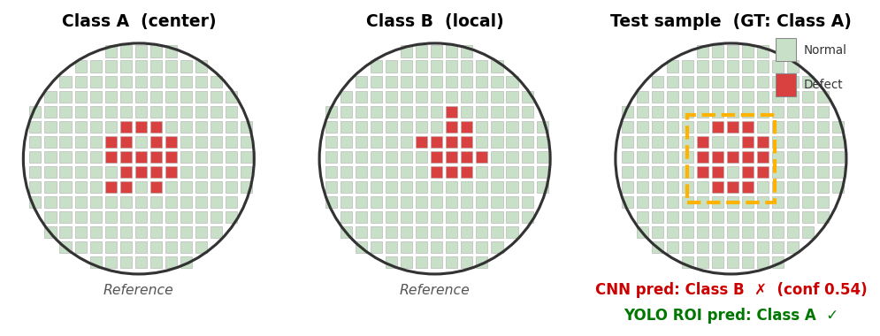
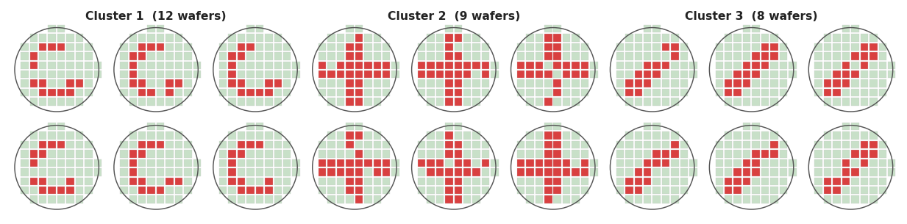

# DRAM Failbit Map 기반 Known 불량 및 Unknown 불량 분석 AI 아키텍처

**An AI Architecture for Known and Unknown Defect Analysis Based on DRAM Failbit Maps**

홍길동¹, 김철수¹

¹ 반도체연구소, Samsung Electronics, 화성시, 대한민국

## 초록

Failbit Map은 반도체 EDS Test에서 생성되는 웨이퍼당 약 1,000만 pixel 수준의 초고해상도 데이터로, 불량 패턴 분석의 핵심 자료이다. 그러나 실제 현업에서는 대량의 Failbit Map 조회가 불가능하고, 일부 Map 분석도 엔지니어의 수작업에 의존하고 있다. 본 논문은 이를 해결하기 위해 대규모 Failbit Map을 생성 및 저장하는 파이프라인과 Known 불량 분류와 Unknown 불량 검출 AI 아키텍처를 구현하였다. Cython 적용으로 데이터 변환 속도를 약 100배 향상시켰고, Palette PNG 적용으로 이미지 용량을 약 75% 절감하였다. Known 불량 분류는 ConvNeXtV2 기반 1차 분류와 저신뢰 샘플에 대한 ROI 기반 YOLO 2차 분류를 결합한 구조로 설계하였으며, F1-score 0.95를 달성하였다. Unknown 불량 검출은 레이블 없이 SimCLR 계열 contrastive learning 기반으로 수행하였고, wafer의 zone 기반 불량 해석 특성을 반영하기 위해 grid structured local sampling을 적용하였다. 구체적으로, Wafer 이미지를 N×N grid로 균등 분할하고 동일 grid cell 내에서 추출한 샘플 쌍을 contrastive learning의 positive pair로 구성함으로써, 발생 위치 정보를 임베딩에 반영하였다. 실제 양산 5일치 Failbit Map 10,000장을 학습한 뒤 1일치 2,000장에 대해 추론한 결과 13개 불량 그룹이 검출되었으며, 현업 분석 엔지니어의 검증 결과 이 중 7개가 실제 불량 그룹으로 판정되어, 실제 운영 환경에서의 적용 가능성을 입증하였다.

Keywords: Failbit Map, Wafer Defect Analysis, ConvNeXtV2, YOLO, Contrastive Learning, HDBSCAN

## 1. 서론

Failbit Map은 EDS Test에서 Memory Cell Block 단위의 불량 정도를 Grade 0(정상)부터 7(최대 불량)까지로 표현한 데이터이다. Wafer 1장에는 약 1,000만 개의 block이 존재하므로, Failbit Map은 불량의 위치와 형태를 반영하는 초고해상도 데이터이자 수율 저하 원인 분석의 핵심 분석 대상이다. 그러나 현업 분석은 Wafer 내 약 1,000개 Chip에서 산출된 Measure 값의 발생 개수를 기반으로 이상 여부를 판단하고 있어, Failbit Map에서만 발현되는 불량을 검출하지 못한다. 따라서 수율 개선 및 Drop 방지를 위해서는 Measure 기반 접근만으로는 충분하지 않으며, Failbit Map 자체를 핵심 분석 단위로 삼아야 한다.

실제 현업 적용에는 두 가지 제약이 있다. 첫째, 대량 Map 생성이 어렵다. 설비 Log는 Wafer당 10~50MB 수준이며, 특정 제품에서는 하루 약 2,000장의 Wafer가 발생한다. 그러나 기존 환경은 속도와 메모리 제약으로 대량 처리가 어려웠으며, 실제로는 한 번에 48매까지 확인 가능하여 전수 분석에 한계가 있었다. 둘째, Map이 생성되더라도 불량 여부와 유형 판단이 엔지니어의 수동 판독에 의존하므로 전수 분석이 어렵다. 본 논문은 이러한 한계를 해결하기 위해, 대량 Raw Data 처리를 위한 데이터 파이프라인과 Failbit Map 기반 Known 불량 분류, Unknown 불량 검출을 통합한 분석 아키텍처를 제안한다. 주요 기여는 다음과 같다.

첫째, 대량 설비 Log의 실시간 적재와 1시간 주기 Failbit Map 생성 체계를 구현하여, 대량 Map의 지속적 생성과 운영 활용이 가능한 데이터 처리 기반을 구축하였다. 둘째, Known 불량 분류는 ConvNeXt V2로 Wafer 내 불량 Chip들의 종류와 분포 패턴을 1차 분류하고, 유사 분포로 인해 혼동되는 샘플은 ROI 기반 YOLO로 개별 Chip object detection을 수행하여 2차 분류함으로써 성능을 향상시켰다. 셋째, 기존 분류 체계에 등록되지 않은 상태에서 새롭게 발생하는 Unknown 불량을 검출하기 위해 SimCLR 계열 contrastive learning 기반 분석 구조를 구현하였다. 또한 grid structured local sampling을 적용하여 발생 위치까지 반영함으로써, Unknown 불량을 보다 정밀하게 검출할 수 있도록 하였다.

## 2. 제안 방법 및 결과

### 2.1 데이터 파이프라인

주요 병목은 wafer당 약 1,000만 개의 암호화된 test 결과를 grade 값으로 변환하는 처리 속도와, 4K를 초과하는 초고해상도 이미지의 저장 용량 부담이었다. 이에 Cython 최적화로 데이터 변환 속도를 약 100배 향상시켰으며(Fig. 1), palette-indexed PNG 적용으로 이미지 용량을 약 75% 절감하였다(Fig. 2).

<table>
<tr><td>
<div align="center"><b>Hex-to-grade conversion</b></div>

```text
    Raw:
        090B0C0D0E0F090A0B0C

    Decoding:
        "0C" -> "C" -> 12 (hex to decimal) -> 3 (if value != 0, subtract 9)

    Python:
        interpreter-based loop execution

    Cython:
        compiled integer loop execution

    Grade:
        0 2 3 4 5 6 0 1 2 3
```
</td></tr>
</table>

**Fig. 1.** Hex-to-grade conversion accelerated by Cython.

<table>
<tr><td>
<div align="center"><b>RGB PNG vs Palette-indexed PNG</b></div>

```text
    RGB PNG:
        [(123,54,24), (123,54,24), ..., (123,54,24)],
        [(123,54,24), (123,54,24), ..., (123,54,24)]

    Palette-indexed PNG:
        P[3] = (123,54,24)
        [(3), (3), ..., (3)],
        [(3), (3), ..., (3)]

    Result:
        (123,54,24) -> (3)
```
</td></tr>
</table>

**Fig. 2.** Palette-indexed PNG for failbit map compression.


### 2.2 Known 불량 분류

Known 불량 분석은 16개 등록 클래스를 대상으로 하였으며, 1,500개의 Failbit Map을 사용하여 ConvNeXtV2[1] 기반 1단계 wafer-level 분류기와 저신뢰 샘플 대상 2단계 ROI 기반 YOLO로 이루어진 구조를 설계하였다.
이는 wafer 내 불량 chip 분포가 유사하여 혼동되는 클래스를 구분하기 위해, 1차 분류의 confidence가 낮은 경우 ROI 기반 YOLO로 불량 chip의 종류를 추가 판별하여 최종 wafer 불량을 구분하도록 구성한 것이다(Fig. 3).



**Fig. 3.** Two-stage known-defect classification with ROI-YOLO.


**Table 1.** Backbone comparison and staged improvements for known-defect classification (16 classes, test Weighted F1)

| Configuration | Pretraining | test Weighted F1 | Note |
|---|---|---:|---|
| ViT | IN-21k | 0.81 | fine-tune |
| Swin | IN-1k | 0.84 | fine-tune |
| EffNetV2 | IN-1k | 0.85 | fine-tune |
| MaxViT | IN-21k | 0.87 | fine-tune |
| ConvNeXtV2 (Ref) | IN-22k | 0.87 | selected |
| Ref + Optuna | IN-22k | 0.92 | HPO |
| Ref + Optuna + ROI | IN-22k | 0.95 | 2-stage |

전체 운영 기준 하루 약 2만 장 이상의 Wafer Failbit Map이 발생하므로, backbone 선택에서는 정확도와 추론 처리량을 함께 고려하였다. MaxViT[4]와 ConvNeXtV2 (Ref)는 동일한 test Weighted F1 0.87을 보였으나, ConvNeXtV2는 더 낮은 추론 지연으로 운영 처리량 확보에 유리하여 최종 backbone으로 선정하였다. 선정된 ConvNeXtV2 (Ref)의 test Weighted F1 0.87은 Ref + Optuna에서 0.92, Ref + Optuna + ROI에서 0.95로 단계적으로 향상되었다.

### 2.3 Unknown 불량 검출

Unknown 불량은 후보 grouping 문제로 정의하였다. 5일치 운영 데이터 10,000장으로 SimCLR 계열 contrastive learning[2] 기반 임베딩을 학습하고, 별도 1일치 2,000장에 HDBSCAN[3]을 적용하여 유사 패턴을 그룹화하였다. 또한 Wafer 이미지를 N×N grid로 균등 분할하고 동일 grid cell 내 샘플을 positive pair로 구성하는 grid structured local sampling으로 발생 위치 정보를 반영하였다.



**Fig. 4.** Unknown-defect grouping on production images.


Unknown 경로에서는 운영 이미지 2,000장에 대한 grouping 결과 13개 후보 그룹이 검출되었으며, 현업 분석 엔지니어 검증 결과 이 중 7개가 실제 불량 그룹으로 판정되었다. 나머지 6개 그룹은 lot성 warning 수준의 noise이거나 chip 불량으로 이어지지 않는 패턴으로 해석되었다.

## 3. 결론

본 연구는 수율 개선 업무의 핵심인 Failbit Map 분석을 위해 대량 생성 파이프라인과 Known 불량 및 Unknown 불량 분석 AI를 통합함으로써, 기존 수작업 중심 분석을 현업 적용 가능한 AI 자동화 체계로 고도화하였다. 현재 DRAM 생산 라인에서 운영 중이며, 1시간 주기 Map 생성과 등록·미등록 불량 자동 분석을 통해 FAB 품질 분석과 신규 불량 대응에 실질적으로 기여하고 있다.

## 참고문헌

[1] S. Woo et al., "ConvNeXt V2: Co-Designing and Scaling ConvNets With Masked Autoencoders," in Proceedings of the IEEE/CVF Conference on Computer Vision and Pattern Recognition (CVPR), pp. 16133-16142, 2023.

[2] T. Chen, S. Kornblith, M. Norouzi, and G. Hinton, "A Simple Framework for Contrastive Learning of Visual Representations," in Proceedings of the 37th International Conference on Machine Learning (ICML), PMLR 119, pp. 1597-1607, 2020.

[3] R. J. G. B. Campello, D. Moulavi, and J. Sander, "Density-Based Clustering Based on Hierarchical Density Estimates," in Advances in Knowledge Discovery and Data Mining, PAKDD 2013, pp. 160-172, 2013.

[4] Z. Tu et al., "MaxViT: Multi-Axis Vision Transformer," in Proceedings of the European Conference on Computer Vision (ECCV), pp. 459-479, 2022.
