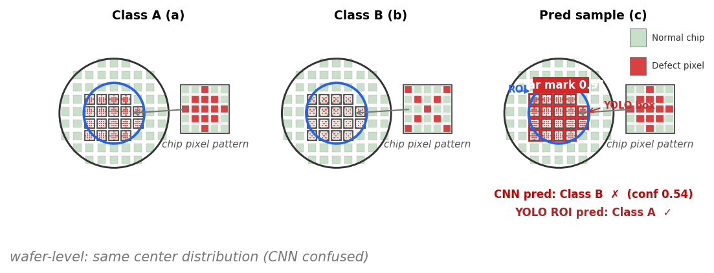
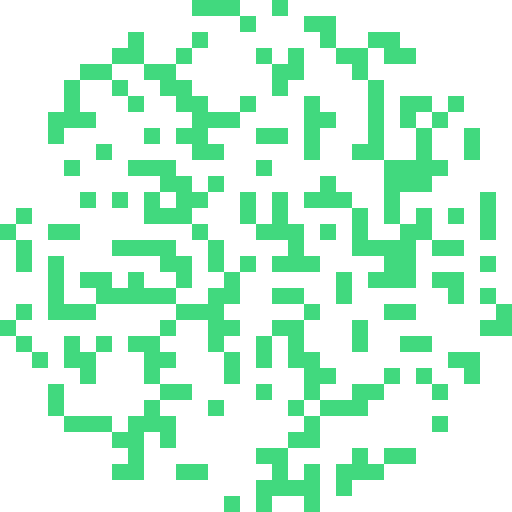
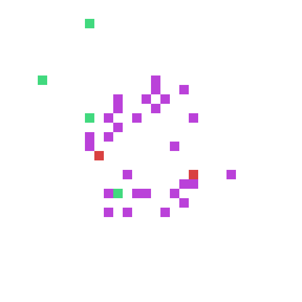
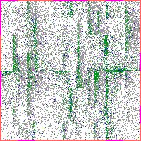

## 1. P1. Failbit Map AI 분류 시스템

### 1.1 과제 기본정보

| 항목 | 내용 |
|------|------|
| 과제명 | Failbit Map 대량 데이터 파이프라인 + single-label Known 2-stage 분류 + Unknown self-supervised 검출 |
| 수행기간 | 2022년 ~ 현재 (3년+) |
| 발의 배경 | 2022년 DRAM YE 팀장 의뢰 — 기존 시스템은 엔지니어 1회 조회 48매 수준에 머물러 있었고, wafer 당 약 1,000만 pixel 의 Failbit Map 을 분석 엔지니어가 수작업으로 판독하는 데 의존하여 전수 분석이 불가능한 상태 |
| 운영 상태 | **종합**: 데이터 파이프라인과 Web App 은 DRAM 전제품 라인에서 양산 운영 중이며, Known AI 모델은 CNN → ROI-YOLO 2-stage 로 실전 검증을 완료했고, Unknown 검출은 실전 운영 적용 후 현업 확인을 받았습니다. chip-CNN 결과를 wafer 좌표계 obj-id map 으로 재구성하는 보정 구조는 추가 생성 데이터 기반으로 개발 중입니다.<br>**세부**: 데이터 파이프라인 + Web App **[양산 운영]** (DRAM 전제품 라인) / Known AI 모델 (CNN → ROI-YOLO 2-stage) **[실전 현업 데이터, 검증 완료 weighted F1 0.95]** / Unknown self-supervised 검출 **[실전 운영 적용 및 현업 확인, 정량 metric 없음]** / chip-CNN → wafer 좌표계 obj-id map 기반 2-stage 보정 구조 (본인 2차 개발) **[추가 생성 chip 데이터, 개발 중, 통합 평가 예정]** |

### 1.2 참여 인력 및 역할

| 인력 | 역할 | 기여도 |
|------|------|--------|
| **본인** | fail-map + mapviewer 전 영역을 본인이 직접 수행 — **Frontend** (JavaScript / WebGL2 / RBAC 4단계 / SAML SSO), **Backend** (FastAPI / pyvips / Numba / S3 적재 / 1시간 주기 cron), **AI 모델 개발** (Known 2-stage 1차 ROI YOLO + 2차 chip-CNN 보정 구조, Unknown self-supervised, ConvNeXtV2 backbone 선정 및 Optuna HPO), **데이터 처리** (Cython hex-to-grade 100배 / 32-color palette-indexed PNG 75% 절감 / PLTE chunk patch), **생성 파이프라인** (chip 단위 1.16M 생성 chip / WM-811K 분포 기반 생성 wafer 9,250 PNG) | **70%** |
| **현업 엔지니어 (분석 담당)** | 아이디어 발의 및 불량 분석 교육, Failbit Map zone 기반 해석 학습 지원, Unknown 후보 그룹 13개에 대한 실제 불량 7개 검증 | **20%** |
| **관리자** | 매니징 (방향성 / 일정 / 리뷰) | **10%** |

### 1.3 개인별 기여 서술

본인의 P1 기여는 **반도체 역량을 AI 모델에 직접 반영해 현업 문제를 개선하는 흐름** 그대로입니다. Failbit Map 의 의미와 현업 사용자 분석 방식을 먼저 학습한 뒤 Known 2-stage 분류와 Unknown self-supervised 검출을 구현했고, 이를 DRAM 전제품 라인 양산 운영과 사내 분석 Web App 으로 이어 붙였습니다.

본인이 독자적으로 수행한 핵심 모듈은 다음과 같습니다.

- **Cython 기반 hex-to-grade 변환 약 100배 가속**: wafer 당 약 1,000만 개 test result 의 hex-to-grade 변환을 Python 인터프리터 loop 에서 Cython 컴파일 integer loop 로 재작성하여 약 100배 가속을 달성하였고, 일 약 2만 장 wafer 의 1시간 주기 Failbit Map 생성 체계를 가능하게 하였습니다.
- **32-color palette-indexed PNG 인코딩 (저장 용량 약 75% 절감)**: Failbit Map 이 Grade 0-7 양자화 이미지라는 도메인 인지를 바탕으로 RGB PNG 대신 32-color palette-indexed PNG 로 무손실 인코딩하여 저장 용량을 약 75% 절감하였고, 사용자별 색상 scheme 도 PLTE chunk 만 patch 하여 즉시 변경 가능하게 하였습니다.
- **Known 2-stage 분류기 1차 개발 (ROI YOLO 2-stage, 검증 완료 weighted F1 0.95)**: 16 known class / 1,500 labeled samples / 4:1 stratified split 데이터셋에서 ConvNeXtV2 기반 wafer-level 1차 분류와 저신뢰 샘플에 대한 ROI YOLO 2차 분류를 결합한 2-stage 구조를 **본인이 직접 개발 및 검증**하여 weighted F1 **0.95** 를 달성하였습니다. 이 수치가 P1 Known 분류의 검증된 성과입니다.
- **Backbone 5종 비교 및 선정**: ViT / Swin / EffNetV2 / MaxViT / ConvNeXtV2 5종 비교 후 ConvNeXtV2 채택 (효율 우위, 상세는 §1.5 표 참조).
- **Known 2-stage 분류기 2차 개발 — chip-CNN → wafer 좌표계 obj-id map 재구성 보정 구조 [추가 생성 chip 데이터셋 기반, 개발 중]**: 본인은 1차 ROI YOLO 2-stage 의 두 가지 한계를 사전 인지하였습니다. 하나는 wafer 큰 이미지에서 ROI 극소부분만 보는 구조라 양산 throughput 측면 추론이 느리다는 점이고, 다른 하나는 16 class / 1,500 sample 제한 조건에서는 0.95 가 검증되었으나 class 수가 늘어나면 성능이 잘 나오지 않을 가능성입니다. 이 두 한계를 풀기 위해 chip-CNN 으로 chip별 결함 종류를 먼저 분류한 뒤, 그 결과를 wafer 좌표계 obj-id map 으로 재배치하여 최종 보정 CNN 이 읽게 하는 구조로 능동적으로 대체 설계하였습니다. chip-CNN 은 chip 원본 해상도를 그대로 유지하면서 분류 성능과 추론 속도 모두 YOLO 대비 우위가 예상되며, ROI 수동 bbox 라벨 비용도 chip 단일 클래스 라벨로 단순화됩니다. 본 2차 개발은 1차의 추격이 아니라 본인이 미리 본 한계를 능동적으로 푼 후속 buildup 이며, 데이터 출처 자체가 1차 실전 데이터와 다른 추가 생성 chip 데이터셋 기반으로 chip 분류기 단계까지 검증되었습니다 (Stage 1+Stage 2 통합 평가는 2026년 내 완료 목표).
- **Unknown self-supervised 검출 (grid-structured local sampling)**: wafer 결함이 center / edge / ring 등 zone 기반으로 해석된다는 본인의 반도체 도메인 역량을 바탕으로 SimCLR 계열 모델에 grid-structured local sampling 을 결합한 대조학습을 적용하였습니다. 실전 운영에서는 정량 metric 없이 5일치 운영 데이터 10,000 장 학습 + 별도 1일치 2,000 장 적용 결과 13 후보 그룹을 검출했고, 현업 엔지니어 확인으로 7 개가 실제 불량 그룹으로 판정되었습니다. 이후 추가 개선과 metric 측정을 위해 생성 데이터 기반 PoC 를 병행하고 있습니다.
- **사내 분석 Web App (mapviewer) 양산 운영**: 대량 Failbit Map 조회 및 분석을 위한 분석 Web App 을 DRAM 전제품 라인에서 운영하고 있으며 (Backend FastAPI + Frontend JavaScript), 기존 1회 48매 수준의 조회를 시간 단위 누적 대량 조회로 전환하였습니다.

### 1.4 문제 정의

| 항목 | 내용 |
|------|------|
| 현장 난제 | Failbit Map 은 EDS Test 에서 wafer 당 약 1,000만 개 block 의 Grade 0-7 로 표현되는 초고해상도 데이터. 현업의 Measure 기반 분석만으로는 확인할 수 없어 전수 분석이 필요하나, 분석 엔지니어 수작업 판독에 의존하여 coverage 가 한계에 도달 |
| 기존 방식 한계 (1) 대량 처리 | 설비 Log 는 wafer 당 10~50MB, 전 제품 기준 일 약 2만 장 생산. 기존 시스템은 속도와 메모리 제약으로 대량 변환, 저장, 조회가 어려웠고, 엔지니어 1회 조회는 48매 수준에 머무름 |
| 기존 방식 한계 (2) 불량 판정 | 생성된 Map 의 불량 여부 및 유형 판정이 수동 판독에 의존, 등록 외 신규 결함 패턴은 known classifier 로 검출 불가 |
| 기술적 제약 | label 데이터 부족 (16 class / 1,500 sample), wafer 1,000+ 장 단위 일괄 배치 처리 요구, 운영 인프라 1시간 주기 적재 필요 |

### 1.5 기술적 해결 방안

**(1) 데이터 파이프라인 — Cython hex-to-grade + 32-color palette-indexed PNG**

데이터 파이프라인은 설비 Raw Log 를 실시간 적재하여 1시간 주기로 Failbit Map 을 생성하도록 설계하였습니다. 핵심 병목은 wafer 당 약 1,000만 개 test result 의 **hex-to-grade 변환 속도** 와 **이미지 저장 용량** 이며, 두 병목 각각에 대해 다음 해법을 적용하였습니다.

```
[병목 1] Hex → Grade 변환 (wafer 당 1,000만 cell)

  Raw:        090B0C0D0E0F090A0B0C
                       │
                       ▼
  Decoding:   "0C" → "C" → 12 (hex to decimal) → Grade 3
                       │
                       ▼
  Grade:      0 2 3 4 5 6 0 1 2 3

  Python interpreter loop   → 기준
  Cython compiled int loop  → 약 100배 가속

────────────────────────────────────────────────

[병목 2] 이미지 저장 용량 (양산 일 약 2만 장)

  RGB PNG:
    각 pixel = (R,G,B) 3 bytes
    [(123,54,24), (123,54,24), ..., (123,54,24)],
    [(123,54,24), (123,54,24), ..., (123,54,24)]
                       │
                       ▼
  32-color palette-indexed PNG:
    P[3] = (123,54,24)
    각 pixel = palette index 1 byte
    [(3), (3), ..., (3)],
    [(3), (3), ..., (3)]

  → 저장 용량 약 75% 절감
  → 사용자별 색상 scheme 은 PLTE chunk 만 patch 하여 즉시 변경
     (양산 1,000+ 장 재계산 불요)

────────────────────────────────────────────────

[도메인 근거]
Failbit Map 은 EDS Test 결과로 Grade 0-7 양자화된 이미지.
자연 이미지 (무한 색상) 가 아니므로 32-color palette 무손실 표현 가능.
도메인 (Grade 양자화 의미) 인지가 결정의 토대.

────────────────────────────────────────────────

[운영 효과]
- 변환 속도: 약 100배 향상 (Cython)
- 저장 용량: 약 75% 절감 (palette-indexed PNG)
- 운영 처리량: 일 약 2만 장 wafer 의 1시간 주기 적재
- 조회 단위: 기존 48 매/회 → 시간 단위 누적 대량 조회 (사내 분석 Web App, mapviewer)
```

**(2) Known 2-stage 분류기 — 본인 1차 개발 (ROI YOLO 2-stage, 검증 0.95) + 본인 2차 개발 (chip 단위 결함 분류 결과를 wafer-level 보정 입력으로 재구성)**

Known 불량 분석은 16 개 등록 클래스를 대상으로 1,500 개의 Failbit Map 을 사용하였습니다. ConvNeXtV2 기반 1단계 wafer-level 분류기는 전반적으로 높은 정확도와 처리 속도를 보였으나, wafer 내 불량 chip 분포가 유사한 클래스에서 분류 성능이 저하되었습니다. 이를 보완하기 위해 1차 분류의 저신뢰 샘플에 대해 2단계를 적용하는 2-stage 구조를 설계하였습니다.

**Backbone 5종 비교 (16-class test weighted F1, 1,500 labeled samples)**

| Configuration | Pre Train | Test weighted F1 | Note |
|---|---|---:|---|
| ViT | IN-21k | 0.81 | fine-tune |
| Swin | IN-1k | 0.84 | fine-tune |
| EffNetV2 | IN-1k | 0.85 | fine-tune |
| MaxViT | IN-21k | 0.87 | fine-tune |
| **ConvNeXtV2** (Ref) | IN-22k | **0.87** | **selected** |
| Ref + Optuna | IN-22k | 0.92 | HPO |
| Ref + Optuna + ROI | IN-22k | **0.95** | 2-stage |

Transformer 계열은 wafer 전체 구조를 보는 데 강점이 있으나, 본 과제의 Failbit Map 불량은 특정 zone 또는 국소 영역에 나타나는 경우가 많습니다. 본인은 CNN 계열인 ConvNeXtV2 가 sliding window 방식의 지역 특징 추출에 유리하여 특정 영역 불량에 더 민감할 것으로 판단했고, 실제 비교에서도 MaxViT 와 동일한 weighted F1 0.87 을 보이면서 파라미터 약 26% 감소 (119.5M → 88.6M) 와 FLOPs 약 39% 감소 (74.2G → 45.1G) 로 더 효율적이었습니다. 이에 ConvNeXtV2 를 최종 CNN backbone 으로 선정하였습니다 (연세대 인공지능학과 전해곤 교수 자문). 이후 Optuna 로 lr / weight decay / focal loss / class weight 등을 최적화하여 weighted F1 0.92 까지 향상시켰고, ROI 기반 2차 분류 보정으로 최종 0.95 를 달성하였습니다.

**핵심 이미지 — wafer-level 혼동 영역 시각**

| Center_fork | Center_scratch | Center_scratch_rot | Center_bank_boundary |
|-------------|----------------|---------------------|----------------------|
|  |  |  |  |

위 4 wafer 는 모두 Center 영역에 결함이 분포 (wafer-level 패턴 거의 동일) 하지만 chip 모양만 다릅니다 (fork / scratch / scratch_rot / bank_boundary). wafer-level CNN 단독으로는 구분이 어려워, 2단계에서 chip 형태 정보를 추가 활용하여 보정합니다.

**chip 단위 결함 형태 — 2단계가 식별하는 chip 패턴**

| chip_bank_boundary | chip_fork | chip_scratch | chip_scratch_rot | chip_invalid_main |
|--------------------|-----------|--------------|------------------|-------------------|
|  |  |  |  |  |

**본인 1차 개발: 2-stage (ConvNeXtV2 + ROI YOLO) — `[실전 현업 데이터]` 사내 실제 불량 이미지 데이터 검증 완료**

본인 1차 개발은 **실전 현업 데이터 (사내 실제 불량 이미지 데이터, 16 known class / 1,500 labeled samples / 4:1 stratified split)** 로 검증되어 weighted F1 0.95 를 달성한 2-stage 구조입니다. Stage 1 ConvNeXtV2 wafer-level CNN 의 softmax confidence 가 임계값 미만인 저신뢰 wafer 만 Stage 2 ROI-YOLO 로 보정합니다.



**ROI-YOLO 2-stage 보정 예시**: 동일 wafer-level zone 분포 (Center 영역 결함) 이지만 chip 형태가 다른 경우 (예: Center_fork vs Center_scratch_rot) 1차 CNN 이 혼동한 wafer 를 2차 ROI-YOLO 가 ROI (파란 원) 내 chip-level defect 박스 (빨간 박스) 탐지로 정확 보정.

```
         [Input wafer (palette-indexed PNG, 실전 사내 lot)]
                    │
                    ▼
   ┌──────────────────────────────────┐
   │ Stage 1: wafer-level CNN         │
   │   ConvNeXtV2 backbone (IN-22k)   │
   │   16-class weighted F1 0.92      │
   │   (Ref + Optuna)                 │
   └────────────────┬─────────────────┘
                    │ softmax
                    ▼
        ┌── confidence ≥ τ_gate ? ──┐
        │ Yes                     No │
        ▼                            ▼
  [16-class 확정]      ┌──────────────────────────────┐
                       │ Stage 2: ROI-YOLO            │
                       │   ROI 영역 내 chip-level     │
                       │   defect bbox 탐지로 보정    │
                       └──────────────┬───────────────┘
                                      │
                                      ▼
                  [최종 weighted F1 0.95 — 실전 데이터 검증]
```

**본인 2차 개발: chip-CNN → wafer 좌표계 obj-id map 재구성 2-stage 보정 구조 — `[추가 생성 chip 데이터, 개발 중]`**

본인이 1차 개발한 ROI YOLO 2-stage 의 **Stage 2** 를 chip-CNN 결함 분류 + wafer 좌표계 obj-id map 재구성 + 최종 보정 CNN 구조로 대체하는 본인 2차 개발입니다. wafer-level CNN 단독으로는 구별이 어려운 Center 영역 동일 패턴 (fork / scratch / scratch_rot / bank_boundary) 을 chip 단위 결함 종류 지도로 구별합니다. 본인은 ROI YOLO 의 두 가지 한계를 사전 인지했습니다. 하나는 wafer 큰 이미지에서 ROI 극소부분만 보는 구조라 양산 throughput 측면 추론 속도가 느린 점, 다른 하나는 16 class / 1,500 sample 제한 조건에서는 0.95 가 검증되었으나 class 수가 늘어나면 성능이 잘 나오지 않을 가능성입니다. 이 두 한계를 풀기 위해 chip-CNN 으로 의도적으로 대체 설계하였습니다. chip-CNN 은 chip 원본 해상도를 그대로 유지하면서 분류 성능과 추론 속도 모두 YOLO bbox 탐지 대비 우위가 예상되며, ROI 수동 bbox 라벨 비용도 chip 단일 클래스 라벨로 단순화됩니다. 본 2차 개발은 1차의 추격이 아니라 본인이 미리 본 한계를 능동적으로 푼 후속 buildup 이며, 데이터 출처 자체가 1차 실전 데이터와 다른 추가 생성 chip 데이터셋 기반으로 개발이 진행되고 있습니다.

**chip 단위 결함 분류기**는 추가 생성 chip 데이터 1.16M 기준의 **보조 개발 지표**로 val_f1 0.9946 / test_f1 0.9872 / 5-seed 평균 0.9838±0.0092 까지 확인했습니다. 이는 chip 분류기 단독 지표이며, 2-stage 구조 전체 (Stage 1 wafer-CNN + Stage 2 chip별 결함 지도 + 최종 보정 CNN) 의 통합 성과가 아닙니다. 통합 평가는 **2026년 내 완료를 목표** 로 진행 중입니다.

**chip-CNN → wafer 좌표계 obj-id map 시각화 예시** (추가 생성 wafer 기준 — Stage 2 chip-CNN 출력 결과를 wafer 좌표계에 재구성한 결과)

| ENGINEER (defect chip 식별) | NORMAL (정상 chip 분포) |
|--------------------------|--------------------------|
|  |  |

→ wafer-level CNN 으로는 둘 다 "Center 영역 결함" 으로만 보이지만, **chip별 결함 종류 지도에서는 fork / scratch / bank_boundary 같은 chip 단위 결함 종류가 색으로 구별** 됩니다. 최종 보정 CNN 이 이 결함 종류 지도와 원본 wafer palette index 를 함께 입력받아 16-class 재분류를 수행하는 구조이며, 본 통합 평가는 **2026년 내 완료를 목표** 로 진행 중입니다.

```
   ┌────────────────────────────────────────────┐
   │ Stage 2 (본인 신규): chip-level CNN        │
   │   wafer 를 chip grid 로 분할 후            │
   │   각 chip 을 single-class 라벨로 분류      │
   │            ↓                               │
   │   chip 별 결함 종류 결과를                 │
   │   wafer 좌표계의 결함 종류 지도로          │
   │   재구성                                   │
   └─────────────────┬──────────────────────────┘
                     │
                     ▼
   ┌────────────────────────────────────────────┐
   │ 최종 보정 CNN                              │
   │   R = wafer palette index                  │
   │   G = chip별 결함 종류 지도                │
   │   B = zeros                                │
   │   → 최종 16-class 재분류                   │
   └─────────────────┬──────────────────────────┘
                     │
                     ▼
              [최종 분류]
```

**두 방식의 특성 (직접 비교 아닌 각 방식의 설계 차이)**

본 표는 두 방식의 정확도 수치를 직접 비교하기 위함이 아닙니다. **1차는 사내 실제 불량 이미지 데이터 (16 class × 1,500 sample) 기반 실전 검증, 2차는 추가 생성 chip 데이터셋 기반 개발 — 데이터 출처 자체가 달라 0.95 와 0.9946 은 비교 불가합니다.** 본 2차 개발은 1차 0.95 의 추격이 아니라 본인이 사전 인지한 YOLO 두 한계 (양산 throughput 추론 속도 + class 확장성) 를 능동적으로 대체한 후속 buildup 이며, 본인은 **각 방식을 모두 baseline 부터 단계적으로 개선** 하여 도메인 한계를 푸는 기법을 발의 및 검증해 왔습니다.

| 항목 | 본인 1차 개발 (ROI YOLO 2-stage) | 본인 2차 개발 (chip별 결함 종류 지도 기반 보정) |
|------|---------------------------|--------------------------------|
| **데이터** | **[실전 현업 데이터]** 사내 실제 불량 이미지 데이터 (16 class / 1,500 labeled samples) | **[추가 생성 chip 데이터, 개발 중]** chip 단위 결함 분류 데이터 1.16M |
| 해상도 | wafer 이미지 내 ROI 영역만 활용 | 원본 chip 해상도 그대로 유지 |
| 추론 속도 | YOLO bbox 탐지 비용 | chip 분류 (병렬 가능) — 도메인상 더 빠름 |
| Annotation | ROI 내 chip-level bbox 라벨 필요 (수동 비용 큼) | chip 단일 클래스 라벨만 필요 |
| 본인 개선 history | **[실전 현업 데이터]** 0.78 (Baseline) → 0.87 (ConvNeXtV2 채택) → 0.92 (Optuna HPO) → **0.95 (ROI YOLO 2-stage 통합)** | **[추가 생성 chip 데이터]** baseline chip-CNN → chip 단위 결함 분류 데이터 1.16M 확장 → Grade/라벨 값을 평균내지 않고 보존하는 범주형 확대 방식 → chip별 결함 분류 결과를 wafer 좌표계 obj-id map 으로 재구성 → **보조 개발 지표 val_f1 0.9946 (chip 분류기 단계만 검증, Stage 1+Stage 2 통합 성과 아님, 통합 평가는 2026년 내 완료 목표)** |
| 상태 | [사내 실전 검증 완료] | [chip 분류기 단독 지표 검증 완료 / Stage 1+Stage 2 통합 평가는 2026년 내 완료 목표] |

**(3) Unknown self-supervised 검출 — ConvNeXtV2-base TAPT + Global InfoNCE + MoCo Queue 4096 + NV-Retriever NEG 0.72 + NeCo 0.2 + HDBSCAN**

Unknown 불량은 등록 클래스가 아닌 신규 패턴이므로 supervised classifier 로 검출할 수 없습니다. 본인은 ConvNeXtV2-base TAPT 백본을 사용해 self-supervised 대조학습을 수행하고, **MoCo Queue 4096** 으로 negative pool 을 확장한 뒤 **NV-Retriever 하드 negative 필터 (NEG 0.72)** 와 **NeCo 0.2** 로 표현을 정제했습니다. 이후 학습된 embedding 에 **HDBSCAN (eom mcs=12, ms=3, defect-only 평가 설정)** 을 적용하여 유사 패턴을 그룹화합니다.

근거는 두 축으로 분리합니다. **실전 현업 데이터 근거**는 정량 metric 이 아니라 5일 운영 데이터 10,000장 학습 + 별도 1일 운영 데이터 2,000장 적용 결과, 13개 후보 그룹 중 7개가 현업 엔지니어 확인으로 실제 불량 그룹 판정을 받은 것입니다. **추가 생성 데이터 개발 근거**는 실전 운영 확인 이후 추가 개선과 metric 측정을 위해 만든 생성 wafer 평가로, B0 (baseline) → NEW (최종 구성) 에서 ARI 0.823 → 0.859 까지 향상시킨 결과입니다.

**Zone 기반 불량 해석 — grid-structured local sampling 도입 근거**

| Donut_scratch | Edge-Top_scratch | Edge-Ring_scratch_rot |
|---------------|------------------|----------------------|
|  |  |  |

| RingDots | BrokenRing | CrescentArc |
|----------|------------|-------------|
|  |  |  |

위 wafer 들은 결함이 donut / edge-top / edge-ring / ring-dots / broken-ring / crescent-arc 등 wafer 좌표계의 **고유 zone** 에 분포함을 보여줍니다. wafer 전체를 하나의 view 로만 contrast 하면 이런 zone-level 다양성이 흐려지므로, wafer 를 grid cell 로 나누어 local 단위로 contrastive 표현을 학습합니다.

**Unknown self-supervised flow — 추가 생성 데이터 개발**

```
[추가 생성 데이터: WM-811K 분포 기반 생성 wafer 9,250 장]
   (42 defect + Normal, total 43 classes, palette-indexed PNG)
         │
         ▼
┌──────────────────────────────────────────────┐
│ ConvNeXtV2-base TAPT 대조학습                │
│   • Global InfoNCE                           │
│   • MoCo Queue 4096                          │
│   • NV-Retriever 하드 negative 필터 (NEG 0.72)│
│   • NeCo 0.2                                 │
│   (seed=42, 5 epoch, batch=8)                │
└────────────────┬─────────────────────────────┘
                 │
                 ▼
┌──────────────────────────────────────────┐
│ Embedding 추출                           │
└────────────────┬─────────────────────────┘
                 │
                 ▼
┌──────────────────────────────────────────┐
│ HDBSCAN grouping                         │
│   (eom, mcs=12, ms=3, defect-only)       │
└────────────────┬─────────────────────────┘
                 │
                 ▼
   [평가: same-anchor defect-only 1,146 장 재 클러스터링]
                 │
                 ▼
┌──────────────────────────────────────────┐
│ 결과: ARI 0.8588 ± 0.018 (3-seed)        │
│       capture 43/43 (1.000)              │
│       cross-anchor (E 8,354) ARI 0.4437  │
│                                          │
│ baseline부터 성능 향상 구성을            │
│ 추가 생성 데이터에서 정량 확인           │
└──────────────────────────────────────────┘
```

**B0 → NEW 구성요소 영향 확인 (본인 직접 시도 최적화)**: Global InfoNCE baseline 에 MoCo Queue → NV-Retriever 하드 negative 필터 → NeCo 를 단계적으로 적용하여 ARI **0.823 → 0.859** 향상을 확인했습니다.

아래 표는 실전 운영 지표가 아니라, 실전 운영 확인 이후 추가 개선 및 metric 측정을 위해 만든 **[추가 생성 데이터, 개발 중]** 평가 결과입니다. 전 행을 실전 성과로 보지 않고, Unknown 검출기의 구성요소 선택 근거와 후속 개선 방향을 확인하는 보조 지표로 사용합니다.

| Recipe **[추가 생성 데이터, 개발 중]** | Capture | Noise | Comp | Hom | ARI | AMI | Sil(cos) | 의미 |
|----------------------------------------|--------:|------:|-----:|----:|----:|----:|---------:|------|
| Global InfoNCE only | 1.000 | 6.20% | 0.960 | 0.929 | 0.823 | 0.929 | 0.582 | baseline |
| Global + Local DenseCL (LW=0.5) | 1.000 | 3.93% | 0.967 | 0.935 | 0.851 | 0.939 | 0.514 | local contrast 보강 효과 확인 |
| Global + Local + MoCo Queue 4096 | 1.000 | 1.31% | 0.983 | 0.937 | 0.846 | 0.950 | 0.573 | queue 로 noise 감소 |
| Global + Local + Queue + NV-Retriever NEG 0.72 | 1.000 | 0.52% | 0.985 | 0.944 | 0.861 | 0.956 | 0.611 | hard negative filtering 효과 |
| Global + Local + Queue + NEG + NeCo 0.2 | 1.000 | 0.61% | 0.991 | 0.937 | 0.870 | 0.953 | 0.610 | NeCo 적용 시 ARI 상승 |
| NEW recipe 3-seed avg | 1.000 | 1.48% | 0.994 | 0.942 | 0.859 ± 0.018 | 0.960 | 0.781 | seed 평균 기준 대표값 |
| NEW + KNN-softmax post (τ=0.5) | 1.000 | 0.00% | 0.994 | 0.942 | 0.868 ± 0.013 | 0.960 | 0.781 | 후처리로 noise 제거 |
| NEW recipe cross-anchor | 1.000 | 4.73% | 0.936 | 0.786 | 0.444 | 0.851 | 0.521 | 다른 합성 anchor 에 대한 stress test |

**cross-anchor ARI 0.4437 의 의미**: cross-anchor 는 학습 anchor 와 분포가 다른 별도 생성 anchor (E, 39 class 8,354 PNG) 에 대한 ARI 로, **추가 생성 데이터 내부에서 도메인 shift 영향을 정량화** 하기 위한 stress test 수치입니다. same-anchor 0.8588 ↔ cross-anchor 0.4437 의 gap 은 anchor 분포 차이 영향을 측정한 결과이며, 후속 개선 (anchor diversification + queue tuning) 으로 본인이 추가 개발 중입니다. 본 ARI/cross-anchor 는 모두 추가 생성 데이터 평가용 보조 지표이며, 실전 운영 결과 (5일 학습 + 1일 적용 → 13 후보 → 7 실제 불량 현업 정성 확인) 와는 별도 trace 입니다.

### 1.6 구현 성과

**성과 및 검증 근거**

아래 표는 **정량 metric** 과 **현업 확인 / 운영 근거** 를 분리합니다. 정량 metric 은 Known F1 0.95, chip 분류기 생성 데이터 보조 개발 지표 val_f1 0.9946 등이며, Unknown 13 → 7 은 정량 metric 이 아니라 실전 운영에서 확인한 현업 판정 근거입니다. mapviewer 2,317 요청은 양산 운영 사용 근거입니다.

| 항목 | 수치 | 근거 |
|------|------|------|
| Known weighted F1 (본인 1차 개발 ROI YOLO 2-stage) **[실전 현업 데이터]** | **0.95** | 사내 실제 불량 이미지 데이터 16-class / 1,500 labeled samples / 4:1 stratified split. ConvNeXtV2 + Optuna + ROI YOLO 2-stage. 사내 실전 검증값 |
| Known weighted F1 단계별 **[실전 현업 데이터]** | 0.78 (Baseline) → 0.87 (ConvNeXtV2) → 0.92 (Optuna) → **0.95 (ROI YOLO 2-stage)** | 동 실전 데이터셋, Backbone 5종 비교 표 |
| 본인 2차 개발 (chip별 결함 분류 결과를 wafer 좌표계에 재구성하는 보정 구조) **[추가 생성 chip 데이터, 개발 중]** | 보조 개발 지표: chip 분류기 단계 **val_f1 0.9946 / test_f1 0.9872 / 5-seed 0.9838±0.0092** | 별도 생성 chip 데이터셋 기준. chip 분류기 단독 지표이며 2-stage 통합 성과가 아닙니다. 2-stage 통합 평가는 개발 중 |
| Backbone 효율 | 파라미터 26% 감소 (119.5M → 88.6M), FLOPs 39% 감소 (74.2G → 45.1G) | 동 실전 데이터셋, MaxViT 대비 ConvNeXtV2 |
| Unknown 운영 적용 **[실전 현업 데이터]** | 5일 운영 데이터 10,000장 학습 + 별도 1일 운영 데이터 2,000장 적용 → **13 후보 중 7개 실제 불량 현업 확인** (정량 metric 없음) | HDBSCAN 후보 그룹을 현업 엔지니어가 확인 |
| Unknown 추가 생성 데이터 **[추가 생성 데이터, 개발 중]** | WM-811K 분포 기반 생성 wafer 9,250 PNG (42 defect + Normal, total 43 classes) | 실전 운영 확인 이후 추가 개선과 metric 측정을 위한 개발 데이터 |
| Unknown ARI **[추가 생성 데이터, 개발 중]** | **0.8588 ± 0.018** (same-anchor) | 3-seed 평균, defect-only HDBSCAN (eom mcs=12 ms=3) 평가 설정, 생성 9,250 내 defect-only subset 1,146 재 클러스터링 |
| Unknown ARI cross-anchor **[추가 생성 데이터, 개발 중]** | **0.4437** | 별도 생성 anchor E (39 class 8,354 PNG) 평가 — 도메인 shift 영향 |
| Unknown capture **[추가 생성 데이터, 개발 중]** | **1.000 (43/43)** | 생성 평가셋 total 43 class 모두 ≥1 cluster 잡힘 |
| Unknown 구성요소 영향 확인 **[추가 생성 데이터, 개발 중]** | baseline → 최종 구성: ARI 0.823 → **0.859** | Global InfoNCE → +MoCo Queue → +NV-Retriever → +NeCo |
| Hex → Grade 변환 [양산 운영] | 약 **100배** 가속 (Cython) | wafer 당 ~1,000만 cell, Python interpreter loop ↔ Cython compiled int loop 자체 측정 (wafer N장 평균) |
| 이미지 저장 용량 [양산 운영] | 약 **75% 절감** (32-color palette-indexed PNG) | RGB 3-byte/pixel ↔ palette index 1-byte/pixel 자체 변환 비교 |
| PLTE chunk patch [양산 운영] | 사용자별 색상 scheme 즉시 변경 (양산 1,000+ 장 재계산 불요) | mapviewer api/composite_map.py 측 구현 |
| 운영 처리량 [양산 운영] | 일 약 2만 장 wafer / 1시간 주기 적재 | DRAM 전제품 라인 운영 |
| 조회 단위 [양산 운영] | 기존 48 매/회 → 시간 단위 누적 대량 조회 | 사내 분석 Web App (mapviewer), 12일 누적 **2,317 요청 (분석 엔지니어 공유 단일 계정 guest 기준) / peak 1,801 (2026-03-07)** |
| Web App 인프라 [양산 운영, 사내 failbitmap 서비스] | Backend FastAPI + Frontend JavaScript (VIPS_CONCURRENCY 32, IO_THREADS 384, RBAC 4단계, SAML SSO, WebGL2, 매일 AM 2시 cleanup) | DRAM 전제품 라인 분석 엔지니어가 실제 사용 중인 사내 Web App 서비스 (사내 도메인명 failbitmap, mapviewer 코드베이스) |

**현업 임팩트**

- **분석 엔지니어 수작업 시간 단축**: wafer 당 약 1,000만 pixel 의 수동 판독을 자동 분류와 대량 조회 Web App 으로 대체하여 전수 분석이 가능한 운영 기반을 구축하였습니다.
- **인프라 [양산 운영] + Known AI 모델 [정량 검증 완료] + Unknown 검출 [현업 정성 확인] + chip 단위 결함 지도 기반 보정 [개발 중]**: 데이터 파이프라인과 Web App 은 DRAM 전제품 라인에서 양산 가동 중입니다. Known 2-stage 분류기 (ROI YOLO) 는 사내 실제 불량 이미지 데이터 16 class / 1,500 sample 에서 weighted F1 **0.95 정량 검증** 을 마쳤습니다. **Unknown 검출기는 정량 metric 검증이 아니라** 5일치 운영 데이터 10,000장 학습 + 별도 1일치 2,000장 적용 → **13 후보 그룹 중 7 개가 실제 불량 그룹으로 현업 엔지니어 정성 확인** 을 받은 상태입니다 (정량 metric 은 추가 생성 데이터 기반 PoC 에서 ARI 0.8588 / capture 43/43 등으로 보조 측정). Stage 2 를 chip 단위 결함 분류 결과 기반 보정 구조로 대체하는 본인 2차 개발은 **추가 생성 chip 데이터셋 기반** 으로 chip 분류기 단계까지 검증되었으며 (Stage 1+Stage 2 통합 평가는 2026년 내 완료 목표), 1차 ROI YOLO 의 실전 0.95 와는 데이터 출처 자체가 달라 비교되지 않습니다.
- **Unknown 결함 사전 인지**: 등록 외 신규 결함 패턴에 대해 5일치 학습 → 1일치 적용으로 13 후보 그룹을 자동 검출하고, 현업 엔지니어 확인으로 7 개가 실제 불량으로 판정되어 사전 인지 가능성을 확인하였습니다. 실전 운영에는 정량 metric 이 없으며, ARI / capture / cross-anchor 는 이후 생성 데이터로 metric 을 보며 개발 중인 보조 지표입니다.
- **양산 운영 web 화**: failbitmap.com 기반 분석 Web App 으로 분석 엔지니어가 직접 대량 조회, 필터링, 분류 결과 확인이 가능하여, 기존 1회 48매 수준의 조회 한계를 해소하였습니다.

---

## 2. P2. Chip Multi-Label Classification

### 2.1 과제 기본정보

| 항목 | 내용 |
|------|------|
| 과제명 | Chip multi-label classification - FCM-PM 신규 적용 및 모델 최적화 |
| 수행기간 | 2025년 ~ 현재 (1년+) |
| 운영 상태 | **[PoC]** — 16+ class × ~3,850 생성 chip 평가셋 (single 4 + combo 6 + Normal + Invalid + OOD 4) 검증 완료, **양산 적용 후보 검증 중** |

### 2.2 참여 인력 및 역할

| 인력 | 역할 | 기여도 |
|------|------|--------|
| **본인** | CutMix 계열 선정, CutMix + Pair Mask background loss masking 설계, FCM-PM (Full-Cover Mixup + Pair Mask) 본 과제 신규 적용 및 구현, val_f1 → val_margin 전환 기반 best-model 선택 도입, 4-bag ensemble 성능 상한 확인, KD single-model 압축, 학습 및 평가 운영 | **90%** |
| **관리자** | 매니징 (방향성 / 일정 / 리뷰) | **10%** |

### 2.3 개인별 기여 서술

본 과제의 main 성과는 **FCM-PM 본인 신규 적용**이며, 개발 순서는 **CutMix 선정 → CutMix + Pair Mask 로 background loss 제외 → Full-Cover Mixup + Pair Mask (FCM-PM) 구성**입니다. 이후 val_margin best-model 선택 기준과 KD single-model 압축을 붙여 multi-label 오탐 억제와 1× 추론 후보 확보까지 확장했습니다.

- **FCM-PM (Full-Cover Mixup + Pair Mask) 본인 신규 적용 - 반도체 도메인 지식의 직접 코드화**: chip 2-combo 라벨이 부족한 상황에서 먼저 Grade 값을 보존하는 CutMix 계열을 선정했고, 다음 단계로 합성 chip 의 background 영역을 loss 에서 제외하는 Pair Mask 를 붙였습니다. 그러나 일반 CutMix 는 chip 의 **특정 영역만 잘라** 다른 chip 에 붙이는 방식이라, 본 도메인 (Failbit Map chip) 처럼 **불량 영역이 chip 안 어디에 분포할지 사전에 알 수 없는** 경우 정작 합성에 포함하려던 불량 패턴이 잘려 학습 신호가 사라질 수 있습니다. 본인은 이를 해결하기 위해 **chip 전체를 grid 로 분할하여 모든 영역을 cover 하는 Full-Cover Mixup (FCM)** 으로 확장하고, Pair Mask (PM) 와 결합한 **FCM-PM** 구조를 구성했습니다. **Pair Mask 제거 시 FAR 100% (전면 오판)** 으로 떨어져, FCM-PM 의 background loss masking 이 성패를 가르는 핵심 장치였음을 제거 비교로 입증했습니다.
- **val_f1 → val_margin 전환 (best-model 선택 기준 도입)**: 작은 val set (n=163) 에서 val_f1 이 3 plateau 로 saturate 되어 best-model 선택 안정성이 낮은 문제를 해결하기 위해, **val_margin = positive bits 평균 prob − negative bits 최대 prob** 의 연속값 지표로 best-model 선택 기준을 본인이 전환했습니다. 학습 설정에는 margin 최대화 기준으로 반영했으며, val_margin 으로 전환한 결과 saturation 없는 연속 spectrum 위에서 안정적 best-model 선택이 가능해졌습니다.
- **Ensemble → KD 운영화 최적화**: multi-seed / multi-configuration 4-bag ensemble 로 성능 상한을 확인했으나, 모델 4회 forward 로 predict 시간이 증가하는 문제가 있었습니다. 이에 4-bag teacher 의 soft target 을 single student 로 distillation 하여 1× 추론 비용에서 운용 가능한 KD 후보를 확보했습니다.
- **비대칭 pos/neg target (pt=0.95 / nt=0.30)**: Grade 양자화 특성 + multi-label 분포 비대칭을 반영한 비대칭 target 설계.

### 2.4 문제 정의

| 항목 | 내용 |
|------|------|
| 현장 난제 | chip 단위 multi-label 분류가 필요하나 **2-combo 이상의 실측 라벨이 매우 부족** |
| 기존 방식 한계 | (1) Mixup 은 픽셀값이 중간 색으로 섞여 Grade 0-7 양자화 의미 손상, (2) Diffusion 은 두 결함을 동시에 정확 합성 어려움, (3) val_f1 단독 best-model 선택은 작은 val set 에서 saturate, (4) ensemble 은 성능은 높지만 predict 시간이 모델 수만큼 증가 |
| 기술적 제약 | 학습 single obj **4종** (bank_boundary, fork, scratch, scratch_rot, `--no-normal` flag), 평가 multi-label **16+ 종** (single 4 + 2-combo 6 + Normal + Invalid + OOD 4, n=200/cls × 16+ class ≈ 3,850 chip), 운영 후보는 single-model 1× 추론 비용 선호 |

### 2.5 기술적 해결 방안

**데이터 수집 및 전처리 경로**: 학습 single 4종 chip 이미지는 WM-811K wafer 분포를 학습한 합성 chip 생성기로 생성하며 (cell 단위 P(defect|y,cell) 확률 분포 + pixel-wise min-blend), 추론 시 입력은 200×200 palette-indexed PNG 로 통일합니다. 평가셋은 학습 합성 방식과 독립된 별도 pipeline (defect_strength 상위 50% 픽셀 확률 매뉴얼 합성 + Normal Beta(2,10) + Invalid orange border + OOD chip-mix overlay) 으로 구성하여 학습-평가 합성 방식 누설을 차단했습니다.

**(1) 학습 single 4종 (생성 chip 학습 이미지, `--no-normal` flag)**

| bank_boundary | fork | scratch | scratch_rot |
|---------------|------|---------|-------------|
|  |  |  |  |

*invalid_main 은 학습 클래스가 아닌 평가 negative 그룹 (Normal/Invalid/OOD 와 함께 false-positive 평가 대상)*

**(2) 평가 — single 4 + 2-combo 6 + Normal + Invalid + OOD 4 (16+ class × ~3,850 chip)**

평가셋은 학습 single 4종뿐 아니라, 학습에 직접 존재하지 않는 2-combo 6종과 Normal / Invalid / OOD 4종을 함께 포함하여 false-positive 를 확인하도록 구성했습니다.

| 평가 그룹 | 클래스 구성 | 목적 |
|-----------|-------------|------|
| Single 4 | bank_boundary, fork, scratch, scratch_rot | 학습 class 기본 재현성 확인 |
| 2-combo 6 | bb+fork, bb+scratch, bb+scratch_rot, fork+scratch, fork+scratch_rot, scratch+scratch_rot | CutMix / FCM-PM 이 조합 결함을 일반화하는지 확인 |
| Normal / Invalid | Normal, Invalid | 정상/무효 chip 을 결함으로 오판하는지 확인 |
| OOD 4 | Starburst, CrossScratch, CenterDonut, DiagonalSmear | 등록 외 패턴을 known defect 로 오판하는지 확인 |

**Single 4 평가 예시**

| bank_boundary | fork | scratch | scratch_rot |
|---------------|------|---------|-------------|
|  |  |  |  |

**2-combo 6종 평가 예시**

| bb+fork | bb+scratch | bb+scratch_rot |
|---------|------------|----------------|
|  |  |  |

| fork+scratch | fork+scratch_rot | scratch+scratch_rot |
|--------------|------------------|---------------------|
|  |  |  |

**Normal / Invalid 평가 예시**

| Normal | Invalid |
|--------|---------|
|  |  |

| OOD: Starburst | OOD: CrossScratch | OOD: CenterDonut | OOD: DiagonalSmear |
|-----------------|---------------------|---------------------|----------------------|
|  |  |  |  |

**(3) 본인 신규 적용 FCM-PM 합성 flow**

**CutMix 적합성 사유 (Grade 양자화 도메인)**: 본 과제는 Grade 0-7 양자화 chip 이미지이므로, 원본 grade 값을 유지하면서 영역 단위로 결함을 합성할 수 있는 CutMix 계열이 적합하다고 판단했습니다. 반면 Mixup 은 픽셀값이 중간 색으로 섞여 grade 의미를 손상시킬 수 있고, Diffusion 은 데이터 수가 부족하며 두 결함을 동시에 정확한 chip 형태로 합성하기 어려워 적용이 어렵다고 판단했습니다 (연세대 인공지능학과 박은병 교수 자문).

**개발 순서**: 본 과제의 핵심 성과는 val_margin 이 아니라 FCM-PM 입니다. 적용 순서는 **CutMix 선정 → CutMix + Pair Mask 로 background loss 제외 → Full-Cover Mixup + Pair Mask (FCM-PM) 구성**입니다. val_margin, ensemble, KD 는 FCM-PM 으로 만든 학습 체계를 운영 후보로 다듬기 위한 후속 최적화입니다.

**FCM-PM (Full-Cover Mixup + Pair Mask, 본 과제 신규 적용 구조 - 반도체 도메인 지식 기반)**:

기존 CutMix 는 chip 의 **특정 영역만 잘라** 다른 chip 에 붙이는 일부 영역 증강 방식입니다. 그러나 본 도메인 (Failbit Map chip) 에서는 **불량 영역이 chip 안 어디에 분포할지 사전에 알 수 없어**, 단일 영역만 cut 하면 정작 합성에 포함하려던 불량 패턴이 잘려 학습 신호가 사라지는 위험이 존재합니다. 본인은 반도체 결함 분포 특성에 대한 도메인 지식을 직접 코드화하여 **chip 전체를 grid 로 분할하여 모든 영역을 cover 하는 Full-Cover Mixup (FCM)** 을 신규 적용하였고, 합성 chip 의 background 영역을 loss 에서 제외하는 **Pair Mask (PM)** 를 결합하여 background = defect 오학습을 차단했습니다.

**기존 CutMix/Mixup 계열 방식과의 차이**: 일반 CutMix/Mixup 계열 방식은 일부 영역을 자르거나 픽셀값을 섞는 방식이 중심입니다. 본 과제에서는 **(1) multi-label chip classification 도메인 + (2) N single-class chip → multi-label combo 합성 + (3) 합성 background loss 제외 Pair Mask** 를 결합하여, chip 전체 영역을 cover 하면서도 background 오학습을 줄이는 구조로 재설계했습니다.

**Pair Mask 제거 시 FAR 100% (전면 오판)** - 본 결합의 결정성을 제거 비교로 입증했습니다.

**FCM-PM 합성 8×8 grid 예시 (학습 시 생성되는 가상 2-combo chip)**



위 8×8 grid 는 학습 single 4종을 CutMix 로 Full-Cover 결합하여 생성된 가상 2-combo chip 64장의 예시입니다. 각 cell 의 background 영역은 Pair Mask 가 loss 에서 제외하여, 합성 chip 의 빈 공간이 defect 으로 잘못 학습되는 것을 차단합니다.

```
[학습 경로]
  학습 데이터: single 4 (--no-normal)
  -> on-the-fly CutMix (FCM-PM)
  -> Full-Cover grid mixup
  -> Pair Mask (본인 신규 적용)
  -> 가상 2-combo 생성
  -> Loss = BCE + LS=0.30
  -> val_margin best-model 선택

[평가 경로]
  평가 데이터: multi-label 16+
  -> pixel 확률 분포 매뉴얼 합성
  -> defect_strength 상위 50%
  -> pixel-wise min-blend
  -> Normal: Beta(2,10)
  -> Invalid: orange border
  -> OOD: chip-mix overlay
  -> I13 inference

[최종 평가]
  -> 대표 모델 기준 bit F1 0.9943
  -> 등록 외 패턴 false-positive 0건
```

**(4) val_f1 → val_margin best-model 선택 (보조 기법)**

val_margin 은 **positive bits 평균 확률 − negative bits 최대 확률**입니다. 작은 val set (n=163) 에서 val_f1 이 3개 plateau 로 포화되어 best checkpoint 선택이 흔들리는 문제를 보완하기 위해 도입했습니다.

| 선택 기준 | eval 정렬성 | 판단 |
|----------|-------------|------|
| val_f1 | Spearman ρ -0.10 | 작은 val set 에서 포화되어 선택 신호가 약함 |
| **val_margin (본인 도입)** | **Spearman ρ +0.56** | 정답 bit score 와 negative false-positive risk 를 함께 반영해 eval bit F1 / FAR 와 더 잘 정렬 |

동일 checkpoint pool 에서 val_margin 선택 대표 모델은 bit F1 **0.9943** 과 등록 외 패턴 false-positive **0건**을 확인했습니다.

**(5) Ensemble → KD 운영화 최적화 (보조 기법)**

4-bag ensemble 로 성능 상한을 먼저 확인한 뒤, 운영 적용 시 4× predict cost 가 부담이 되므로 single student KD 로 압축했습니다.

| 구성 | bit F1 | FAR | 추론 비용 | 용도 |
|------|--------|-----|----------|------|
| 4-bag ensemble | 0.9953 | 0.00% | 4× | 성능 상한 확인 (teacher) |
| KD single student | 0.9872 | 0.5% | **1×** | 운영 후보 |

핵심은 ensemble 을 최종 답으로만 쓰지 않고, 성능 상한 확인 후 predict 시간 문제를 KD 로 줄이는 운영화 경로까지 검증한 점입니다.

### 2.6 구현 성과

아래 수치는 동일 계열 추가 생성 chip 평가에서 확인한 대표 성과입니다. main 성과는 FCM-PM 본인 신규 적용이며, val_margin 은 best-model 선택 기준 검증, ensemble/KD 는 성능-추론비용 trade-off 검증입니다.

| 항목 | 수치 | 검증 근거 |
|------|------|----------|
| 핵심 구조: FCM-PM 본 과제 신규 적용 **[추가 생성 chip 데이터, PoC]** | CutMix 선정 → CutMix + Pair Mask → FCM-PM 구성 | Grade 값을 보존하는 CutMix 계열을 기반으로, chip 전체 grid 를 cover 하고 background loss 를 제외하는 합성 및 손실 마스킹 구조 |
| FCM-PM 대표 모델 bit F1 **[추가 생성 chip 데이터, PoC]** | **0.9943** (보고 요약 0.99대, val_margin 선택 대표 모델) | 생성 chip 평가셋: 16+ class × ~3,850 chip (single 4 + 2-combo 6 + Normal + Invalid + OOD 4), 학습 ↔ 평가 생성 방식 독립 |
| FCM-PM 대표 모델 FAR **[추가 생성 chip 데이터, PoC]** | negative 평가 false-positive **0건** | 동 생성 평가셋의 Normal / Invalid / OOD negative 기준 false-positive 확인 |
| Pair Mask 제거 시 **[추가 생성 chip 데이터, PoC]** | FAR **100% (전면 오판)** - FCM-PM 결정성 입증 | 동 생성 평가셋, Pair Mask 제거 비교 |
| val_f1 → val_margin 전환 효과 **[추가 생성 chip 데이터, PoC]** | val_margin Spearman ρ **+0.56** / val_f1 ρ **-0.10** | FCM-PM 학습 후보 중 동일 checkpoint pool 에서 eval bit F1 / FAR 정렬성 확인 |
| 성능-비용 비교: 4-bag ensemble **[추가 생성 chip 데이터, PoC]** | bit F1 **0.9953** / FAR **0.00%** | multi-seed / multi-configuration 4-bag 결합으로 성능 상한 확인. 단, predict 비용 약 4× 이므로 운영 단독 후보보다 teacher / 성능 상한 확인 용도 |
| 성능-비용 비교: KD single student **[추가 생성 chip 데이터, PoC]** | bit F1 **0.9872** / FAR **0.5%** | 4-bag teacher soft target 을 single model 로 distillation (α=0.5, T=4). 1× 추론 비용 운영 후보 |

**현업 임팩트**

- P1의 single-label 이미지 처리와 다른 문제인 **chip 단위 multi-label 이미지 처리**에 대해 별도 PoC 체계를 구축
- 핵심 성과는 **FCM-PM 본 과제 신규 적용**입니다. CutMix 로 Grade 값을 보존하고, CutMix + Pair Mask 로 background loss 를 제외한 뒤, Full-Cover Mixup 으로 chip 전체 영역을 cover 하도록 확장했습니다.
- val_f1 → val_margin 전환은 FCM-PM 학습 후보 중 best-model 선택 기준을 바꿔 eval bit F1 / FAR 정렬성을 개선하여 학습 자원 한정 환경에 직접 기여
- ensemble 으로 성능 상한을 확인한 뒤 KD 로 single-model 추론 후보를 확보하여, predict 시간 증가 문제까지 운영 관점에서 대응
- P2에서 **FCM-PM 은 본인이 본 데이터 특성에 맞게 신규 적용한 합성 및 손실 마스킹 구조**이며, val_margin 기반 best-model 선택도 본인이 도입한 운영 기준입니다. 두 방법 모두 이 도메인 특성 (Grade 양자화 + 작은 val set + multi-label 오탐 억제) 에 맞춰 설계했습니다.

---

## 3. P3. Anomaly Detection

### 3.1 과제 기본정보

| 항목 | 내용 |
|------|------|
| 과제명 | Anomaly-detection — 도메인 knowledge episode 합성 + noise 3종 + 일반 trend 불량 4종 + context 1종 |
| 수행기간 | 2025년 ~ 현재 (1년+) |
| 운영 상태 | **[합성 trend chart PoC]** — normal 750 + abnormal 5종 각 150 = 총 1,500 sample 합성 trend chart 평가셋 검증 완료. trend 단일 modality 양산 적용 후보 검토 + multi-modal Orchestration Agent 장기 확장 방향 |
| 장기 확장 방향 | multi-modal Orchestration Agent (trend + semi image + EDS test data + engineer history + 공정 config → 의사결정 자동화) |

### 3.2 참여 인력 및 역할

| 인력 | 역할 | 기여도 |
|------|------|--------|
| **본인** | episode 합성, noise 3종 매핑, 일반 trend 불량 4종 + context 1종 합성, 모델 학습 및 평가, 전체 설계 및 구현 직접 수행 | **90%** |
| 관리자 | 매니징 (방향성 / 일정 / 리뷰) | **10%** |

### 3.3 개인별 기여 서술

CD overlay trend, noise 분포, baseline 평탄도, spec-in 변동 사고 가능성에 대한 현업 인지를 episode 합성 generator 와 2-stage Binary gate + Type classifier 구조로 코드화하여, L1 trend 분석 시간 소모와 초보자 누락 문제를 줄이는 방향으로 설계했습니다.

**본인 (90%)** — 본 과제의 모든 핵심 설계 및 구현을 직접 수행했습니다. 구체적으로:
- **합성 데이터 엔지니어링**: 현업 시절 형성된 4 가지 도메인 자산 (CD overlay trend 모양 / noise 분포 / baseline 평탄도 / spec-in 변동 사고 가능성 인지) 을 합성 코드의 모든 파라미터로 직접 코드화
- **Region 5종 / Noise 3종 / 일반 trend 불량 4종 + context 1종** 의 설비 모드 매핑 본인 발의
- **정상 wafer 분산 비례 강도 보장** 메커니즘 본인 발의
- **val-F1 median smoothing + val-loss spike guard 기반 checkpoint hunting 제어**: 학습 중 일시적 지표 spike 에 의해 checkpoint 선택이 흔들리는 문제를 줄이기 위해 최근 window 의 val-F1 median 과 val-loss spike guard 를 함께 사용
- **2-stage 운영 구조** (Binary gate + Type classifier) 설계 및 구현
- 모델 학습, 평가, 튜닝 직접 수행

**관리자 (10%)** — 방향성, 일정, 리뷰 매니징.

본인 기여의 핵심은 일반 공개 자료나 외부 벤치마크에서 가져올 수 없는 **현업 시절 형성된 도메인 자산을 합성 코드의 파라미터로 그대로 코드화**한 점입니다. 4 가지 자산의 의미와 P3 코드 반영을 표로 정리합니다.

| 현업 도메인 자산 | 의미 (현업 시절 형성) | P3 합성 코드 반영 |
|---------------|---------------------|------------------|
| **CD overlay trend 모양** | 양산 trend 가 정상 또는 이상 시 각각 어떤 형상으로 그려지는지 (선형, 계단형, 헌팅, 점진 표류, 점 튐 등 형상 카탈로그) | **일반 trend 불량 4종 + context 1종 합성**: `mean_shift` (계단형 이동) / `drift` (점진 표류) / `spike` (점 튐) / `standard_deviation` (산포 확대) / `context` (맥락 이탈) 의 형상 매핑 |
| **noise 분포** | 정상 운영 시 측정값에 섞이는 noise 의 통계 분포 — 정규분포 산포 / 두꺼운 꼬리 헌팅 / 자기상관 미세 drift 의 도메인 매핑 | **Noise 3종**: `Gaussian` (설비 산포, σ ∈ [0.03, 0.065]) / `Laplacian` (설비 헌팅, b ∈ [0.012, 0.03]) / `corr` (설비 미세 drift / RF time, ρ ∈ [0, 0.2]) |
| **baseline 평탄도** | 양호 시 baseline 이 얼마나 평탄한지 — 영역별 계측 밀도 차이로 baseline 분산도 다름 (계측 안 되는 영역 / 널널 / 밀도 영역) | **Region 5종**: `dense` (70-100% 계측) / `sparse` (40-70%) / `very_sparse` (20-35%) / `thin` (10-20%) / `missing` (0%) episode 합성 |
| **spec-in 변동 사고 가능성** | spec-in 범위 내 변동도 설비 항상성 깨지면 사고로 이어진다는 인지 (현업 시절 형성된 risk 감각) | **`context` 불량 type 합성** (spec-in 내 통계적 이탈) + **정상 wafer 분산 비례 강도 보장** (정상 운영값 분포 대비 anomaly 강도 자동 조절) |

위 매핑은 일반 공개 자료나 외부 벤치마크에서 가져온 것이 아니라, 본인이 현업 시절 일상적으로 관측하고 분석한 도메인 자산을 합성 코드의 파라미터로 그대로 코드화한 결과입니다.

### 3.4 문제 정의

| # | 컨텍스트 |
|---|----------|
| 1 | **기술팀(QIE) 업무 본질 = L1 trend 분석** |
| 2 | **매뉴얼 정기 모니터링에 일 단위 수 시간 소요** — fleet 규모 trend chart 를 엔지니어가 직접 순회 점검하며, 1인 1일 trend monitoring 에 다수 시간 (수십~수백 chart) 이 정기적으로 소비됨 |
| 3 | **초보자는 trend 이상을 놓치는 경우 잦음** (학습 곡선 길고 실수 비용 큼) |
| 4 | **spec-in 범위 내 변동도 설비 항상성 깨지면 사고 가능** → 단순 threshold X, AI 패턴 인지 필수 |

### 3.5 기술적 해결 방안

**데이터 수집 및 전처리 경로**: 양산 fleet trend chart (현업 측정 및 관리 chart) 의 통계 특성 (정상 fleet_mean / fleet_within_std / fleet_between_std) 을 fleet 통계로 직접 코드화하여, 합성 generator 가 fleet 비례 정상 wafer 분산을 자동 보존하도록 구성했습니다. 학습 입력은 224×224 chart PNG (baseline_line + fleet overlay 렌더링) 로 통일하며, 평가는 normal 750 + abnormal 5종 각 150 = 총 1,500 sample 합성 trend chart 평가셋으로 확인합니다.

**(1) 불량 5종 trend 이미지**

| normal | mean_shift | standard_deviation |
|--------|-----------|--------------------|
|  |  |  |

| spike | drift | context |
|-------|-------|---------|
|  |  |  |

**(2) 영역 5종 (계측 밀도별, 본인 반도체 현업 인지)**

양산 trend 는 한 chart 안에서 영역마다 계측 밀도 차이가 큽니다. 본인의 반도체 현업 경험으로 이 차이를 인지하고 합성에 반영했습니다.

| 영역 | 계측 비율 | 도메인 설명 |
|------|----------|-------------|
| **dense (밀집)** | 70-100% | trend 가 연속적으로 그려지는 영역 |
| **sparse (희소)** | 40-70% | 띄엄띄엄 측정 |
| **very_sparse** | 20-35% | 매우 띄엄띄엄 |
| **thin (널널)** | 10-20% | 거의 빈 영역 |
| **missing (결핍)** | 0% | 측정 안 됨 |

**(3) Noise 3종 (각 설비 모드 매핑, 본인 도메인 코드화)**

| Noise type | 확률 | 도메인 매핑 | 파라미터 |
|------------|------|-------------|---------|
| **Gaussian** | 0.80 | **설비 산포** — 정규분포 측정 오차, 정상 운영 기본 변동 | σ ∈ [0.03, 0.065] |
| **Laplacian** | 0.15 | **설비 헌팅** — 간헐적 강한 변동, 두꺼운 꼬리 분포. 설비가 setpoint 주변을 진동하는 헌팅 거동 | b ∈ [0.012, 0.03] |
| **corr (Correlated)** | 0.05 | **설비 미세 drift (RF time 등)** — 자기상관, 시간상 천천히 변하는 추세 | ρ ∈ [0, 0.2], σ ∈ [0.003, 0.008] |

**(4) 학습 안정화 — val-F1 median smoothing + val-loss spike guard 기반 checkpoint hunting 제어**

학습 중 trend anomaly signal 이 특정 구간의 spike 에 과민 반응하면 checkpoint 선택이 한 방향으로 안정되지 않고 hunting 하듯 흔들릴 수 있습니다. 이를 줄이기 위해 최근 window 의 val-F1 대표값을 평균이 아니라 median 으로 잡고, 동시에 val-loss spike guard 를 적용하여 일시적인 지표 spike 보다 반복적으로 유지되는 이상 신호가 best checkpoint 선택에 반영되도록 설계했습니다.

```
[Trend episode signal]
          │
          ▼
[Val-F1 smoothing window 적용]
          │
          ▼
[Window median 기준 안정화 + val-loss spike guard]
          │
          ▼
[일시 spike 영향 완화]
          │
          ▼
[Checkpoint hunting 제어 + anomaly pattern 학습 안정화]
```

위 안정화 결과 5-seed sweep 의 Binary F1 분포가 0.9944~0.9988 범위로 좁아진 점을 §3.6 에서 확인했습니다.

**(5) Episode 합성 flow**

```
[Episode Generator (12-25 episode mix)]
                  │
                  ▼
┌─────────────────────────────────────────┐
│ Region 5종 (계측 밀도별)                │
│   dense / sparse / very_sparse /        │
│   thin / missing                        │
└────────────────────┬────────────────────┘
                     │
                     ▼
┌─────────────────────────────────────────┐
│ Noise 3종 (chart 단위 단일 type)        │
│   Gaussian   — 설비 산포                │
│   Laplacian  — 설비 헌팅                │
│   corr       — 설비 미세 drift (RF time)│
└────────────────────┬────────────────────┘
                     │
                     ▼
┌─────────────────────────────────────────┐
│ 일반 trend 불량 4종 + context 1종 합성    │
│   mean_shift / std / spike /            │
│   drift / context                       │
│   + 정상 wafer 분산 비례 강도 보장       │
└────────────────────┬────────────────────┘
                     │
                     ▼
            [PNG 렌더링 → trend chart]
                     │
                     ▼
              [CNN backbone 학습]
                     │
                     ▼
   [PoC 학습 수렴 확인 — 성능 수치는 합성 데이터 기준 참고 수치]
```

### 3.6 구현 성과

이 과제의 핵심 성과는 **현업 도메인 자산을 합성 generator 의 모든 파라미터로 직접 코드화** 한 점이며, 성능 metric 은 합성 평가셋 기준의 학습 수렴 확인 참고 수치입니다. **실전 양산 데이터 검증은 미실시** 상태이고, 본 과제가 향하는 방향은 단일 metric 경쟁이 아니라 **trend + semi image + EDS + engineer history 의 multi-modal 동시 개발** 입니다.

**참고 — 합성 평가셋 학습 수렴 수치 [합성 trend chart, PoC]**: Binary F1 0.9967 (seed 42, 5-seed sweep 0.9944~0.9988), Abnormal Recall 0.9987 (FN=1/750 abnormal). 평가셋은 normal 750 + abnormal 5종 각 150 = 총 1,500 sample 입니다. 실전 양산 적용 미실시.

**Multi-modal 개발 — 이 과제의 핵심 방향성**

이 과제는 trend chart 단일 modality 의 metric 경쟁이 아니라 반도체 도메인 자산을 **multi-modal 로 통합 개발** 하는 자체가 본질입니다. trend / semi image / EDS test data / engineer history / 공정 config 를 단계 전환이 아닌 **동시 개발 중**이며, 장기 확장 방향은 **multi-modal Orchestration Agent 의사결정 자동화** (진행 금지 / 후속 계측 / 양호 판정 3-way 분기) 입니다.

| 개발 modality | 상태 | 내용 |
|--------------|------|------|
| trend chart 단일 | **[합성 PoC 완료]** | Region 5종 + Noise 3종 + 일반 trend 불량 4종 + context 1종 합성 generator 직접 설계, Binary F1 0.9967 학습 수렴 확인 |
| **+ semi image + EDS test data** | **[multi-modal 동시 개발 중]** | P1 Failbit Map 자산과 연계 가능한 입력 축으로 설계 중입니다. 단, P3 성능 검증 데이터는 아직 합성 trend chart 기준이며 P1 실전 양산 데이터를 P3 검증 데이터로 사용한 것은 아닙니다. |
| **+ engineer history + 공정 config** | **[multi-modal 동시 개발 중]** | 현업 분석 의사결정 패턴과 공정 컨디션 통합 |
| **multi-modal Orchestration Agent 의사결정 자동화** | **[장기 확장 방향]** | 진행 금지 / 후속 계측 / 양호 판정 3-way 분기 |

**데이터 생성 차별성 요약**

이 과제의 본질은 **일반 공개 자료나 외부 벤치마크에서 가져올 수 없는 현업 도메인 자산을 합성 코드에 직접 반영** 한 것입니다 (§3.3 도메인 자산 4 행 표 참조). 구체적으로:

- **Region 5종** (dense / sparse / very_sparse / thin / missing) — 양산 trend 의 계측 밀도 차이 코드화
- **Noise 3종 설비 모드 매핑** (Gaussian(산포) / Laplacian(헌팅) / corr(drift)) — 정상 운영 변동의 통계 분포 코드화
- **불량 5종 trend 형상** (일반 trend 4종: mean_shift / std / spike / drift + context 1종) — 현업 trend 이상 형상 카탈로그 코드화
- **Fleet 비례 enforcement floor** (mean_shift_floor_sigma / std_floor_ratio / spike_floor_sigma 등) — fleet_std 대비 강도 하한 자동 보장 메커니즘
- **정상 wafer 분산 비례 강도 보정** — target_std 를 fleet_within_std × 1.2 이내로 자동 정렬하도록 설계하여, 합성 정상 chart 가 실전 정상 chart 통계 특성에 가까워지도록 보정

위 5 항목은 PoC 평가 metric 보다 이 과제의 합격 결정 요소이며, **반도체 역량을 AI 모델에 직접 반영해 현업 문제를 개선** 하는 흐름에서 "도메인 역량" 의 직접 코드화 증거입니다. 현업 L1 trend 분석의 시간 소모, 초보자 누락, spec-in 미세 변동 사고를 **multi-modal 동시 개발** 로 풀어내며, 단일 metric 경쟁이 아니라 도메인 자산 통합 개발로 평가받습니다.
