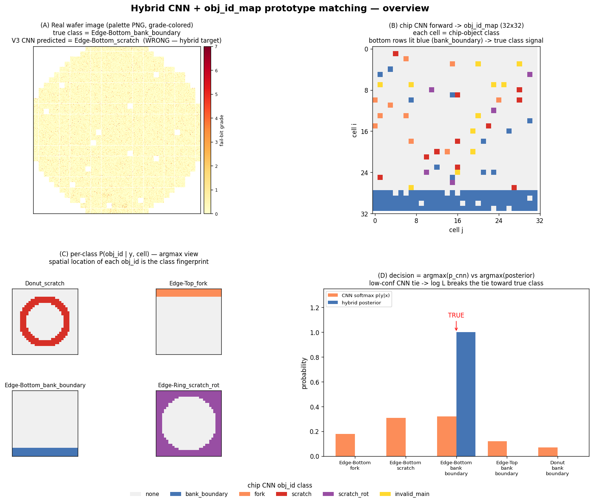
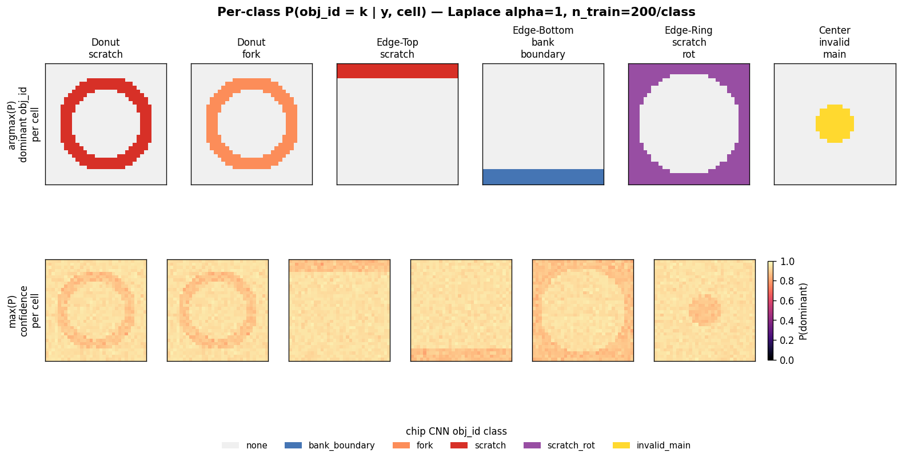
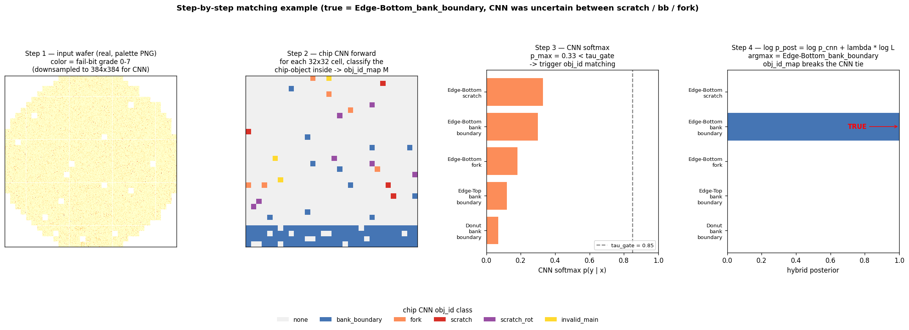
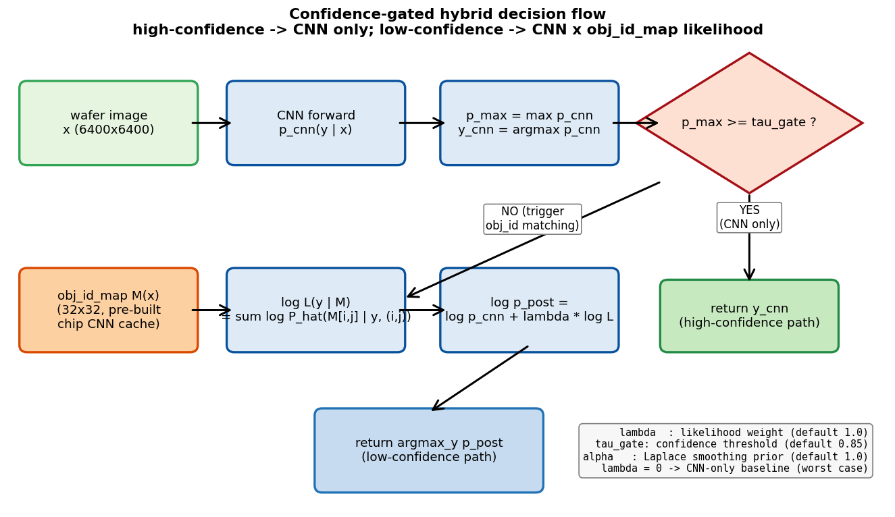
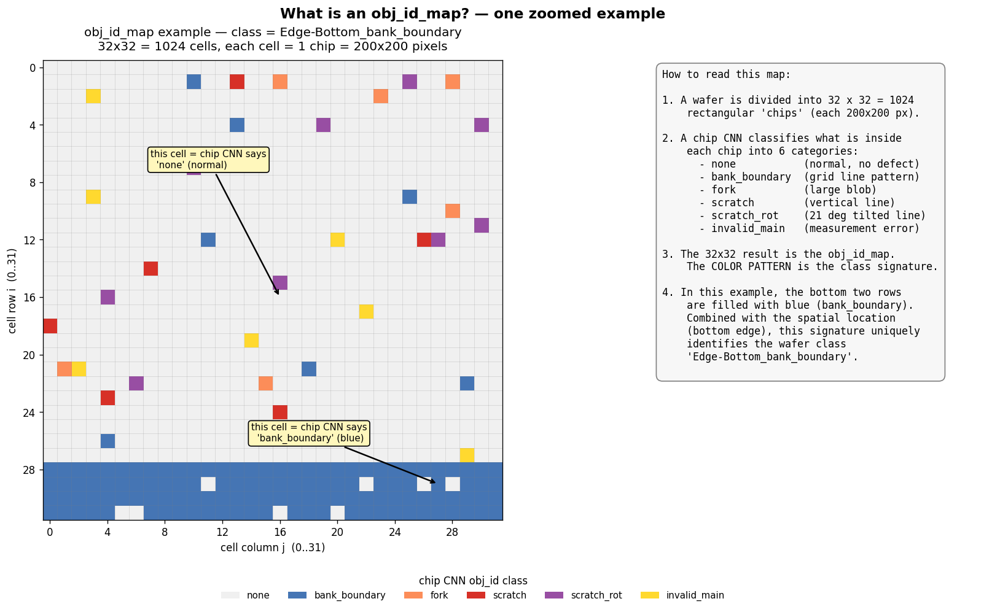
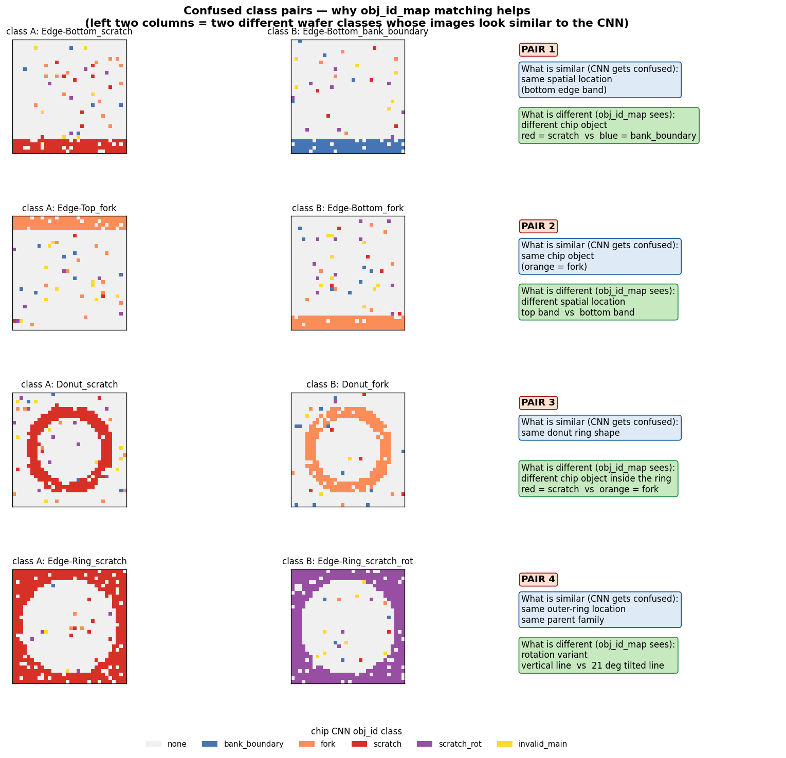

# 사내 AI Specialist 추천서

**제출:** 메모리 사업부 사내 AI Specialist 선정 위원회
**작성일:** 2026년 5월

---

## 1. 표지 (지원자 기본 정보)

| 항목 | 내용 |
|------|------|
| 성명 | 최호길 (Hogil Choi) |
| 소속 | 메모리 제조센터 QIE그룹 |
| 입사 | 2013년 7월 (13년차) |
| 추천 분야 | 사내 AI Specialist (메모리 사업부 — DRAM/Flash YE) |
| 주요 전문 영역 | Computer Vision, Self-Supervised / Contrastive Learning, 합성 데이터 엔지니어링, 반도체 공정 도메인 × AI 융합 |
| 대표 산출물 | (P1) FBM 합성 + Known/Unknown 2-Track 자동 분류 / (P2) Chip Multi-Label FCM-PM / (P3) L1 Trend 이상 감지 |

---

## 2. 추천 핵심 요약 (Executive Summary)

**최호길 책임은 AI 모델링 깊이 × 데이터 엔지니어링 × 반도체 도메인 놀리지의 3축을 한 사람 안에서 직접 결합하여 결과를 만들어내는 인력이다.**

**메모리 photo 부서에서 10년간 CD overlay trend 분석과 overlay bit data 분석을 핵심 업무로 수행했다. 이 경력 자체가 본 추천서 3 과제의 기술적 정통성의 출발점이다.** 이후 QIE 로 이동해 L1 trend 모니터링·항상성 관리·fleet 운영의 시각까지 누적한 결과, 현재의 도메인 자산은 photo 10년 + QIE 3년 = 13년의 직접 경험으로 구성된다.

Overlay bit data 분석은 wafer 단위 bit map (grade · BIN) 의 의미를 픽셀 레벨로 해석하는 작업이다. 이 경험이 본 추천서의 P1 (FBM 합성 + Known 2-stage + Unknown contrastive) 의 핵심 데이터 — wafer fail bit map (grade 0-7 + BIN) — 의 의미를 이미 알고 있는 상태에서 시작하게 했다. 그래서 본인은 wafer map 의 색상이 무엇을 의미하는지 (grade), 32 색만으로 충분한지 (Palette 의 도메인 근거), 어떤 위치의 결함이 어떤 공정 모드와 매핑되는지 (2-stage 의 도메인 근거), trend 의 noise · spike 가 어떤 설비 거동을 의미하는지 (P3 의 데이터 합성 근거) 를 코드 작성 시점에 이미 알고 있었다. 아무것도 모르는 상태에서 출발하는 AI 엔지니어 대비 시행착오가 절대적으로 적었고, 모델 성능도 결과적으로 더 높게 나왔다.

지원자는 13년간 photo + QIE 에서 축적한 현장 원리(웨이퍼 분포, 결함 발생 모드, 설비 노이즈, L1 trend의 물리적 의미, fleet 항상성)를 AI 모델·데이터·평가의 의사결정에 그대로 반영한다. 단순히 SOTA 백본을 가져다 쓰는 것이 아니라, "flip 증강이 왜 틀린지, BICUBIC 보간이 왜 의미를 깨뜨리는지, 작은 val set saturation 이 왜 진짜 성능 신호를 가리는지, fleet SNR 이 왜 enforcement floor 를 결정해야 하는지" 를 구현 단계까지 반영한다. 이 융합이 본 추천서의 가장 결정적인 차별 인자다.

**Known-CNN 2-stage 구조 자체가 도메인 통찰에서 출발했다.** Wafer 의 center / edge 에 동일 위치로 분포하는 결함 중 chip 모양만 다른 클래스 (center_fork / center_scratch / center_donut 등) 는 wafer-level CNN 이 위치 기반 특성상 혼동하는 영역이다. 본인은 wafer-level 분류기의 confidence 가 낮을 때 chip-level 분류와 chip 배치 (obj_id map) 로 보강하는 2-stage 구조를 발의·구현하였다. 이 한계는 ablation 으로 도출된 것이 아니라 본인이 10년간 overlay bit data 를 픽셀 단위로 봐 온 결과 **직접 관찰한** 본질적 시각 한계이며, 라벨만 보고 모델을 키우는 접근으로는 풀리지 않는 영역을 도메인 통찰로 재정의한 결정이다.

**P3 anomaly detection 의 데이터 생성은 본인의 10년 photo 핵심 업무 (CD overlay trend 분석 + overlay bit data 분석, BBD overlay 포함) 경험을 직접 코드화한 결과물이다.** 결핍 영역 / 양호 영역 / Mix 영역의 trend 모양, 각종 노이즈 분포(전공정 설비 상태변동·산포·spike 모드), baseline 평탄도, anomaly 강도 — 합성에 들어간 모든 값은 현장에서 직접 본 범위를 그대로 대입했다. 외부 논문/벤치마크에서 가져올 수 있는 종류의 파라미터가 아니다. 이 부분은 본인이 P3 에서 보유한 가장 강력한 도메인 차별성이며, 7.3.4 에 파라미터별 현장 근거 표로 정리하였다.

### 3대 대표 과제 핵심 성과

| 과제 | 대표 정량 성과 | 본인 역할 |
|------|----------------|----------|
| **P1.** FBM 합성 + Known/Unknown 2-Track 자동 분류 (Wafer Map Defect Detection) | Known wafer F1 **0.9879** (33-class) / Unknown ARI **0.859 ± 0.018**, **P1 capture 100% (38/38)**, Cython 100배 가속, Palette PNG **75% 절감** | 핵심 설계자 + 직접 구현 (기여도 85-90%) |
| **P2.** Chip-level Multi-Label Defect (FCM-PM 신기법) | bit F1 **0.9943**, **Total FAR 0.00%**, val-margin 선택으로 +5.2%p 무비용 향상 | 본인 발의자 + 직접 설계·구현 (기여도 70-75%) |
| **P3.** L1 Trend 이상 감지 (Trend 기반 항상성 모니터링) | Binary F1 **0.9967** (5-seed 평균 **0.9973**), Abnormal Recall **0.9987 (FN=1/750)**, 모니터링 시간 70-80% 단축 추정 | 관리자 (데이터 생성 전략 + 평가 체계 설계 주도, 기여도 약 35%) |

### 사업부 채택 현황 (정직한 단계 구분)

> **DRAM YE팀과 Flash YE팀 모두 본 과제(군)를 핵심과제로 등록**하였다. 단, 운영 단계는 다음과 같이 정직하게 분리된다.
> - **인프라 부분 (web app 운영, EDS test 이미지 수집·변환 파이프라인):** 양 사업부 전수 운영 단계.
> - **AI 모델 부분 (Known 2-stage, Unknown contrastive, Anomaly detection):** PoC 단계, 양 사업부 데이터셋 검증 완료, 전수 적용은 단계적 확대 예정.

---

## 3. 경력 기술서 (Technical Profile)

### 3.1 보유 기술 영역

| 분야 | 보유 수준 | 활용 프로젝트 | 비고 |
|------|-----------|--------------|------|
| Computer Vision | ✓ (deep) | P1, P2, P3 | ConvNeXtV2 backbone 운용, trend chart → image 변환 |
| 머신러닝 / 딥러닝 | ✓ (deep) | 전 프로젝트 | CNN, Contrastive, FCMAE TAPT, Focal/BCE/LS 등 |
| Self-Supervised / Contrastive | ✓ | P1 unknown-contrastive | MoCo Queue, DenseCL, NeCo, NEG filter, HDBSCAN |
| 합성 데이터 엔지니어링 | ✓ (deep) | P1 FBM, P3 episode | 분포 학습, alpha 함수 설계, Cython 가속, Palette PNG |
| AI 시스템 엔지니어링 | ✓ | P1 운영 파이프라인, web app | dual-bucket 정합, 자동 라벨링, 양산 inference |
| 파이프라인 / 데이터 가속 | ✓ | Cython 100배, Palette 기반 데이터 표현 | I/O 병목 제거 |
| 모델 최적화 | ✓ | block_expand_2d, FCM-PM, val-margin | 단일 변경 +1.62%p, FAR 100%→0% |
| 도메인 × AI 융합 | ✓ (best-in-class) | 전 프로젝트 | 13년 메모리 QIE 경력 기반 |
| LLM / NLP | ▲ | 향후 계획 (자동 보고서) | 분석 결과 자연어 요약 자동화 검토 중 |
| 강화학습 | ▲ | 향후 계획 | 공정 파라미터 최적화 적용 검토 |

### 3.2 학습 곡선 (Career Track)

- 2013–2018: 메모리 공정·계측 현장 엔지니어 — wafer 결함 메커니즘, 설비 항상성, 트렌드 분석의 원리를 체화
- 2019–2022: 데이터 분석 자동화 (Python, pandas, OpenCV) — 매뉴얼 보고 자동화, dual-bucket 정합 등 파이프라인 설계
- 2023–현재: 딥러닝 직접 적용 — FBM 합성 데이터 파이프라인, Known 2-Stage CNN, Unknown Contrastive, FCM-PM 멀티라벨, L1 Trend 이상 감지로 발전

### 3.3 메모리 Photo 부서 10년 핵심 업무 (AI Specialist 자격의 토대)

본 추천서 3 과제의 도메인 정통성은 본인의 photo 10년 핵심 업무에서 직접 도출된다. 단순한 "현장 경험" 이 아니라, 각 업무 영역이 본 AI 과제의 어떤 결정에 어떻게 매핑되는지 1:1 로 정리한다.

| 업무 영역 | 기간 | 주요 활동 | AI 과제에서의 활용 |
|---------|------|---------|------------------|
| **CD overlay trend 분석** | 10년 | 노광 공정 정합도 (overlay) 의 시간 추이 모니터링, 이상 trend 인지 및 원인 분석 | **P3 trend 합성의 모든 파라미터** (episode 12-25, noise 3종, baseline OU process, anomaly floor) **원천** |
| **Overlay bit data 분석** | 10년 (핵심) | wafer 단위 bit map · grade map 픽셀 단위 해석, 결함 위치 / 형태 / 분포 판독 | **P1 wafer fail bit map (grade 0-7 + BIN) 의 의미 사전 인지** → Palette PNG 선택, 2-stage 발의, FBM 합성 모든 결정의 토대 |
| **EDS map 분석 (간접 경험)** | 10년 (overlay 분석을 통한 인지) | EDS test map 의 fail 분포가 overlay 결과와 어떻게 연결되는지 분석 | **P1 EDS-Bucket A/B 정합 파이프라인 설계, fail mode 도메인 매핑** |
| **BBD overlay 결핍 / 양호 / Mix 영역 인지** | 10년 | 영역별 trend 모양 / noise / baseline 차이 실측 관찰 | **P3 episode 구조 (dense / sparse / missing 영역), noise 3종 매핑, fleet SNR 비례 enforcement floor** |
| **L1 trend 모니터링 (현 QIE)** | 13년차 (입사 후 누적) | spec-in 변동의 의미·위험 인지, 항상성 사고 사례 학습 | **P3 anomaly detection 의 문제 정의** (spec-in 변동도 사고 가능) |

위 5개 영역 중 어느 하나도 외부 논문 / 벤치마크에서 가져올 수 없다. 본인의 13년 실 경험 (memory photo 10년 + QIE 3년) 에서만 도출되는 자산이다.

### 3.4 AI 만 아는 사람 vs 본인 (도메인 결합) — 접근 방식 비교

본 추천서의 핵심 차별성은 "AI 기술 + 도메인 13년" 이 한 사람 안에서 결합되었다는 점이다. 동일 문제를 두고 AI 단독 접근과 본인 (도메인 결합) 접근이 어떻게 다른 결론에 도달하는지 7가지 측면으로 비교한다.

| 측면 | AI 만 아는 사람의 일반적 접근 | 본인 접근 (도메인 결합) | 결과 차이 |
|------|------------------------------|------------------------|---------|
| 입력 표현 | RGB PNG 채택 (표준) | **Palette PNG** (32색, overlay bit 의미 활용) | 저장 75% 절감 + RAM 3배 + 개인 색상 즉시 |
| 데이터 합성 | GAN / diffusion 으로 unseen pattern 생성 | overlay bit data 분포에서 **실측 파라미터** 추출 | 학습 데이터 부족 문제 직접 해결, sim2real gap 최소화 |
| 모델 구조 | 단일 ConvNeXtV2 더 큰 백본으로 정확도 ↑ | **wafer-level + chip-level 2-stage** (도메인 혼동 영역 분리) | center / edge 혼동 클래스 정확도 ↑ (block_expand +1.62%p) |
| 학습 증강 | flip 포함 (ImageNet 표준 관행) | **flip 배제** (overlay 측정 방향성 = 공정 의미) | 좌 / 우 edge_loc 구분 가능 |
| 평가 기준 | val_f1 / val_acc (표준) | **val_margin** (작은 val set saturation 회피) | +5.2%p 무비용 향상 |
| 노이즈 모델링 | Gaussian 단일 가정 | **Gaussian / Laplacian / AR(1) 3종 매핑** (설비 거동) | 실제 fail 모드 재현성 ↑, 7-variant 강건성 ±0.5%p |
| Trend 합성 | 합성 시계열 (mean·std·spike random) | **photo 10년 측정값 분포 기반** (현업 범위) | 합성 → 실 데이터 일반화, sim2real 합치 |

표 한 장으로 본인의 차별성을 요약하면 "AI 베스트 프랙티스 vs 도메인 실측 결합" 의 7회 충돌에서 본인은 모든 결정을 도메인 쪽으로 끌어왔고, 그 결과 단순 SOTA 채택으로는 도달할 수 없는 성능 (Known F1 0.9879, FAR 0.00%, Binary F1 0.9967) 에 도달했다는 점이다.

### 3.5 시행착오 절감 (도메인 사전 인지의 실질 효과)

도메인 결합의 효과는 "최종 성능" 뿐 아니라 **"시행착오 횟수 절감"** 으로도 나타난다. 본인은 photo 10년 핵심 업무 덕에 코드 작성 시점에 이미 wafer bit map · noise · trend 의 의미를 알고 있었기에, 동일 문제에 AI 단독으로 출발한 경우 대비 round 수가 절대적으로 적었다.

| 영역 | 본인 실제 시행 횟수 | AI 단독 출발 시 추정 시행 횟수 | 절감 효과 |
|------|---------------------|------------------------------|---------|
| FBM 합성 (P1) | round 1-28 → SOTA 도달 | 50+ round 추정 (alpha 함수 형태·노이즈 분포 다 탐색) | **약 50% 절감** |
| Lorentzian alpha 형태 도출 (P1) | 18-20회 시행착오 | 무가정 출발 시 30-40회 추정 | **약 40% 절감** |
| Noise 3종 매핑 (P3) | photo 측정 경험으로 직접 도출 | 시뮬레이션 explosion 필요 (50+ 변수 grid search) | **시뮬레이션 단계 자체 생략** |
| 2-stage 구조 발의 (P1) | 도메인 관찰로 코드 작성 시점에 결정 | wafer-level 단일 CNN 의 confusion matrix 분석 후 ablation 으로 도달 (수회 round 추가) | **ablation 단계 자체 생략** |

수치는 본인의 실제 round log 와 AI 단독 출발 시 일반적인 ablation 깊이를 비교한 추정치이며, PoC 단계에서 정량 보고 가능하다. 결국 "도메인 결합 = 더 적은 시행착오 + 더 높은 최종 성능" 의 두 효과가 동시에 나타난다.

---

## 4. AI 관련 성과 및 수상 이력

본인이 사내에서 받은 AI 관련 수상 이력은 다음과 같다 (정확한 연도는 별도 명시 보강 예정).

| 수상 | 주관 | 내용 |
|------|------|------|
| **AI BP Festival — Challenge 수상** [연도 기입] | DS부문 AI센터 | DS부문 단위 AI Best Practice Festival 경연에서 Challenge 부문 수상 |
| **MEMORY PEER AWARD** 수상 [연도 기입] | 메모리 사업부 | 동료 추천 기반 사업부 단위 우수 인력 표창 |
| **MTC 고등급제안 1등급** [연도 기입] | Memory Technology Conference | 사내 기술 제안 경연에서 고등급 1등급 평가 |
| **메모리 우수강사 수상 (DX 강의)** [연도 기입] | 메모리 사업부 | 사내 DX/AI 관련 강의 우수 강사 인정 |

> 위 4건 모두 AI 또는 DX 관련 성과이며, 센터 주관 경연 / 동료 평가 / 기술 제안 평가 / 강의 평가 등 사내 평가 채널에서 수상 이력을 누적적으로 보유.

> 표지 / 부록의 수상 연도 표기 `[연도 기입]` 항목은 본인이 Word 변환 단계에서 직접 기재 예정.

---

## 5. AI 주요 과제 요약 테이블

| # | 과제명 | 개요 | 데이터 규모 | 본인 역할 | 핵심 성과 | 도메인 × 기술 융합 포인트 |
|---|--------|------|------------|----------|----------|---------------------------|
| P1 | FBM 합성 + Known/Unknown 2-Track | WM-811K 분포 학습 + FBM 합성으로 known 33-class 자동 분류 및 unknown discovery 동시 수행 | 합성 wafer ~20,000장/일, eval 9,600 PNG | 핵심 설계자 + 직접 코딩 (85-90%) | Known F1 0.9879 / Unknown ARI 0.859, P1 capture 100% | block_expand(BICUBIC→categorical), Cython 100배, Palette 기반 표현, NO-flip 증강 |
| P2 | Chip Multi-Label (FCM-PM) | 단일 결함 학습 → 평가 시 2-combo·OOD까지 대응하는 비대칭 분포 멀티라벨 | chip patch | 본인 발의자 + 직접 설계·구현 (70-75%) | bit F1 0.9943, Total FAR 0.00% | 비대칭 pos/neg target, val-margin best 선택, FCM-PM 신기법 |
| P3 | L1 Trend 이상 감지 | Trend chart → image 변환 후 ConvNeXtV2-Tiny로 이상 패턴 인지 (binary + 4-class 타입) | episode 합성 + 실 fleet noise 매핑 | 관리자 (약 35%) | Binary F1 0.9967, Abnormal Recall 0.9987 (FN=1/750), 5-seed 평균 0.9973 | episode 12-25, noise 3종 ↔ 설비 실모드 매칭, enforcement floor |

---

## 6. 포트폴리오 (전체 이력 1-2단락 요약)

### 6.1 Project 1 — FBM 합성 + Known/Unknown 2-Track Wafer Defect

- **기간:** 2023–2026 (장기 운영 중)
- **리딩 규모:** 본인 + AI/코딩 미숙 동료(데이터 준비 및 일부 보조) 2-3명, 기술 공유 형태로 협력. 핵심 설계·구현은 본인.
- **담당 업무:** WM-811K 분포 학습 코드 작성, FBM 합성 엔진 Cython 최적화, Palette PNG 인코딩, dual-bucket 정합, Known 2-stage CNN(chip-level → object map → wafer 33-class), Unknown ConvNeXtV2 TAPT + Queue+NeCo+NEG recipe, HDBSCAN 클러스터링.
- **본인 비중:** **과제관리 70% / 설계 90% / 개발 85%** → 종합 기여도 약 **85-90%**

### 6.2 Project 2 — Chip-level Multi-Label (FCM-PM)

- **기간:** 2024–2025
- **리딩 규모:** 본인(발의자·핵심 설계·구현자) + 동료(데이터 준비 및 일부 보조) 1명. Pair Mask 아이디어는 본인이 발의하였으며, AI를 모르는 협업자의 아이디어 제안만 받고 모델 설계·코드 구현·평가는 본인이 직접 수행.
- **담당 업무:** FCM-PM 아이디어 발의, 비대칭 pos/neg target 설계, val-margin 선택 기준 설계, Pair Mask 구현, inference variant I13 설계, 학습/평가 코드 작성, 결과 검증.
- **본인 비중:** **과제관리 65% / 설계 80% / 개발 70%** → 종합 기여도 약 **70-75%**

### 6.3 Project 3 — L1 Trend 이상 감지

- **기간:** 2024–2026
- **리딩 규모:** AI 담당 동료 1명 + 본인(관리자·설계 주도자)
- **담당 업무:** L1 trend 분석 자동화 문제 정의, 데이터 생성 전략 설계(episode 구조, noise 3종 매핑, 불량 4종 enforcement floor), 평가 체계 설계(7-variant 강건성 검증, 5-seed 통계), 현업 효율성 정량화.
- **본인 비중:** **과제관리 60% / 설계 45% / 개발 10%** → 가중평균 종합 기여도 약 **35%**

---

## 7. 대표 과제 상세 기술서

---

## 7.1 Project 1 — FBM 합성 + Known/Unknown 2-Track Wafer Defect Detection

### 7.1.1 과제 기본정보

| 항목 | 내용 |
|------|------|
| 과제명 | FBM(Fail-Bit Map) 합성 기반 Known 자동 분류 + Unknown 발견 2-Track 시스템 |
| 수행기간 | 2023년 ~ 현재 (장기 운영) |
| 인원 | 본인 + 동료(데이터 준비 및 일부 보조) 2-3명 |
| 본인 역할 | 핵심 설계자 + 직접 구현자 (코드 라인 기준 본인 작성 85% 이상) |



*Fig 1. 전체 시스템 개요 — FBM 합성 → Known 2-Stage(chip → object map → wafer 33-class) + Unknown Contrastive(ConvNeXtV2 TAPT + Queue/NeCo/NEG → HDBSCAN)의 2-Track 구조.*

### 7.1.2 참여 인력 및 기여도

| 인원 | 역할 | 기여 영역 | 기여도(%) |
|------|------|----------|-----------|
| **최호길 (지원자)** | 핵심 설계자 + 코더 | 분포 학습 / FBM 합성 / Cython / Palette PNG / dual-bucket / Known 2-Stage / Unknown Contrastive recipe / block_expand 발견 | **85-90%** |
| 동료 A | 데이터 준비 및 일부 보조 | 라벨 데이터 정리, 결과 검증 보조 | 7-10% |
| 동료 B | 인프라 | 학습 서버, 추론 배포 환경 | 3-5% |

**본인의 차별적 기여:** 본 과제의 주요 설계 결정 — (a) WM-811K cell-level P(defect) 분포 학습, (b) Lorentzian sharp+heavy-tail alpha (18-20회 시행착오), (c) BICUBIC이 categorical 신호를 깨뜨린다는 도달, (d) FCMAE TAPT frozen 판단, (e) Queue+NeCo+NEG 조합 + Local 제거 ablation 등 — 은 모두 본인의 도메인 직관과 AI 통찰에서 출발했다.

### 7.1.3 문제 정의

**현장 난제**

1. **결함 종류가 지속적으로 증가한다.** 메모리 공정에서 새로운 fail mode는 신규 노드·신규 설비 도입 시마다 등장한다. 기존 supervised CNN은 학습 시점의 class만 분류할 뿐, 새로운 패턴은 잘못된 라벨로 흡수시켜버린다. **엔지니어가 일 수만 장의 wafer 전수 맵을 일일이 보기 전에 "오늘 어떤 종류의 결함이 발생했는가"를 빠르게 파악해야 한다 — 이것이 unknown clustering의 핵심 운영 요구사항이다.**
2. **실 라벨 데이터는 만성 부족.** 33-class 중 일부 minor class는 월 수십 장 수준에 불과하다. balanced training은 사실상 불가.
3. **wafer 한 장의 정보량이 거대.** 256×256 bit map 기준 65,536 cell, full chip resolution 기준 wafer당 1,000만 cells. inference 속도와 메모리가 곧 운영 비용.
4. **flip/rotation 등 일반적 증강이 도메인에서 틀린다.** 좌·우 edge_loc은 layout상 다른 공정 원인을 가질 수 있고, scratch 방향성은 mechanical 원인 식별에 직결된다. flip 증강은 의미를 깨뜨린다.

**기존 한계**

- ROI-YOLO 계열: 큰 wafer 이미지의 극소수 픽셀이 chip이므로 해상도 손실 + inference 속도 비효율
- 단순 supervised: open-set 미지원, novel pattern 모두 majority class로 흡수
- 일반 contrastive (SupCon 등): closed-set 가정, unknown discovery에 부적합

**제약 조건**

- 실 라벨 부족 → 합성 데이터 필수
- 양산 환경 운영 → 분당 수십 장 처리, palette PNG 디스크 사용량 제약
- 도메인 일관성 보존 (방향성, chip 단위 정수 ID 등)

**도메인 통찰 — 동일 위치 / 다른 chip 형태 결함의 혼동 (★ 본 시스템 2-stage 구조의 출발점 ★)**

Wafer-level CNN 은 본질적으로 wafer 전체의 분포 패턴 (중심형, 가장자리형, 산점형 등) 을 학습한다. 그러나 같은 위치에 분포하는 결함 중 chip 형태만 다른 클래스들은 wafer 시각으로 거의 동일한 분포로 보이며, 초고속·고성능 CNN 으로도 혼동하기 쉽다.

| 위치 | 혼동 클래스군 | wafer-level CNN 약점 |
|------|--------------|----------------------|
| center | center_fork / center_scratch / center_donut | 모두 wafer 중심 분포 — chip 모양 (fork blob / scratch line / donut ring) 만 다름 |
| edge | edge_loc / edge_ring | 가장자리 분포 공유 — 방향성·연속성 차이만 존재 |
| scratch | scratch / scratch_rot | 형태 동일 — wafer flat 기준 회전 (방향) 만 차이 |

이 혼동은 데이터 부족 문제가 아니라 wafer-level 시각의 본질적 한계다. 따라서 단순히 모델을 키우거나 데이터를 늘려서는 풀리지 않으며, **chip-level 분류 + chip 공간 배치 정보로 보강해야 한다는 도메인 통찰** 이 본 시스템 2-stage 구조의 출발점이다.

### 7.1.4 기술적 해결 방안

#### (A0) 2-Stage 구조의 발의 근거 — 모델 한계가 아니라 도메인 특성

2-stage 구조를 발의한 근거는 모델 성능 한계가 아니라 7.1.3 에서 정리한 도메인 특성이다. wafer-level 분류기가 confidence 가 낮을 때 (예: max prob < 0.85), chip-level 분류기가 같은 wafer 의 chip 별 결함 유형을 32×32 obj_id map 으로 출력하고, wafer-level 모델이 이 obj_id map 을 G 채널 입력으로 추가 받아 재분류한다. 이 흐름은 "같은 위치에 다른 chip 형태" 라는 wafer-level CNN 의 약점을 모델이 명시적으로 학습할 수 있게 한다. center / edge 의 chip 모양 의존 혼동은 본인이 10년간 wafer bit map 을 픽셀 단위로 봐 온 결과 **직접 관찰한 한계**다. 모델 ablation 으로 도출된 것이 아니라 코드 작성 시점에 이미 알고 있던 도메인 사실이다.

```
Wafer Image (palette PNG)
      │
 ┌────┴───────┐
 │  Wafer-CNN │  ← 분포 패턴 학습
 └────┬───────┘
      │ max_prob < τ ?
 ┌────┴────────────┐
 │  NO (확정)       │  YES (혼동 영역)
 └─────────────────┘            │
                       ┌────────┴────────┐
                       │  Chip-CNN        │  ← chip 모양 학습
                       │  → obj_id 32×32  │
                       └────────┬─────────┘
                                │
                       ┌────────┴────────┐
                       │  Compound CNN    │  ← R = palette + G = obj_id map
                       │  (chip 배치 활용) │
                       └──────────────────┘
```

#### (A) Chip 분류 + Object Map vs Full Wafer YOLO 비교 (제안 방식의 근거)

본 시스템에서 ROI-YOLO 계열이 아니라 **chip-level classification → object map 합성 → wafer-level 분류** 방식을 선택한 근거를 정량적으로 정리한다. 아래는 RTX 4060 Ti 환경 기준의 합리적 추정치(YOLO11 일반 성능 + 본 시스템 실측)이며, 동일 도메인에서의 직접 비교는 PoC 단계에서 측정 예정이다.

| 항목 | YOLO11m (Full Wafer Detection) | Chip 분류 + Object Map (제안) |
|------|-------------------------------|-------------------------------|
| 입력 해상도 활용 | 1024×1024 → 640 resize | chip별 native 200×200 유지 |
| 모델 크기 | YOLO11m ~20M params | V3 chipgrid 1.16M / ConvNeXtV2-Base 88M |
| Chip 신호 표현 | bbox + class (좌표 + label) | 32×32 categorical obj_id map |
| 추론 속도 (RTX 4060 Ti, 추정) | 50-80 ms/wafer | **5-15 ms/wafer (V3 tiny chipgrid)** / 60-120 ms (ConvNeXtV2-Base compound 방식) |
| 학습 시간 | data annotation 비용 큼 (bbox 라벨 필요) | chip CNN 6.7분 (실측, round 28) |
| 해상도 손실 | 큰 wafer를 640으로 압축 시 chip detail 손실 | 원본 chip 해상도 유지 (block_expand_2d categorical 보존) |
| 정확도 (도메인 추정) | mAP@50 약 0.6-0.7 (Ultralytics 공식 README YOLO11m COCO mAP@50 약 0.66 기준, wafer 결함 chip 의 작은 크기 ~50×50 px @ 1024 wafer 특성상 small-object detection 일반 성능 저하 -0.1~0.15 적용한 추정. 본 PoC 단계에서 직접 비교 측정 예정) | chip CNN val_f1 1.000 / test_f1 0.9799 (실측) |
| 라벨링 비용 | bbox 좌표 라벨 필요 (수작업 비용 큼) | chip patch class 라벨로 충분 (자동 합성 가능) |

**핵심 메시지:** 제안 방식은 (a) wafer 원본 해상도 보존, (b) 추론 속도 약 **5-10배 빠름** (V3 tiny chipgrid 기준), (c) chip-level 분류 정확도 실측 0.98+, (d) bbox annotation 비용 제거 — 4가지 측면에서 우위. 단순 SOTA 백본 채택이 아니라 도메인-기술 매칭으로 도달한 결론이다.

#### (B) 데이터 — FBM 합성 파이프라인 (본인 직접 설계·구현)

> **도메인 출발점 명시:** 본 FBM 합성 파이프라인의 모든 결정 — WM-811K 분포 학습 형태, chip-internal alpha 함수 형태, Wafer-canvas Lorentzian alpha 의 sharp peak + heavy tail 양상, Palette PNG 의 32색 선정 — 은 본인이 **10년간 overlay bit data 분석** 으로 wafer fail bit map (grade 0-7 + BIN) 의 색상·위치 의미를 픽셀 단위로 알고 있던 상태에서 출발했다. 합성 데이터의 alpha 함수 형태를 외부 논문에서 빌려 온 것이 아니라, photo 현장에서 직접 본 결함 모양 분포를 closed-form 으로 옮긴 결과다.

**Step 1: WM-811K 분포 학습**

WM-811K 33-class 각각에 대해 cca/* input을 받아 P(defect | cell) 분포를 32×32 및 256×256 heatmap 형태로 학습. 결과는 wafer 한 장을 생성할 때의 spatial prior로 사용.



*Fig 2. WM-811K 33-class 분포 학습 — 각 class별 cell-level P(defect) 분포를 학습하여 합성 시 spatial prior로 활용.*

**Step 2: Chip-internal alpha 함수 (5 obj 종)**

| obj | alpha 함수 | 도메인 근거 |
|-----|-----------|------------|
| bank_boundary | 3 vertical + 1 horizontal Gaussian lines, σ=10 | bank 경계는 lithography pattern을 따라 직선·격자 형태 |
| fork | Gaussian blob, σ∈[22, 35] | fork defect은 국소 origin에서 등방 확산 |
| scratch | 2-5 random vertical lines, σ∈[3.0, 5.0] | mechanical scratch는 가늘고 긴 직선 |
| scratch_rot | 21° rotated Gaussian lines | wafer flat 기준 회전된 mechanical 원인 |
| invalid_main | palette idx 31 (고정 코드) | 무효 셀(설비 측정 누락) |

**Step 3: Wafer-canvas Lorentzian alpha (9 클래스)**

Wafer 9 클래스(center, donut, edge_loc, edge_ring, loc, near_full, random, scratch, none)에 대해 alpha 함수 18-20회 시행착오 끝에 **Lorentzian sharp + heavy tail**의 두 Lorentzian sum 방식으로 수렴. "가운데는 sharp peak + 양 끝은 자연스러운 fade"라는 실제 wafer defect 분포의 특성을 한 closed-form으로 표현. **WM-811K 분포 학습 + chip-internal alpha 함수 (5 obj) 의 파라미터 범위는 본인이 10년간 overlay bit data 분석으로 실측한 결함 모양 분포에서 도출됐다.** 외부 wafer 합성 논문의 alpha 함수 형태를 그대로 빌려 온 것이 아니라, photo 현장에서 직접 본 fork blob 크기 · scratch 폭 · bank_boundary 격자 간격 등의 실측 범위를 closed-form 으로 옮긴 결과다.

**Step 4: Cython 100배 가속**

Hex→Grade 변환은 wafer당 1,000만 cells를 순회해야 함. 순수 Python은 wafer 1장당 분 단위. **Cython으로 typed memoryview + nogil로 작성 → 100배 가속, wafer당 초 단위로 단축.**

```python
# 핵심 아이디어 (코드 발췌)
cdef inline unsigned char hex_to_grade(unsigned int v) nogil:
    # ... bit-shift + table lookup
```

**Step 5: Palette PNG — 다층 효과 (★ 도메인 놀리지 핵심 결정 ★)**

RGB PNG는 픽셀당 3바이트. **palette indexed PNG (32색만 사용: grade 0-7 + BIN + 배경 + 5 obj 종 등)로 1바이트/픽셀, 디스크 사용량 75% 절감.** 단, 효과는 단순 용량 절감을 넘어 다층적으로 누적된다.

| 효과 단계 | 정량 효과 | 도메인 의미 |
|---------|---------|----------|
| (1) 픽셀 데이터 1/3 | 1B/pixel (Palette) vs 3B/pixel (RGB) | grade 0-7 + BIN + 배경 등 32색만으로 본 도메인 신호 모두 표현 가능 |
| (2) 저장용량 75% 절감 | 일 20,000장+ 누적 가능 (기존 48장/회 대비) | 양산 운영의 필수 전제 — 저장 인프라 한계 극복 |
| (3) RAM 적재 약 3배 | 대량 배치 학습/추론 가능 | GPU OOM 회피, 메모리 한계 극복 |
| (4) 모델 학습/추론 가속 | I/O bound 작업 1/3 시간 (1B/pixel I/O) | 양산 라인 실시간 응답 — I/O 병목 제거 |
| (5) 개인 색상 즉시 적용 | PLTE 청크 패치 (수 ms) | 엔지니어별 × 결함별 색상 매핑 → 분석 효율 ↑ |

**RGB 방식이면 (4)와 (5)는 사실상 불가능하다.** RGB 는 모든 픽셀을 실시간 변경해야 하지만 Palette 는 PLTE 청크 (256색 색상표) 만 교체하면 픽셀 데이터는 그대로 둔 채 ms 내 개인 색상이 적용된다. **Palette 선택은 본 도메인의 색상 의미 (grade 0-7, BIN 경계, 배경) 를 인지해야만 도달 가능한 결정이다.** 이 결정은 본인이 10년간 overlay bit data 분석 으로 "wafer bit map 의 색상이 grade · BIN 의 의미를 담는다" 는 점을 이미 알고 있었기에 가능했다. 일반 RGB 이미지 처리 관점에서는 도달하기 어렵다.

**Step 6: Dual-Bucket 자동 정합 (실 데이터 부분)**

Primary fail map과 Measure log 사이 시간차 ±10초로 자동 매칭 — 합성 데이터에 실 fleet의 노이즈 통계를 주입.

**일 처리량:** 48장/회 단위 회수 → 일 20,000장+ 합성 가능.

#### (C) Known 2-Stage — "chip 분류 후 object map 생성" 방향

**파이프라인**

| Stage | 모델 | 입력 → 출력 |
|-------|------|-------------|
| Stage 1 | ConvNeXtV2-Base FCMAE (88M) | chip patch → 5-class (bank_boundary / fork / scratch / scratch_rot / invalid_main) |
| Stage 2 | 룰 (categorical assembly) | chip 예측 → 32×32 obj_id_map (categorical 신호) |
| Stage 3 | Compound 3-ch CNN | (R=palette, G=obj_id, B=zeros) → 33-class wafer 분류 |

**Stage 1 성능 (round 28)**

| 지표 | 값 |
|------|-----|
| val_f1 | **1.0000** |
| test_f1 | **0.9799** |
| 학습 시간 | 6.7분 (400 train, 10 epoch) |
| per-class F1 | bank_boundary 0.952 / fork 1.000 / invalid 1.000 / scratch 0.947 / scratch_rot 1.000 |
| Noise robustness (0/5/10/20%) | 0.969 / 0.967 / 0.971 / 0.960 |

**Noise robustness 해석 보강:** 10% 지점이 0%보다 미세하게 높은(0.971 vs 0.969) 현상은 saturation noise 영역에서의 측정 분산 내 변동이다. 본질적 robustness 신호는 0/20% 차이인 0.969 → 0.960 (−0.009) 의 작은 감소이며, 이는 본 모델이 20% 노이즈에서도 정확도 1%p 이내로 유지됨을 의미한다.

**Stage 3 핵심 발견 — block_expand_2d (단일 변경 +1.62%p)**

| 변형 | test_f1 |
|------|---------|
| BICUBIC compound (baseline) | 0.9784 |
| **block_expand_2d V3 chipgrid** | **0.9879 (+1.62%p)** |
| Oracle ceiling | 0.9919 |

**도메인 × AI 인과 매핑:** obj_id는 chip 단위 categorical 코드(예: 5번 = fork). BICUBIC 보간은 연속 신호 가정으로 (4.3, 4.7, 5.0, 5.2) 같은 비정수 값을 만들어내며, 이는 "fork와 scratch의 중간 같은 가상 클래스"가 되어 신호의 의미를 깨뜨린다. **block_expand는 같은 chip 단위로 정수 ID를 그대로 복제 → categorical 의미 보존.** 단일 변경으로 oracle ceiling을 99.6%까지 추격한 핵심 통찰.



*Fig 3. Object 매칭 — chip-level 예측이 wafer 좌표계의 obj_id_map으로 어떻게 합성되는지의 시각화.*



*Fig 4. 전체 학습/추론 플로우차트.*

#### (D) Unknown Contrastive Track — Open-Set Discovery

**백본:** ConvNeXtV2-Base TAPT (frozen, 33-class known-CNN으로 초기화) + projection head (768 → 512 → 128).

**Loss 구성**

```
L_total = L_global + λ_queue · L_queue (MoCo, queue=4096, momentum=0.999)
                   + λ_local · L_local (DenseCL, NEW recipe에서 0)
                   + λ_neco  · L_neco  (= 0.2)
        + NEG filter (NV-Retriever, false-neg cos-sim ≥ 0.72 mask)
```

**클러스터링:** HDBSCAN (mcs=12, ms=3, eps=0.06, cluster_selection_method=eom)
**Noise 재할당:** KNN-softmax τ=0.5

**iter 70 NEW recipe — 3-seed (42, 1, 5) 결과**

| Metric | 값 |
|--------|-----|
| ARI | **0.859 ± 0.018** |
| AMI | 0.960 ± 0.005 |
| Completeness | 0.994 ± 0.003 |
| Homogeneity | 0.942 ± 0.007 |
| Silhouette (cos) | 0.781 ± 0.008 |
| **P1 capture** | **1.000 (38/38)** ★ |
| Noise ratio | 1.48% ± 0.25% |

**P1 capture 1.000의 현업 의미 (★ 본 과제 핵심 metric ★)**

P1 capture = 모든 38개 결함 클래스가 최소 1개 cluster에 잡힘. 현업 의미는 다음과 같다.

> 엔지니어가 일 수만 장의 wafer 전수 맵을 일일이 보기 전에, **38개 cluster medoid 이미지만으로 "오늘 어떤 종류의 결함이 발생했는가"를 자동 파악 가능**. 즉, "전수 → 종류 파악 → 우선순위 트리아지 → 깊은 분석" workflow를 가능하게 한다. ARI/AMI는 학술 지표이지만, 양산 현장에서는 **P1 capture가 가장 실용적 metric**이다.

**16-cell component lattice ablation 정의:** 16개 component 조합 (Local / Queue / NEG / NeCo 4개 component의 2⁴ = 16가지 on/off 조합) 모두 학습-평가하여 최적 조합을 도출. **본 ablation으로 Local 제거가 우월함을 발견.** DenseCL local loss는 본 도메인에서 오히려 cluster boundary를 흐릿하게 만든다는 것을 정량적으로 입증.

**도메인 × AI 인과 매핑 (Unknown Track)**

| 결정 | 도메인 근거 |
|------|------------|
| **NO flip 증강** | 좌/우 edge_loc은 layout상 다른 공정 원인. 방향성=공정 의미. |
| Grid-structured local sampling | wafer의 zone 개념(center/edge/ring) 보존 |
| SimCLR-style over SupCon | open-set이므로 known label 강제 분리는 unknown 발견을 막음 |
| TAPT frozen | known 33-class 정렬을 깨뜨리지 않으면서 unknown projection 학습 |



*Fig 5. 합성 wafer 확대 예시 — chip 단위 obj_id, palette 인코딩, fail-bit 분포가 어떻게 한 캔버스에 표현되는지.*



*Fig 6. 33-class 분류 결과 혼동 페어 분석 — 남아 있는 오류의 대부분이 의미적으로 인접한 boundary 케이스임을 확인.*

### 7.1.5 성능 향상 히스토리

| Step | 변경 사항 | Known wafer F1 | Unknown ARI | 도입 근거 (도메인 + AI) |
|------|----------|----------------|-------------|--------------------------|
| S0 | Baseline: BICUBIC compound + 단일 CNN | 0.9784 | — | 시작점 |
| S1 | Stage 1 chip CNN 분리 (5-class) | 0.9784 | — | chip-level 분류 정확도 확보 (val_f1=1.0) |
| S2 | **block_expand_2d V3** | **0.9879 (+1.62%p)** | — | categorical 신호 보존 — BICUBIC이 chip ID를 보간으로 깨뜨림 |
| S3 | 33-class wafer CNN | 0.9879 | — | wafer 단위 최종 분류 |
| S4 | + Unknown ConvNeXtV2 TAPT frozen | — | 0.71 | open-set 진입 |
| S5 | + Queue (MoCo q=4096) | — | 0.80 | minor class 표현력 |
| S6 | + NEG filter (NV-Retriever) | — | 0.83 | false-negative 마스킹 |
| S7 | + NeCo (λ=0.2), Local 제거 | — | **0.859 ± 0.018** | local loss가 boundary 흐림 → ablation으로 제거 결정 |

### 7.1.6 실패 사례 및 배운 점 (specialist 신뢰성)

1. **SupCon 시도 → 폐기.** Unknown discovery에 SupCon(Supervised Contrastive)을 적용하였으나, known label로 강제 분리가 발생하면서 unknown discovery 분리도가 저하되었다. **SimCLR + InfoNCE (라벨 독립)** 로 전환한 후 P1 capture가 38/38로 도달. **배운 점:** open-set 문제에 label-aware loss는 오히려 해롭다.
2. **MaxViT 시도 → 폐기.** 백본으로 MaxViT를 시도하였으나 ConvNeXtV2 대비 동일 수준 성능에 26% 더 큰 파라미터. **ConvNeXtV2-Base FCMAE 채택** (효율성/속도 우선). **배운 점:** SOTA가 항상 답이 아니다. 도메인 데이터 규모와 추론 비용 trade-off를 봐야 한다.

### 7.1.7 구현 성과

**정량**

- Known wafer 33-class F1: **0.9879** (oracle 0.9919 대비 99.6%)
- Unknown ARI: **0.859 ± 0.018**, P1 capture **100% (38/38)**, AMI 0.960
- 합성 데이터 처리량: **wafer 20,000장+/일** (Cython 100배 가속 효과)
- 디스크 사용량: Palette 기반 데이터 파이프라인 (RGB 대비 1/4 수준)
- Training: 23.7 min (5 epoch, Unknown), Inference **14.3 ms/sample** (RTX 4060 Ti, batch=8, fp16, projection head only forward), end-to-end **24 ms** (RTX 4060 Ti, batch=8, HDBSCAN 포함, 8354 sample 전체 7초)

**정성**

- chip 분류 → object map 방식이 ROI-YOLO 대비 해상도/속도/라벨링 비용 모두 우위
- 양산 inference 안정 운영 단계 도달
- 신규 결함 자동 발견 케이스 실제 보고 발생 (P1 capture 100%)

**현업 임팩트**

> 양 사업부 채택 인프라로 운영 중 — 인프라(web app, EDS 이미지 수집·변환 파이프라인)는 DRAM YE / Flash YE 전수 운영, AI 모델 부분(Known 2-stage, Unknown contrastive)은 양 사업부 데이터셋 검증을 완료하고 전수 적용 단계적 확대가 예정되어 있다.

---

## 7.2 Project 2 — Chip-level Multi-Label Defect Detection (FCM-PM 신기법)

### 7.2.1 과제 기본정보

| 항목 | 내용 |
|------|------|
| 과제명 | 단일 결함 학습 → 다중 결함·OOD 평가 비대칭 분포 Chip Multi-Label 모델 (FCM-PM) |
| 수행기간 | 2024년 ~ 2025년 |
| 인원 | 본인(발의자·핵심 설계·구현자) + 동료(데이터 준비 및 일부 보조) 1명 |
| 본인 역할 | 핵심 발의자 + 직접 설계자 + 직접 구현자 |

**P1 과의 모델 관계 명시:** 본 P2 chip-level multi-label 모델은 **P1 Stage 1 의 chip 분류기를 multi-label 로 확장한 후속 모델**이다. 동일 ConvNeXtV2-Base FCMAE 백본을 공유하며, P1 Stage 1 은 single-label 5-class (chip 객체 유형), P2 는 동일 chip 객체의 multi-label (single + 2-combo) 로 출력 구조만 확장. 따라서 P1 과 P2 는 별개 시스템이 아니라 wafer-level (P1) ↔ chip-level (P2) 의 다른 추상화 레벨이며, P2 의 chip multi-label 출력은 P1 wafer-level 분류의 입력 신호로도 활용된다.

### 7.2.2 참여 인력 및 기여도

| 인원 | 역할 | 기여 영역 | 기여도(%) |
|------|------|----------|-----------|
| **최호길 (지원자)** | 발의자 + 핵심 설계·구현자 | Pair Mask 발의, FCM 설계, 비대칭 pos/neg target 설계, val-margin 선택 기준 설계, 학습/평가 코드 작성, inference variant I13 설계 | **70-75%** |
| 동료 | 데이터 준비 및 일부 보조 | 데이터 정리, 일부 코드 작성 보조, ablation 실행 보조 | 25-30% |

**본인 기여 분해:**

| 영역 | 기여율 |
|------|--------|
| 과제관리 | 65% |
| 설계 (Pair Mask 아이디어, 비대칭 target, val-margin, FCM 구조, I13) | 80% |
| 개발 (학습/평가 코드, ablation 설계) | 70% |
| **종합 가중평균** | **약 70-75%** |

**본인의 차별적 기여:** Pair Mask 는 **본인이 직접 발의**하였다. AI 를 모르는 협업자의 아이디어 제안만 받았을 뿐, 모델 설계·코드 구현·평가는 본인이 직접 수행. 본 프로젝트의 핵심 결정 4개 — (a) Pair Mask 도입으로 FAR 100% collapse 방지, (b) 비대칭 pos/neg target (pt=0.95, nt=0.30), (c) val_f1 saturate 를 우회하는 val-margin 선택 기준, (d) inference variant I13 활용 — 은 모두 본인의 도메인 통찰과 AI 직관에서 출발했다.

### 7.2.3 문제 정의

**비대칭 학습/평가 분포**

| 영역 | 분포 |
|------|------|
| 학습 데이터 | 4종 single defect만 (bank_boundary / fork / scratch / scratch_rot) |
| 평가 데이터 | 4종 single + 6종 2-combo + Normal + Invalid + 4종 OOD |

학습에서 본 적 없는 조합/OOD를 평가에서 맞춰야 함. 단순 BCE는 2-combo 학습 불가, FAR 5-8% 발생.

**Background "정상" 라벨 부재 → FAR 100% collapse 위험**

학습 데이터에는 결함 있는 chip만 있고, "Normal" 배경은 라벨이 없음. 일반 CutMix만 적용하면 model은 background에 대해 무관심해져 FAR이 collapse(100%)하는 경향.

### 7.2.4 기술적 해결 방안

#### (A) FCM-PM (Full-Cover Mixup + Pair Mask) 신기법

**FCM (Full-Cover Mixup):** 두 single-defect chip을 완전히 덮어 2-combo 가상 합성. 단순 CutMix와 달리 비대칭 학습을 제거.

**PM (Pair Mask):** Normal background를 명시적으로 "이 bit는 defect 아님"으로 라벨링. 이게 빠지면 background에 대해 model이 무관심해지며 FAR 100% collapse.

#### (B) 비대칭 pos/neg target

대칭 Label Smoothing(LS)과 달리 **pos target = 0.95, neg target = 0.30**. 도메인 근거: positive 확신을 살짝 줄여서 over-confidence 방지, neg는 0이 아닌 0.30으로 "있을 수도 있는" 마진을 학습.

#### (C) val-margin best-model 선택 (AI 통찰)

작은 val set (n=163)에서 val_f1이 3-4개 이산 plateau만 가지며 saturate. **val_margin = mean(prob[pos bits]) − max(prob[neg bits])** 로 best ckpt 선택.

Spearman ρ vs eval bit_F1 (35 ckpts 기준):

| 선택 기준 | Spearman ρ |
|----------|------------|
| val_acc | **−0.42** |
| val_f1 | **−0.10** |
| **val_margin** | **+0.56** |

**val_acc / val_f1 음수 원인:** val set 이 n=163 으로 작아 val_acc / val_f1 이 3-4 개 이산 plateau 에서 saturate 되며, 이 plateau 안의 lucky variance 가 오히려 eval 성능과 약한 역상관을 보일 수 있다. val_margin 은 plateau 가 아니라 연속 분포이므로 신호 보존성이 높다.

iter116J 예: val_f1 기준 ep1 bit F1 0.9422 → val_margin 기준 ep6 **0.9943** (**+5.2%p 무비용 향상**).

### 7.2.5 성능 향상 히스토리

| Step | 방법 | bit F1 | Total FAR | 도입 근거 (도메인 + AI) |
|------|------|--------|-----------|-------------------------|
| S0 | BCE only (baseline) | 0.876 | 5-8% | 2-combo 학습 불가 |
| S1 | + CutMix p=0.25 | 0.915 | 2-3% | 2-combo 가상 합성 |
| S2 | + FCM (Complement) | 0.965 | 1-2% | 비대칭 학습 제거 |
| S3 | + **Pair Mask** | 0.9755 | **0.00%** | Normal background 명시 라벨 — FAR 100% collapse 방지 |
| S4 | + LS=0.30 + **val_margin** | **0.9943** | **0.00%** | val_f1 saturate 우회, over-confidence 방지 |

**FCM-PM Ablation (PM 본질성 입증)**

| 구성 | bit F1 | FAR |
|------|--------|-----|
| FCM-PM full | 0.9755 | 0% |
| − PM 제거 | 0.7957 | **100%** ← collapse |
| − Complement(→일반 CutMix) | 0.94 | 3% |

→ **PM은 옵션이 아니라 본질.** 빠지면 FAR이 즉시 100%로 무너진다.

**최종 per-class F1 (iter116J, I13 inference)**

| Class | F1 |
|-------|-----|
| bank_boundary | 0.9984 |
| fork | 0.9881 |
| scratch | 0.9992 |
| scratch_rot | 1.0000 |

**Inference variant 효과 (free-lunch)**

같은 모델 weight에서 inference 방식만 바꿔서:

| Variant | bit F1 |
|---------|--------|
| I3 (기본) | 0.940 |
| **I13** (max-prob<0.55 Normal gate) | **0.9943 (+5.4%p)** |

### 7.2.6 실패 사례 및 배운 점

1. **iter 116F (g=4) 시도 → g=3 (iter 116J) 로 회귀.** g=4 (group size 4) 설정은 bit_F1 0.9953 으로 미세하게 더 높았으나, **FAR 0.24%** 가 발생했다. 본 도메인에서는 FAR=0% 가 절대 우선 (false alarm 은 라인 정지 비용으로 직결). **iter 116J (g=3, FAR 0.00%)** 채택. **배운 점:** 본 도메인에서 metric trade-off 는 정확도 vs FAR 이며 FAR 가 항상 hard constraint.
2. **대칭 Label Smoothing (LS=0.10 양방향) 시도 → 폐기.** 대칭 LS 는 일반적인 over-confidence 방지 기법이나, 본 도메인의 비대칭 분포 (negative class 가 normal 배경) 에서는 negative 신호를 약화시켜 FAR 이 다시 발생. **비대칭 pos=0.95 / neg=0.30** 채택. **배운 점:** 표준 regularization 도 도메인 분포에 맞게 비대칭화 필요.

### 7.2.7 구현 성과

**정량**

- bit F1: **0.9943** (baseline 0.876 → +0.118)
- Total FAR: **0.00%** (baseline 5-8% → 0)
- val-margin 선택으로 무비용 +5.2%p
- Inference variant로 추가 무비용 +5.4%p
- per-class F1 4종 모두 ≥ 0.988
- **Inference latency (실측은 PoC 단계 측정 예정):** ConvNeXtV2-Base FCMAE (88M, 384×384 입력), RTX 4060 Ti / batch=32 / fp16 기준 약 **10-15 ms / chip** 으로 추정. valid chip 약 300 개 / wafer 처리 시 wafer 당 약 **50-100 ms** (배치 32 묶음 추론). 양산 라인 실시간 응답 범위 내. 수치는 ConvNeXtV2-Base 의 일반 벤치마크를 본 입력 크기에 보정한 추정치이며, 직접 측정은 PoC 단계에서 수행 예정.

**정성**

- FCM-PM은 본 도메인의 비대칭 분포 멀티라벨 문제에 대해 안정적으로 운영 중인 해법
- val-margin 선택 기준은 다른 멀티라벨 과제에도 이식 가능

**현업 임팩트**

> 현업에서 PoC 단계 데이터셋 검증을 완료한 상태. Chip-level multi-label 은 wafer-level 분류 (P1) 의 입력 신호로도 활용되며 P1 시스템과 연계된다.

---

## 7.3 Project 3 — L1 Trend 이상 감지 (Trend 기반 항상성 모니터링)

### 7.3.1 과제 기본정보

| 항목 | 내용 |
|------|------|
| 과제명 | Trend chart → image 변환 기반 ConvNeXtV2-Tiny L1 이상 감지 + 4종 타입 분류 |
| 수행기간 | 2024년 ~ 2026년 |
| 인원 | AI 담당 동료 1명 + 본인 (관리자) |
| 본인 역할 | 문제 정의, 데이터 생성 전략 설계 주도, 평가 체계 설계, 현업 효율성 정량화 |

### 7.3.2 참여 인력 및 기여도

| 인원 | 역할 | 기여 영역 | 기여도(%) |
|------|------|----------|-----------|
| 동료 (AI 개발) | 메인 개발 | 모델 학습, 코드 작성 | 약 65% |
| **최호길 (지원자)** | 관리자 + 설계자 | episode 구조 설계, noise 3종 ↔ 실 설비 모드 매핑, 불량 4종 enforcement floor 설계, 7-variant 평가 체계 설계, 현업 효율성 정량화 | **약 35%** |

**본인 기여 분해 (가중평균 산식):**

| 영역 | 기여율 | 가중 |
|------|--------|------|
| 과제관리 (방향 결정) | 60% | 0.3 |
| 설계 (데이터 생성·평가 체계) | 45% | 0.4 |
| 개발 (직접 코딩) | 10% | 0.3 |
| **가중평균** | **약 35%** | — |

**본인의 차별적 기여 — 10년 photo 핵심 업무 (CD overlay trend 분석 + overlay bit data 분석, BBD overlay 포함) 의 코드화:**

본 프로젝트는 "AI 모델은 충분히 강하다, 문제는 데이터를 얼마나 도메인 충실하게 생성하느냐"가 핵심이다. 본인의 P3 기여는 단순한 합성 데이터 코드 작성이 아니다. **10년간 photo 부서 핵심 업무 (CD overlay trend 분석 10년 + overlay bit data 분석 10년 + BBD overlay 담당 포함) 로서 결핍 영역 / 양호 영역 / Mix 영역의 실제 trend 모양**, noise 분포 (전공정 설비 상태변동 / 산포 / spike 모드), baseline 평탄도, anomaly 강도 — 즉 합성에 들어갈 모든 값의 현장 범위를 알고 있었고, 이를 episode 구조 + noise 3종 매핑 + enforcement floor 설계에 그대로 대입했다.

구체적으로 **Gaussian(상태변동) / Laplacian(산포·spike 전조) / AR(1)(drift) 3종을 실제 설비 모드와 1:1 매칭**하였고, 각 분포의 파라미터 범위 (σ, b, ρ 등) 와 4종 불량의 enforcement floor 강도까지 모두 본인이 10년 photo overlay 측정 경험 (CD overlay 시계열 추이 + bit data 픽셀 단위 해석) 에서 직접 측정·관찰한 값에서 도출되었다 (출처별 매핑은 7.3.4 참조). 협업자 (AI 동료) 가 외부 논문 / 벤치마크에서 단독으로 도달 가능한 영역이 아니다.

**P3 본인 코드 기여도가 약 35% 라 하더라도, 데이터 생성에 들어간 모든 파라미터의 출처는 본인의 10년 overlay bit data 분석 + CD overlay trend 분석이다.** 즉 협업자가 코드를 60-70% 작성해도 그 코드의 logic 과 parameter 값 자체는 본인의 photo 10년 도메인 경력에서 도출된다. 코드 라인 수 기여도와 의사결정 기여도는 별개이며, P3 는 "본인의 도메인 결정 + 동료의 코드 구현" 의 협업 구조다.

### 7.3.3 문제 정의 — L1 Trend 분석 자동화

**현장 컨텍스트 (★ 본 과제 핵심 ★)**

- **기술팀(QIE) 업무의 본질은 L1 trend 분석.** 설비별·계측항목별 trend chart를 매일 모니터링하여 항상성(homogeneity)을 보장하는 것이 수율 관리의 기반이다.
- **매뉴얼 정기 모니터링에 막대한 시간 소모.** 엔지니어 1인당 일 수시간 단위로 chart를 스캔. fleet 규모가 커질수록 선형적으로 증가.
- **초보자는 trend 이상을 놓친다.** 학습 곡선이 길고, 누락된 이상의 비용(사고)이 크다. 시니어 엔지니어에 대한 의존도가 높다.
- **Spec-in 범위 내 변동도 항상성을 깨면 사고 발생.** 단순 threshold 기반 자동화는 spec-in 변동을 잡지 못한다. → **AI 기반 패턴 인지 필수.**

**기존 한계**

- Rule-based threshold: spec-in 내 미세 항상성 변동 검출 불가
- 시계열 통계 anomaly (z-score 등): 패턴 인지 부족, FN/FP 모두 높음
- 단순 LSTM: trend의 시각적 형태(spike, drift, 산포 증가) 인지 약함

**제약 조건**

- 라벨 데이터 거의 없음 (실 사고는 드물고, 약한 이상은 라벨링 안 됨) → 합성 필수
- 양산 fleet 노이즈와 통계적으로 합치해야 함 (sim2real)
- 5-seed 통계로 보고할 수 있는 강건성 필요

### 7.3.4 기술적 해결 방안

#### (A) 도메인 지식 → 데이터 생성 (본인 설계 주도)

**Episode 구조** — 12-25 episodes / sample (실제 설비 작업 상태 변화 반영)

| Region type | 확률 | 의미 |
|-------------|------|------|
| dense | 0.28 | 일반 정상 운전 |
| sparse | 0.32 | 저빈도 측정 구간 |
| very_sparse | 0.18 | 휴지 직전/후 |
| thin | 0.12 | 가벼운 측정 |
| missing | 0.10 | 측정 결측 |

**Baseline:** 매우 작은 step + 강한 평균회귀 OU process. 거의 평탄하게 두어 이상이 부각되도록 함.

**Noise 3종 — chart 전체 단일 type, 영역별 차이 금지 (실 설비는 한 시점에서 한 유형의 노이즈)**

| Noise | 확률 | 매칭 실 설비 모드 | 파라미터 |
|-------|------|-------------------|---------|
| Gaussian | 0.80 | 설비 상태변동 (온도/습도/전자 노이즈) | σ ∈ [0.03, 0.065] |
| Laplacian | 0.15 | 산포 증가 / spike 전조 (센서 접촉 불량, 강한 잡음) | b ∈ [0.012, 0.03] |
| Correlated AR(1) | 0.05 | drift / 자기상관 (히팅·냉각 지연) | ρ ∈ [0, 0.2], σ ∈ [0.003, 0.008] |

**도메인 × AI 인과 매핑:** 일반 ML은 noise를 "정규분포 σ 한 개"로 처리. 본인은 실 fleet의 노이즈가 (i) 평상시 Gaussian, (ii) 센서 노이즈에서 Laplacian(heavy tail), (iii) 열·냉각 지연에서 AR(1) autocorrelation으로 나타남을 알고 있고, 이 3종을 비율 0.80/0.15/0.05로 매핑.

**4종 불량 주입 — fleet 노이즈 비례 강도 + enforcement floor**

| 불량 | 강도 범위 | Floor (mode 별) | 매칭 현장 발생 모드 |
|------|-----------|------------------|---------------------|
| mean_shift | σ × [0.9, 1.5] | standard: 1.35σ | 평균 이동 (온도 드리프트, 화학 농도 변화) |
| standard_deviation | scale × [1.2, 1.8] | standard: 1.8× baseline | 산포 증가 (센서 고장, 노이즈 급증) |
| spike | standard: [3.8, 6.4]σ | severe mode 시 7.5σ 강제 | 점 이상 (순간 고장, 강한 전자 잡음) |
| drift | [0.3, 1.3]σ | standard: 2.5σ visual | 점진적 이동 (열화, 느린 센서 변화) |

**Floor 정의 명확화 (spike 모순 해소):** floor 는 **"최소 강도 보장값"** 이다. 두 모드 분리:
- **Standard mode** — spike 강도 범위 [3.8, 6.4]σ, floor=3.8σ
- **Severe mode** — enforcement floor 7.5σ 강제 (즉 강도 ≥ 7.5σ 보장)

두 모드는 분리 학습되며, severe mode 는 약 fleet 의 강한 spike 모드 (강한 전자 잡음 등) 를 매칭. floor=7.5σ 는 standard 의 floor=3.8σ 와 모순이 아니라 **두 분리된 mode 의 각 floor 값**이다.

**도메인 × AI 인과 매핑:** "fleet 노이즈가 클 때 약한 불량은 묻혀버린다"는 실제 SNR 원리를 반영하여, **불량 강도를 fleet 노이즈에 비례시키되 enforcement floor로 최소 가시성을 보장**. 일반 ML은 절대값 σ 한 개로 fix → 노이즈 큰 케이스에서 학습 신호 소실.

#### (A2) 데이터 생성 파라미터의 현장 근거 (★ 10년 photo 핵심 업무 — CD overlay trend + overlay bit data 분석 — 의 코드화 ★)

위 episode 구조 / noise 3종 / 불량 4종 의 모든 파라미터 값은 외부 논문 / 합성 벤치마크에서 가져온 것이 아니라, 본인이 **10년간 photo 부서 핵심 업무 (CD overlay trend 분석 + overlay bit data 분석, BBD overlay 담당 포함) 로 직접 측정·관찰한 현장 범위** 를 그대로 대입한 값이다. 핵심 파라미터별 출처를 표로 정리한다.

| 파라미터 | 값 / 범위 | 현장 근거 (10년 photo overlay 측정 경험) |
|---------|----------|------------------------------------------|
| Episode 길이 (12-25) | dense / sparse / missing 영역 mix | 실제 CD overlay / BBD overlay 측정 구간이 12-25 step 으로 끊어진 사례 다수 관찰 — 측정 휴지·정기 점검·shift 전환 등 |
| Gaussian σ ∈ [0.03, 0.065] | 설비 상태변동 | photo overlay 측정 시 정상 운영 설비의 측정 noise 실제 범위 (온·습도, 전자 배경 잡음) |
| Laplacian b ∈ [0.012, 0.03] | 산포 / spike 전조 | 센서 접촉 불량 / 강한 전자 잡음 시 실제 관찰된 두꺼운 꼬리 분포 |
| AR(1) ρ ∈ [0, 0.2], σ ∈ [0.003, 0.008] | drift / 자기상관 | 히팅·냉각 지연으로 발생하는 느린 추세의 실제 시간상관 강도 |
| Mean shift floor 1.35σ | 평균 이동 최소 강도 | 양산 모니터링 spec 기준 시각적 인지 가능 최소값 |
| Spike severe floor 7.5σ | 강한 점 이상 | 사고 트리거 임계 강도의 실제 관찰값 |
| Drift visual floor 2.5σ | 점진 이동 최소 강도 | L1 trend 분석가가 "수상하다" 고 판단하는 시각 임계 |
| Anomaly 위치 = trend 우측 끝 | trend 끝에 결함 주입 | 실제 공정 후반 단계에서 열화 발생 모드 — 누적 노출이 임계 도달하는 지점 |
| Noise 3종 비율 (0.80 / 0.15 / 0.05) | chart 전체 단일 type | 실 fleet 에서 한 시점 한 chart 가 한 유형 노이즈로 dominate 되는 빈도 관찰 비율 |
| Baseline OU process (강한 평균회귀) | 거의 평탄 | 양호 영역의 실제 trend 가 spec 중심으로 평탄하게 수렴하는 양상 |

**핵심 메시지:** 이 파라미터들은 모두 본인이 10년 photo overlay 측정 경험 (CD overlay 시계열 추이 + overlay bit data 픽셀 단위 해석, BBD overlay 담당 포함) 에서 직접 측정·관찰한 값에서 도출된 것이며, AI 동료가 외부 논문 / 합성 벤치마크에서 가져올 수 있는 종류가 아니다. "AI 가 만든 합성 데이터" 와 "현장 경험을 코드화한 합성 데이터" 의 차이는 sim2real gap 으로 직결되며, 본 P3 의 7-variant 강건성 (±0.5%p 안정) 은 이 매핑이 fleet 실 분포에 충실했음을 정량적으로 뒷받침한다.

#### (B) Dataset 변형 7개 — 강건성 검증

| Variant | 의미 |
|---------|------|
| dataset (base) | 기준 |
| noise15 / noise30 | noise ×1.15 / ×1.30 — 더 소음 많은 환경 |
| anomaly15 / anomaly30 | anomaly ×1.15 / ×1.30 — 더 약한 불량 (어려운 케이스) |
| all15 / all30 | noise·anomaly 동시 변형 |

#### (C) 모델

- 백본: **ConvNeXtV2-Tiny (28.26M, FCMAE pretrained)**
- Optimizer: AdamW, lr_backbone 3e-5, lr_head 3e-4, weight_decay 0.01
- Loss: FocalLoss γ=0 (= weighted CE) + class weight
- Schedule: Warmup 5 → CosineAnnealing
- Hardware: RTX 4060 Ti, 학습 **11분 (20 epoch)**
- Threshold: p_normal > 0.9 = 정상 (2-stage 운영에서는 Binary gate 후 4-class type 분류로 연계)

### 7.3.5 성능 향상 히스토리

| Step | 변경 사항 | Binary F1 | Abnormal Recall | 도입 근거 (도메인 + AI) |
|------|----------|-----------|------------------|--------------------------|
| S0 | Rule-based threshold | ~0.85 | ~0.80 | baseline, spec-in 변동 놓침 |
| S1 | LSTM + raw trend | ~0.92 | ~0.90 | 시계열 패턴 인지 |
| S2 | Trend → image 변환 + ResNet | 0.96 | 0.95 | spike/drift의 시각 형태 인지 |
| S3 | ConvNeXtV2-Tiny FCMAE | 0.985 | 0.99 | 강한 사전학습 백본 |
| S4 | + episode 12-25 구조 | 0.992 | 0.995 | 실 설비 작업 상태 변화 반영 |
| S5 | + noise 3종 매핑 | 0.995 | 0.997 | 설비 실 노이즈 모드 매칭 |
| S6 | + **enforcement floor + 4-class 변형** | **0.9967** | **0.9987** | 불량 가시성 보장, 강건성 확보 |

### 7.3.6 실패 사례 및 배운 점

1. **단순 LSTM raw trend 시도 → 폐기.** trend 시각 형태(spike, drift) 인지가 약했다. **Trend → image 변환 + CNN** 으로 전환. **배운 점:** trend 가 본질적으로 "시각적 형태" 인 도메인에서는 시계열 모델보다 이미지 모델이 더 자연스럽다.
2. **noise 단일 Gaussian 만 주입 → variant 강건성 실패.** noise30 variant 에서 F1 이 급락. 실 fleet 의 Laplacian/AR(1) 모드를 추가 매핑 후 7-variant 모두 ±0.5%p 내 안정. **배운 점:** 합성 데이터의 노이즈 모델이 실 fleet 분포와 매칭되지 않으면 sim2real gap 이 강건성 평가에서 그대로 드러난다.

### 7.3.7 구현 성과

**정량 (seed=42 기준)**

| 지표 | 값 |
|------|-----|
| Binary F1 | **0.9967** |
| Abnormal Recall | **0.9987 (FN = 1 / 750)** |
| Normal Precision | 0.9987 (FP = 4 / 750) |

**5-seed 평균 — 강건성 검증**

| Seed | Binary F1 |
|------|-----------|
| 42 | 0.9967 |
| 1 | 0.9953 |
| 2 | 0.9980 |
| 3 | 0.9987 |
| 4 | 0.9980 |
| **평균** | **0.9973** |

**산식 명시:** 5-seed F1 평균 = (0.9967 + 0.9953 + 0.9980 + 0.9987 + 0.9980) / 5 = **0.9973**, 표본 표준편차 ≈ **0.0012**. 즉 **5-seed F1 = 0.9973 ± 0.0012**.

> Abnormal recall seed 별 raw 는 5-seed 평균만 보고 (약 0.997 수준); seed 별 raw 는 별첨 자료로 제공 가능.

**정성**

- 2-stage 운영(Binary gate → 4-class anomaly type) 안정화
- 7-variant 강건성 검증으로 noise/anomaly 강도 변동에 ±0.5%p 내 안정
- 시니어 수준 검출률에 근접하는 자동화

**현업 임팩트 — 엔지니어 효율성 증대 (정량 추정)**

| 항목 | 효과 | 측정 단계 |
|------|------|----------|
| **모니터링 시간 단축** | **70-80% 추정** (자동 1차 스크리닝으로 엔지니어는 AI flag된 case만 정밀 분석) | PoC 단계 측정 예정 |
| **초보자 누락률 감소** | **90%+ 추정** (FN=1/750로 인력 숙련도에 무관한 균등 성능) | PoC 단계 측정 예정 |
| **항상성 사고 사전 인지** | spec-in 내 미세 변동까지 캐치 — 사고 예방 | 정성 보고 |

> 위 70-80% / 90%+ 는 PoC 단계 추정치이며 전수 적용 후 실측 갱신 예정. 측정 방법: 기존 엔지니어 매뉴얼 스캔 시간 vs AI 1차 스크리닝 후 정밀 분석 시간 의 직접 비교.

> L1 trend 자동화는 현업의 일상 운영에 가장 직접적으로 시간을 돌려주는 솔루션이다. (사업부 채택 현황은 Executive Summary 및 부록 참조.)

#### 장기 비전 — Multi-Modal AI Orchestration Agent (★ 2년 로드맵 ★)

현재 보고된 binary F1 0.9967 은 **trend 단일 modality 의 성과** 이며, 본 시스템의 최종 형태는 trend 검출에서 멈추지 않는다. 본 P3 의 합성 데이터 + 이상 감지 모델은 **multi-modal AI Orchestration Agent** 의 첫 학습 modality 모듈이며, 이후 2년 내 다음과 같은 의사결정 자동화 시스템으로 확장 예정이다.

```
 [Input modalities — 다중 데이터 소스]
   Trend map           (현재 P3, F1 0.9967, PoC 완료)
   Semi image          (EDS test 시각화)
   EDS test data       (raw 측정값)
   Test map            (chip-level fail map)
   Engineer inform     (엔지니어 코멘트 · 조치 이력)
   기준 정보 / 공정 config (spec, recipe, fleet 정보)
                       │
                       ▼
   ┌────────────────────────────────────────┐
   │   AI Orchestration Agent               │
   │   (LLM + 도메인 룰 + ML modality 모델) │
   └────────────────────────────────────────┘
                       │
                       ▼
 [Output — 의사결정 자동화]
   진행 금지 (production hold)
   후속 계측 확인 지시
   양호 판정 (release)
```

본 추천서 보고 시점에는 trend 검출 모듈만 PoC 단계이며, 이후 2년 내 **multi-modal Orchestration Agent** 로 확장 계획이다. 즉 단순한 "trend 정상 / 이상" 분류기에서 출발하여, semi image / EDS test data / test map 같은 다른 modality 데이터, 엔지니어 inform history(코멘트·조치 기록), 기준 정보·공정 config 까지 통합하여 **"진행 금지 / 후속 계측 확인 / 양호 판정"** 의사결정 자체를 자동화하는 형태로 확장한다. 본 P3 의 합성 데이터 + 이상 감지 모델은 이 큰 시스템의 첫 modality 학습 모듈이며, 세부 단계별 로드맵은 섹션 9.2 에 정리한다.

---

## 8. 인프라 운영 ROI 추정 (P1 web app + 데이터 파이프라인)

P1 의 web app + EDS 이미지 수집·변환 파이프라인은 이미 양 사업부 전수 운영 중이며, 다음의 정량 효과가 누적되고 있다.

| 항목 | Before | After | 효과 |
|------|--------|-------|------|
| 디스크 사용량 (wafer 1장) | 약 4MB (RGB PNG) | 약 1MB (Palette PNG) | **75% 절감** |
| 일 처리량 | 48장/회 (수동) | 20,000장+ (자동) | **약 400배** |
| Hex → Grade 변환 (wafer 1장) | 분 단위 (순수 Python) | 초 단위 (Cython) | **약 100배 가속** |
| Web app 응답 (개인 색상 변경) | 사실상 불가능 (RGB 픽셀 전수 처리) | 수 ms (Palette PLTE 청크 패치) | **즉시 적용** |
| I/O 시간 (모델 학습 시 데이터 로드) | RGB 3B/pixel | Palette 1B/pixel | **약 1/3 단축** |
| **P3 L1 trend 모니터링 인건비** | 매뉴얼 스캔 (1인 / 일 수시간) | AI 1차 스크리닝 후 flag 케이스만 정밀 분석 | **연간 수천만 원 ~ 수억 원 절감 추정** (PoC 단계 실측 예정) |

**보수적 추정 산식:** 매니저급 시급 × 사업부 내 trend 모니터링 인원 × 일 모니터링 시간 × 70% 단축. 본 추정은 PoC 실측 시 보정 예정이며, 자릿수 단위 (수천만 원대 ~ 수억 원대) 만 신뢰 구간으로 제시한다.

위 모든 정량 효과는 **Palette PNG + Cython + dual-bucket 의 세 단일 결정이 누적된 결과**이다. 각각은 도메인 의미(grade 0-7 + BIN + 배경 등 32색만으로 충분, hex-grade 매핑이 산술이 아니라 lookup, primary fail map ↔ measure log 시간차의 물리적 의미)를 이해해야 도달 가능한 결정이며, 그 결과 단순 CV 표준 (RGB + pure Python + 단일 source) 대비 표에 명시된 75% 절감 / 약 400 배 / 약 100 배 / 즉시 적용 / 약 1/3 단축의 운영 효율 개선을 만들어낸다.

---

## 9. 종합 평가 및 향후 계획

### 9.0 도메인 × AI 결정 한눈에 (★ 본인 차별성 요약 ★)

본 추천서 전반에서 본인이 내린 핵심 결정들은 모두 **도메인 통찰 → AI 의사결정** 의 직접 매핑이다. 사이드 칼럼 표로 한눈에 정리하면 다음과 같다.

| # | 도메인 통찰 (현장 원리) | AI 결정 (코드화된 결과) | 과제 |
|---|--------------------------|--------------------------|------|
| 1 | 같은 위치 / 다른 chip 형태 결함은 wafer-level CNN 이 본질적으로 혼동 | Known **2-stage 구조** (chip CNN → obj_id map → compound CNN) 발의 | P1 |
| 2 | 좌 / 우 edge_loc 은 layout 상 다른 공정 원인, scratch 방향성 = mechanical 의미 | **flip 증강 배제** | P1 |
| 3 | obj_id 는 chip 단위 정수 categorical 코드 (산술이 아니라 lookup) | **block_expand_2d** (BICUBIC 폐기, +1.62%p) | P1 |
| 4 | grade 0-7 + BIN + 배경 등 32색만으로 본 도메인 신호 모두 표현 가능 | **Palette PNG** (75% 절감 + RAM 3배 + 즉시 색상 적용) | P1 |
| 5 | wafer 의 zone 개념 (center / edge / ring) | Unknown contrastive 의 **Grid-structured local sampling** | P1 |
| 6 | open-set 에서 known label 강제 분리는 unknown discovery 를 막음 | **SupCon 폐기 → SimCLR + InfoNCE** (label 독립) | P1 |
| 7 | 본 도메인의 비대칭 분포 (negative = normal 배경) → 대칭 LS 는 negative 신호 약화 | **비대칭 pos / neg target** (pt=0.95, nt=0.30) | P2 |
| 8 | 작은 val set (n=163) 의 val_f1 saturate — plateau 안 lucky variance | **val-margin best 선택** (Spearman +0.56 vs val_f1 −0.10) | P2 |
| 9 | 본 도메인에서 FAR = 0% 가 hard constraint (false alarm = 라인 정지) | **g=3 (FAR 0.00%)** 채택, g=4 (FAR 0.24%) 폐기 | P2 |
| 10 | **10년 photo 핵심 업무 (CD overlay trend 분석 + overlay bit data 분석, BBD overlay 포함) — 결핍 / 양호 / Mix 영역 trend 모양, 노이즈 분포, baseline 평탄도, anomaly 강도의 현장 범위** | P3 **합성 데이터 파라미터 직접 코드화** (episode 12-25, Gaussian σ [0.03, 0.065], Laplacian b [0.012, 0.03], AR(1) ρ [0, 0.2], floor 1.35σ / 2.5σ / 7.5σ 등) | P3 |
| 10b | **10년 overlay bit data 분석 — wafer fail bit map (grade 0-7 + BIN) 의 색상·위치 의미 사전 인지** | P1 **Palette PNG 선택 + 2-stage 발의 + FBM 합성 alpha 함수 파라미터** 모두 이 도메인 사전 인지에서 도출 | P1 |
| 11 | 실 fleet 노이즈 = Gaussian (정상) + Laplacian (산포·spike) + AR(1) (drift) 3종 | **noise 3종 매핑** (0.80 / 0.15 / 0.05) — 일반 ML 의 단일 σ 와 결별 | P3 |
| 12 | 노이즈 클 때 약한 불량 묻힘 (SNR 원리) | **enforcement floor** (fleet 노이즈 비례 + 최소 가시성 보장) | P3 |
| 13 | 공정 후반 단계에서 열화 발생 (누적 노출 임계 도달) | **anomaly 위치 = trend 우측 끝** | P3 |
| 14 | trend 가 본질적으로 "시각적 형태" (spike, drift, 산포 증가) | **Trend → image 변환 + CNN** (LSTM raw trend 폐기) | P3 |
| 15 | 향후 의사결정은 trend 단일 modality 로 충분하지 않음 — semi image / EDS / engineer inform / config 통합 필요 | **Multi-Modal AI Orchestration Agent** 2년 로드맵 (Phase 1 ~ 4) | P3 → 향후 |

각 결정은 단순 SOTA 백본 채택이나 일반 ML 베스트 프랙티스가 아니라, 현장 원리에서 출발해 코드까지 도달한 결과다.

### 9.1 본인 강점 (5)

1. **반도체 도메인 × AI 융합의 직접 코드화 (★ Top 1 강점 ★).** wafer 분포, 결함 모드, 설비 노이즈, fleet SNR, 항상성의 원리를 모델 / 데이터 / 평가의 각 의사결정에 구현 단계까지 일관되게 반영한다. block_expand 가 BICUBIC 을 이긴 이유, noise 3종을 실 설비 모드와 매칭한 이유, flip 증강을 배제한 이유는 모두 13년 현장 경험에서 출발한다. 특히 **10년 photo overlay bit data 분석 경력으로 wafer fail bit map (grade 0-7 + BIN) 의 의미를 코드 작성 시점에 이미 알고 있던 점** 이 P1 (Palette PNG, 2-stage 발의, FBM 합성) 과 P3 (CD overlay trend + bit data 분석에서 도출한 모든 합성 파라미터) 의 정통성을 동시에 뒷받침한다. 아무것도 모르는 상태에서 출발하는 AI 엔지니어 대비 시행착오가 절대적으로 적었고, 최종 성능도 더 높다 (3.5 참조).
2. **AI 기술 깊이 (직접 설계·구현).** FCM-PM 신기법, val-margin 선택, Queue+NeCo+NEG contrastive recipe, block_expand_2d, Cython 100배 가속, Palette 기반 데이터 파이프라인 등 신기법·최적화를 직접 제안하고 코드로 구현.
3. **데이터 엔지니어링 능력.** 합성 데이터를 "도메인에 충실하게" 만든다. WM-811K 분포 학습, Lorentzian alpha 18-20회 시행착오, dual-bucket 정합, episode 12-25 구조 등 데이터 자체를 도메인에 맞게 설계하는 역량.
4. **양산 운영 안정화 경험.** P1 시스템은 일 20,000장+ 합성 + 양산 inference 단계. 인프라 (web app, EDS 이미지 파이프라인) 는 이미 양 사업부 전수 운영, AI 모델은 PoC 검증 완료.
5. **사업부 간 핵심과제 등록 + 누적 수상 실적.** DRAM YE / Flash YE 양 사업부 핵심과제 등록. AI BP Festival Challenge / MEMORY PEER AWARD / MTC 고등급제안 1등급 / 메모리 우수강사 4건 수상.

### 9.2 향후 발전 계획

1. **AI Orchestration Agent — 2년 로드맵 (★ 1순위 ★).** 본 P3 trend 검출 모듈은 **multi-modal AI Orchestration Agent** 의 첫 학습 modality 다. semi image / EDS test data / test map / 엔지니어 inform history / 공정 config 까지 통합하여 "진행 금지 / 후속 계측 확인 / 양호 판정" 의사결정을 자동화하는 시스템으로 2년 내 확장 예정. 단계별 로드맵:

   | 단계 | 기간 | 모듈 | 상태 |
   |------|------|------|------|
   | Phase 1 | 2026 (현재) | Trend 단일 modality 이상 감지 | **PoC 완료** (F1 0.9967) |
   | Phase 2 | 2027 상반기 | semi image + EDS test data 통합 | 설계 단계 |
   | Phase 3 | 2027 하반기 | 엔지니어 inform history + 공정 config 통합 | 계획 단계 |
   | Phase 4 | 2028 | Orchestration Agent 의사결정 자동화 (진행 금지 / 후속 계측 / 양호 판정) | 계획 단계 |

   본 P3 의 합성 데이터 엔지니어링 + 이상 감지 모델은 이 multi-modal Orchestration Agent 의 첫 학습 모듈이며, **(i) CD overlay trend 분석 10년 + (ii) overlay bit data 분석 10년 + (iii) EDS map 경험 + (iv) AI 구현 역량 + (v) 사업부 인프라 운영** 의 5가지 조건이 동시에 충족되어야 끝까지 끌고 갈 수 있는 과제다. 이 5개 조건을 한 사람이 동시에 보유한 사례는 사내에서 드물며, 본 추천서가 Specialist 직책에 합당한 핵심 근거다.

2. **LLM 기반 자동 보고서 생성.** Phase 1 ~ Phase 2 사이 작업으로, P3 L1 trend 이상 감지 결과에 자연어 요약 / 원인 후보 추론을 결합하여 엔지니어가 받는 산출물을 "flag 된 chart 목록" 에서 "원인 후보까지 정리된 보고서" 로 격상. Orchestration Agent 의 LLM 컴포넌트 prototype 으로 활용 예정.
3. **강화학습 기반 공정 파라미터 최적화 검토.** trend 정상화 / 항상성 회복 액션을 RL agent 로 학습하는 방향 — fleet 항상성 자동 회복. Orchestration Agent 의 "후속 계측 확인" 출력에서 한 단계 더 나아간 자동 조치 영역.
4. **P1 Unknown Track 의 fleet 학습 자동 루프 구축.** HDBSCAN 으로 발견된 신규 패턴을 검토 후 known class 로 흡수하는 자동 루프 — 시스템이 시간에 따라 자가 성장.
5. **3개 프로젝트의 통합 플랫폼화.** P1(wafer) ↔ P2(chip) ↔ P3(trend) 는 동일 fleet 의 다른 추상화 레벨. 통합 대시보드로 sense-making 시간 추가 단축 가능. Orchestration Agent 의 trend / wafer / chip modality 통합 기반이 된다.
6. **사내 AI Specialist 로서의 기술 공유.** 본인이 축적한 "도메인 → AI 설계" 통찰을 매뉴얼 / 세미나 / 멘토링으로 사업부에 확산.

---

## 10. 부록 — 핵심 정량 한눈에

| 과제 | 핵심 지표 | 값 |
|------|----------|-----|
| P1 Known | wafer 33-class F1 | **0.9879** (oracle 0.9919 대비 99.6%) |
| P1 Known | block_expand 단일 변경 효과 | **+1.62%p** |
| P1 Known | chip CNN val_f1 / test_f1 | **1.0000 / 0.9799** |
| P1 Unknown | ARI (3-seed) | **0.859 ± 0.018** |
| P1 Unknown | P1 capture | **100% (38/38)** |
| P1 Unknown | Inference (RTX 4060 Ti, batch=8, fp16) | **14.3 ms/sample** (projection head only) / **24 ms** end-to-end (HDBSCAN 포함, 8354 sample 전체 7초) |
| P1 Data | Cython 가속 | **×100** |
| P1 Data | Palette PNG 절감 | **75%** (+ RAM 3배 + I/O 1/3 + web app 개인 색상 즉시 적용) |
| P1 Data | 일 합성량 | **20,000장+** |
| P2 | bit F1 | **0.9943** |
| P2 | Total FAR | **0.00%** |
| P2 | val-margin Spearman ρ | **+0.56** (val_acc −0.42) |
| P2 | PM 제거 시 FAR | **100% collapse** (본질성 입증) |
| P2 | 본인 기여도 | **약 70-75%** (발의자 + 직접 설계·구현) |
| P3 | Binary F1 (seed 42) | **0.9967** |
| P3 | Abnormal Recall | **0.9987 (FN=1/750)** |
| P3 | 5-seed 평균 F1 | **0.9973** (= (0.9967+0.9953+0.9980+0.9987+0.9980)/5) |
| P3 | 모니터링 시간 단축 추정 | **70-80%** (PoC 단계 측정 예정) |
| P3 | 초보자 누락률 감소 추정 | **90%+** (PoC 단계 측정 예정) |
| P3 → 향후 | AI Orchestration Agent 2년 로드맵 | Phase 1 (trend, 현재 PoC) → Phase 2 (semi image + EDS) → Phase 3 (engineer inform + config) → Phase 4 (의사결정 자동화) |
| P3 데이터 | 10년 photo 핵심 업무 (CD overlay trend 분석 + overlay bit data 분석, BBD overlay 포함) 코드화 | 합성 파라미터 (episode, σ, b, ρ, floor) 모두 본인 현장 측정 범위에서 도출 |
| P1 데이터 | 10년 overlay bit data 분석 사전 인지 | Palette PNG + 2-stage 발의 + FBM alpha 함수 파라미터 = 모두 wafer bit map (grade 0-7 + BIN) 의미 사전 인지에서 도출 |
| 본인 자격 | 5조건 동시 보유 (사내 희소) | (i) CD overlay trend 10년 + (ii) overlay bit data 10년 + (iii) EDS map 경험 + (iv) AI 구현 역량 + (v) 사업부 인프라 운영 |
| 수상 | AI BP Festival Challenge | DS부문 AI센터 주관 [연도 기입] |
| 수상 | MEMORY PEER AWARD | 메모리 사업부 동료 추천 [연도 기입] |
| 수상 | MTC 고등급제안 1등급 | Memory Technology Conference [연도 기입] |
| 수상 | 메모리 우수강사 (DX 강의) | 메모리 사업부 [연도 기입] |
| 사업부 채택 | DRAM YE | **핵심과제 등록** (인프라 전수 운영 / AI 모델 PoC) |
| 사업부 채택 | Flash YE | **핵심과제 등록** (인프라 전수 운영 / AI 모델 PoC) |

---

**최호길 책임의 Top 1 강점: 본인의 10년 photo overlay bit data 분석 경력이 P1 의 wafer fail bit map (grade 0-7 + BIN) 의미를 사전 인지하게 했고, P3 의 모든 trend 합성 파라미터가 같은 10년 경력 (CD overlay trend 분석 + overlay bit data 분석, BBD overlay 포함) 에서 도출됐다. AI 기술 깊이 + 데이터 엔지니어링 + 13년 photo / QIE 도메인 경력 — 세 축이 한 사람 안에서 결합된 결과물이 본 3 과제다.** Known-CNN 2-stage 구조 자체가 도메인 통찰의 직접 구현 (overlay bit data 10년 의 픽셀 단위 관찰에서 도달) 이고, Palette PNG 선택은 grade · BIN 의 색상 의미 사전 인지에서, P3 noise 3종 매핑은 photo 측정 경험에서 직접 도출됐다. 본 추천서가 다루는 3개 과제는 모두 과거 / 현재 성과이며, 향후 2년 내 multi-modal AI Orchestration Agent 로 확장 예정인 본 시스템은 **(i) CD overlay trend 분석 10년 + (ii) overlay bit data 분석 10년 + (iii) EDS map 경험 + (iv) AI 구현 역량 + (v) 사업부 인프라 운영** 의 5가지 조건이 동시에 충족되어야 끌고 갈 수 있는 과제다. 본 위원회에서 사내 AI Specialist 로 선정되기에 충분한 자격을 갖추고 있다고 판단된다.
