# 사내 AI Specialist 추천서

---

## 1. 표지

| 항목 | 내용 |
|------|------|
| 성명 | 최호길 |
| 부서 | 메모리제조센터 QIE그룹 (메모리) |
| 입사 | 2013년 7월 |
| 경력 | 13년차 ('13년~) (2026년 5월 기준) |
| 학력 | 연세대학교 인공지능 컴퓨팅 학부 석사과정 (재학 중) |
| 경력 구성 | Photo 부서 BBD/Overlay 담당 (2013-2022) → QIE 그룹 AI 실무 (2023-현재) |
| 추천 분야 | **AI Specialist** |

### 수상 이력 (4건, 사내 인사 시스템 검증 가능)

| 수상 | 연도 |
|------|------|
| DS부문 AI센터 주관 AI BP Festival Challenge 수상 | [연도 기입] |
| MEMORY PEER AWARD 수상 | [연도 기입] |
| MTC 고등급제안 1등급 | [연도 기입] |
| 메모리 우수강사 수상 (DX 강의) | [연도 기입] |

---

## 2. Executive Summary

본 추천서는 학술 논문 보고서가 아닌 **양산 운영 시스템 구축 보고서** 입니다. 모든 정량 성과는 (1) 실제 EDS Test 데이터를 가공·제공하는 파이프라인 (fail-map), (2) 현업 엔지니어가 웹앱에서 자유롭게 분석·확인하는 도구 (mapviewer), (3) AI 기반 결함 분류 및 이상감지 모델 (known-cnn / unknown-contrastive / anomaly-detection) 의 3축이 결합된 시스템에서 도출되었습니다.

본 추천서의 합격 평가 기준은 다음 1줄에 정렬되어 있습니다.

> **"반도체 도메인 역량 → AI 적용 → 현업 문제 개선"**

본인은 이 3-step 인과 chain 을 다음 3개 프로젝트에서 입증해 왔습니다.

- **P1 (Failbit Map AI 분류 시스템)**: WM-811K 분포 학습 기반 합성 데이터 생성 + Known-CNN 2-stage 분류 + Unknown-contrastive 검출. **본인 기여도 70%** (현업 엔지니어 20% — 아이디어 발의 및 불량 분석 교육 / 관리자 매니징 10%). DRAM 전제품 라인 운영 (인프라) + PoC AI 모델 개발 중.
- **P2 (Chip multi-label classification)**: CutMix 기반 **FCM-PM (Full-Cover Mixup + Pair Mask, 본인 발의)** + val-margin best-model 선택. **본인 기여도 90%** (관리자 매니징 10%). bit F1 0.9943, Total FAR 0.00%.
- **P3 (Anomaly-detection)**: 반도체 현업 경험을 코드화한 **도메인 episode 합성** + **noise 3종 (설비 산포 / 설비 헌팅 / 설비 미세 drift)** 매핑 + 5종 불량 합성. **본인 기여도 90%** (관리자 매니징 10%). Binary F1 0.9967.

본인의 핵심 차별성은 다음 3 조건을 동시에 보유하고 있다는 점입니다.

1. **반도체 도메인 역량** — Photo BBD/Overlay 측정·분석 및 QIE 그룹 AI 실무를 통해 형성된 wafer / shot / chip / chip 내 영역 단위의 해석 능력
2. **AI / 딥러닝 구현 역량** — Self-supervised contrastive learning, CutMix 기반 합성, ConvNeXtV2 backbone fine-tuning 등 최신 기법 직접 구현
3. **사업부 인프라 운영 경험** — mapviewer (106K 줄) 및 fail-map 파이프라인 DRAM 전제품 라인 운영

본인이 직접 시도한 모든 설계 결정은 **"반도체 도메인 역량 → AI 적용 → 현업 문제 개선"** 의 인과 chain 으로 정렬되어 있습니다.

---

## 3. 경력 기술서 (보유 기술)

### 3.1 보유 기술 분야

| 기술 분야 | 수준 | 대표 적용 사례 |
|-----------|------|----------------|
| Computer Vision | 상 | P1 wafer/chip 이미지 분류, P2 chip multi-label |
| Self-Supervised Learning | 상 | P1 Unknown-contrastive (DenseCL Local InfoNCE + NeCo) |
| 머신러닝 | 상 | HDBSCAN 클러스터링, Focal Loss / Label Smoothing |
| 합성 데이터 엔지니어링 | 상 | P1 alpha 함수 + WM-811K 분포 학습, P3 episode 합성 |
| AI 시스템 엔지니어링 | 상 | mapviewer (Backend Python 24K + Frontend JS 82K) |
| 파이프라인 구축 | 상 | fail-map Dual Bucket 자동 정합, Cython 100배 가속 |
| 모델 최적화 | 상 | block_expand_2d (단일 변경 +1.62%p), Palette PNG 75% 절감, val-margin best-model 선택 |

### 3.2 반도체 도메인 자산

- **Photo BBD/Overlay 측정·분석**: 노광 정합 오차 (misalign) 분석 및 개선 — **wafer 내 최대 2,000 point 측정값을 fitting 하여 misalignment 정밀 개선** 수행. 이를 위한 **big data mining** 과 **1nm 이하 단위에서의 Failbit Map 불량 확인** 역량 보유. EDS Test 결과 (Failbit Map) ↔ misalign 값 매칭 분석 다수 수행
- **해석 단위**: wafer / shot / chip / chip 내 영역 (픽셀 단위 X)
- **CD overlay trend 분석·관리**: 이상 trend 인지 / 양호 시에도 noise 인지 / 영역 (계측 X / 널널 / 밀도) 차이 인지
- **spec-in 범위 내 변동 의미** → 설비 항상성 깨질 시 사고 발생 가능성 인지 (현업 시절 형성)
- **Failbit Map (EDS Test 결과, Grade 0-7) 의미 인지** — 본 과제 시작 시점에 아이디어 제안해 준 현업 사용자(분석 엔지니어) 로부터 수개월간 학습

### 3.3 교수 자문 (연세대 인공지능 컴퓨팅 학부)

- **전해곤 교수 (이미지 처리를 연구)** — P1 백본 선택 자문
  > "영역에 발생하는 불량이 많고 그것을 구분해내야 하는 도메인은 전역(global attention) 보다 특정 불량이 튀는 부분(local) 을 더 잘 찾는 CNN 계열이 ViT 보다 적합합니다. CNN 의 sliding window 방식이 본 도메인에 더 유리하며, 엔지니어링 스킬로 성능을 극대화하기에도 더 유리합니다. Transformer 계열은 데이터 개수가 매우 많아야 학습되므로, label 부족한 본 도메인에는 ConvNeXtV2-Base 같은 CNN 계열이 baseline 으로 적합합니다."

- **박은병 교수 (이미지 생성을 연구)** — P2 합성 기법 자문
  > "Grade 0-7 의 양자화된 값을 가지는 본 도메인의 결함 이미지는 CutMix 가 적합합니다. Mixup 이나 Diffusion 계열은 픽셀값이 중간 색으로 섞일 수 있어 Grade 의 양자화 의미가 손상되므로 부적합합니다. 또한 데이터 개수도 부족하고, 두 결함이 동시에 있는 chip 이미지는 각각을 정확히 합성하는 것이 어려워 Mixup / Diffusion 기반 합성으로는 도달이 어렵습니다."

---

## 4. AI 주요 과제 요약

| 과제명 | 과제 개요·규모 | 담당 역할 | 정량 성과 | 도메인·AI 기술 |
|--------|---------------|-----------|----------|----------------|
| **P1. Failbit Map AI 분류 시스템** | 합성 데이터 생성 + Known-CNN 2-stage + Unknown-contrastive. DRAM 전제품 라인 운영 (인프라) + PoC AI 모델 개발 중 | 본인 70% / 현업 엔지니어 20% / 관리자 10% | Known F1 0.95 (5단계 향상 0.78→0.95), Unknown 13 후보 / 7 검증, mapviewer 실사용 2,317 요청 / 12일 | ConvNeXtV2-Base FCMAE, DenseCL Local InfoNCE, NeCo consistency, HDBSCAN, Palette PNG, Cython, Dual Bucket |
| **P2. Chip multi-label classification** | 5 단일 obj 학습 → 11+ multi-label / OOD 평가. CutMix → FCM-PM (본인 발의) | 본인 90% / 관리자 10% | bit F1 0.9943, Total FAR 0.00%, val-margin 선택으로 +5.2%p 무비용 향상 | CutMix, FCM-PM (Full-Cover Mixup + Pair Mask), Label Smoothing, val-margin best-model, Temperature scaling |
| **P3. Anomaly-detection** | 도메인 knowledge episode 합성 + noise 3종 + 불량 5종. PoC 단계 | 본인 90% / 관리자 10% | Binary F1 0.9967, Abnormal Recall 0.9987 (FN=1/750), 5-seed 0.9973±0.0013 | Episode 12-25 mix, Gaussian / Laplacian / AR(1) noise, mean_shift / std / spike / drift / context 합성, ConvNeXtV2-Tiny |

**정량 수치 1줄 풀이** (임원 보고용)

- **bit F1**: per-class binary relevance 의 macro F1. 본 도메인 multi-label 평가의 표준 지표입니다.
- **Total FAR**: (Normal_fp + Invalid_fp + OOD_fp) / N_total_negative. 등록 외 패턴을 잘못 정답으로 부르는 비율로, 양산 운영에서 0% 가 필수입니다.
- **val-margin**: positive bits 의 평균 prob − negative bits 의 최대 prob. 작은 val set (n=163) 에서 val_f1 이 saturate 되는 문제를 회피하기 위해 도입한 best-model 선택 기준입니다.
- **P1 capture**: 모든 클래스가 최소 1개 cluster 에 잡힌 비율. 1.000 (38/38) 은 현업 엔지니어가 결함 종류를 모두 파악 가능함을 의미합니다.
- **ARI**: pair-wise label agreement (0=random, 1=perfect). 클러스터링 성능 표준 지표입니다.
- **Binary F1**: pass/fail 분류의 macro F1.
- **Abnormal Recall**: 실제 불량 중 모델이 잡은 비율. 1.0 에 가까울수록 불량 놓침이 적습니다.
- **weighted F1**: 클래스 빈도 가중 평균 F1.

---

## 5. 포트폴리오

| # | 프로젝트 | 기간 | 리딩 규모 | 관리 / 설계 / 개발 비중 |
|---|----------|------|-----------|----------------------|
| P1 | Failbit Map AI 분류 시스템 (Known + Unknown) | 2022-현재 (3년+) | DRAM 전제품 라인 운영 + PoC AI 모델 | 관리 10% / 설계 40% / 개발 50% |
| P2 | Chip multi-label classification (CutMix → FCM-PM) | 2025-현재 (1년+) | 5 single obj 학습 → 11+ multi-label / OOD 평가 | 관리 20% / 설계 40% / 개발 40% |
| P3 | Anomaly-detection (도메인 episode 합성) | 2025-현재 (1년+) | PoC 단계, 장기 multi-modal Orchestration 비전 | 관리 5% / 설계 50% / 개발 45% |
| 운영 | mapviewer + fail-map 인프라 | 2023-현재 | 106K 줄 운영, 실사용 2,317 요청 / 12일 / peak 1,801/day | 관리 30% / 설계 30% / 개발 40% |

---

## 6. 대표 과제 상세 기술서

---

### 6.1 P1. Failbit Map AI 분류 시스템

#### 6.1.1 과제 기본정보

| 항목 | 내용 |
|------|------|
| 과제명 | Failbit Map 합성 데이터 생성 + Known-CNN 2-stage 분류 + Unknown-Contrastive 검출 |
| 수행기간 | 2022년 ~ 현재 (3년+) |
| 발의 배경 | 2022년 DRAM YE 팀장 의뢰 (수작업 분석 한계, 데이터 방대, coverage 향상, 자동화·고도화 필요) |
| 운영 상태 | DRAM 전제품 라인 운영 (인프라) + PoC AI 모델 개발 중 |

#### 6.1.2 참여 인력 및 역할

| 인력 | 역할 | 기여도 |
|------|------|--------|
| **본인** | 합성 데이터 생성, 2-stage CNN, Unknown-contrastive, 인프라 운영 — 핵심 설계·구현 직접 수행 | **70%** |
| 현업 엔지니어 (분석 담당) | 아이디어 발의 및 불량 분석 교육, Failbit Map 의미·해석, 결함 종류 검증 | **20%** |
| 관리자 | 매니징 (방향성 / 일정 / 리뷰) | **10%** |
| DRAM YE 팀장 | 과제 발의 (2022) | 발의 |
| 전해곤 교수 | ConvNeXtV2 백본 선택 자문 (CNN 계열의 sliding window 우위, ViT 부적합 사유) | 자문 |

#### 6.1.3 개인별 기여 서술

본인이 독자적으로 수행한 핵심 모듈은 다음과 같습니다.

- **WM-811K 분포 학습 → FBM 합성 alpha 함수**: 공개 wafer 결함 데이터셋의 통계 분포를 학습한 뒤, 본 도메인 Failbit Map 의 Grade 0-7 양자화 특성에 맞춘 합성 alpha 함수를 본인이 설계·구현했습니다.
- **Cython 100배 가속 (Hex→Grade)**: 1 wafer 당 약 1,000만 pixel 의 Hex 값을 Grade 0-7 로 변환하는 핵심 hot loop 를 Cython 으로 재작성하여 100배 가속을 달성했습니다.
- **Palette PNG 32색 인코딩 (저장량 75% 절감)**: Failbit Map 이 Grade 양자화 이미지라는 도메인 인지를 바탕으로 32색 indexed PNG 로 무손실 인코딩하여 저장량을 75% 절감했습니다. 사용자별 색상 scheme 도 PLTE chunk 만 patch 하여 실시간 적용이 가능합니다.
- **Dual Bucket ±10초 자동 정합**: S3 Bucket A/B 의 시간차 ±10초 데이터를 자동 정합하는 파이프라인을 본인이 설계·구현했습니다.
- **block_expand_2d (categorical resize)**: 기존 BICUBIC interpolation 은 Grade categorical 신호를 연속값으로 보간하여 의미를 손상시킵니다. 이를 categorical 기반 expand 로 대체한 단일 변경으로 **+1.62%p** 성능 향상을 확보했습니다.
- **chip-level CNN + obj_id_map 2-stage 구조 발의**: wafer-level CNN 만으로는 같은 영역에 분포한 다른 결함을 구분하기 어렵다는 도메인 통찰을 바탕으로 chip 분류 → obj_id_map → compound CNN 의 2-stage 구조를 본인이 발의했습니다.
- **Unknown-contrastive Local InfoNCE 도입**: wafer 결함이 center / edge / ring 등 spatial 영역별로 분포한다는 본인의 반도체 도메인 역량을 바탕으로 DenseCL 기반 Local InfoNCE 를 도입했습니다.
- **mapviewer 인프라 운영**: Backend Python 24K + Frontend JS 82K = 106K 줄 규모의 웹앱을 DRAM 전제품 라인에서 운영 중입니다.

#### 6.1.4 문제 정의 및 기술적 해결 방안

##### (1) 문제 정의

| 항목 | 내용 |
|------|------|
| 현장 난제 | wafer 당 약 1,000만 pixel 의 Failbit Map 을 분석 엔지니어가 수작업으로 검토하는 데 막대한 시간 소요. 데이터 방대화로 coverage 가 자체 한계 도달. |
| 기존 방식 한계 | (1) hex 값 그대로 RGB PNG 로 저장 시 wafer 1장 ≈ 30MB, (2) wafer-level CNN 단독으로는 영역이 같지만 chip 모양이 다른 결함 구분 어려움, (3) 신규 / 등록 외 결함 패턴은 known classifier 로 검출 불가 |
| 기술적 제약 | label 데이터 부족, GPU 1대 (RTX 4060 Ti), wafer 1,000+ 장 일괄 배치 처리 요구 |

##### (2) 데이터 — Failbit Map Palette PNG 도메인 결정

```
[자연 이미지 RGB PNG]                  [Failbit Map Palette PNG]

각 pixel = (R, G, B) 3 bytes          각 pixel = palette index 1 byte
            ↓                                       ↓
색상 무한 (256³ ≈ 16M)                Grade 0-7 양자화 (8 색)
                                       + BIN border + bg/text
                                       = 32 색 충분
            ↓                                       ↓
Wafer 1장 ≈ 30 MB                     Wafer 1장 ≈ 8 MB
                                       (저장량 75% 절감)

────────────────────────────────────────────────

[색상 scheme 변경 시]

RGB PNG: 모든 픽셀 (R,G,B) 재계산 필요
         → 양산 1,000+ 장 일괄 처리 부담

Palette PNG: PLTE chunk 만 patch → 색상 즉시 변경
             → 사용자별 색상 scheme 실시간 적용 (mapviewer 운영)

────────────────────────────────────────────────

[도메인 근거]
Failbit Map 은 EDS Test 결과로 Grade 0-7 양자화된 이미지.
자연 이미지 (무한 색상) 가 아니므로 32 색 Palette 무손실 표현 가능.
도메인 (Grade 양자화 의미) 인지가 결정의 토대.

(논문 paper_codex_2page_rev167.md §2.1 Fig. 2 참조)
```

##### (3) Known-CNN 2-stage 분류 (chip 분류 + obj_id_map 방향)

본인이 발의한 2-stage 구조의 배경은 다음과 같습니다. wafer-level CNN 단독으로는 **같은 wafer 위치 (예: center 영역) 에 분포하지만 chip 자체 모양만 다른 결함** (center_fork / center_scratch / center_scratch_rot / center_bank_boundary 등) 을 혼동하는 한계가 있습니다. 이를 해결하기 위해 chip 분류 + obj_id_map 의 2-stage 구조를 본인이 발의했습니다.

**핵심 이미지 — wafer-level 혼동 영역 시각**

| Center_fork | Center_scratch | Center_scratch_rot | Center_bank_boundary |
|-------------|----------------|---------------------|----------------------|
|  |  |  |  |

위 4 wafer 는 모두 **Center 영역에 분포 (wafer-level 패턴 거의 동일)** 하지만 chip 모양만 다릅니다 (fork / scratch / scratch_rot / bank_boundary). wafer-level CNN 단독으로는 구분 어려움 → chip-level CNN + obj_id_map 으로 보강이 필요합니다.

**2-stage flow (chip 분류 + obj_id_map)**

```
[Input wafer (palette PNG)]
          │
          ▼
┌─────────────────────────────┐
│ Stage 1: wafer-level CNN    │
│  ConvNeXtV2-Base FCMAE      │
└─────────────┬───────────────┘
              │ softmax
              ▼
       ┌── confidence ≥ τ_gate (0.85) ? ──┐
       │ Yes                            No │
       ▼                                   ▼
   [16-class 확정]            ┌──────────────────────────┐
                              │ Stage 2: chip-level CNN  │
                              │  → 32×32 obj_id map      │
                              └────────┬─────────────────┘
                                       │
                                       ▼
                              ┌──────────────────────────┐
                              │ Compound CNN             │
                              │  R = wafer palette       │
                              │  G = obj_id (chip)       │
                              │  B = zeros               │
                              │  → 33-class              │
                              └────────┬─────────────────┘
                                       │
                                       ▼
                                [최종 분류]
```

ROI-YOLO 방향 대비 본 방향의 우위는 (1) 원본 chip 해상도 (200×200) 유지로 해상도 우위, (2) wafer 큰 이미지에서 극 소수 부분만 chip 인 YOLO 대비 추론 속도 5-10배 우위입니다. 정확도는 도메인 추정상 동일 수준으로 잡혔습니다.

##### (4) Unknown-Contrastive 검출 (Contrastive / NeCo / Local 개념)

본 구조의 손실 함수 3 요소는 다음과 같습니다.

- **Contrastive Learning (Global InfoNCE)**: positive pair (같은 wafer 의 augmented view) 끼리 끌어당기고 negative pair (다른 wafer) 끼리 밀어내는 self-supervised 학습. InfoNCE loss 사용.
- **NeCo (Neighbor Consistency)**: 이웃 sample 의 일관성을 유도하여 clustering 안정성을 향상시키는 손실 항.
- **Local InfoNCE (DenseCL)**: wafer 결함이 center / edge / ring 등 spatial 영역별로 분포한다는 **본인의 반도체 도메인 역량** 으로 도입한 손실 항. 14×14 grid cell 단위 contrast.

**Spatial 분포 다양성 시각 (Local InfoNCE 도입 근거)**

| Center_fork | Edge-Ring_bank_boundary | Donut_scratch | CrossScratch |
|-------------|------------------------|---------------|--------------|
|  |  |  |  |

위 4 wafer 는 결함이 center / edge / ring / cross 등 spatial 영역별로 분포함을 보여줍니다. 단순 global InfoNCE 만으로는 이런 spatial 다양성을 학습하기 어렵기에 14×14 grid 단위의 Local InfoNCE 를 도입했습니다.

**Unknown-Contrastive flow**

```
[wafer augmented view 1]  [wafer augmented view 2]
         │                          │
         ▼                          ▼
   ┌─────────────────────────────────┐
   │ ConvNeXtV2-Base FCMAE encoder   │ (frozen, TAPT 초기화)
   └────────────────┬────────────────┘
                    │
        ┌───────────┼───────────┐
        ▼           ▼           ▼
   [Global       [Local       [NeCo
    InfoNCE]      InfoNCE]     consistency]
   wafer 전체    14×14 grid    이웃 sample
   pair          cell-wise     일관성
        │           │           │
        └───────────┼───────────┘
                    ▼
         [Loss = Global + Local + NeCo + Queue + NEG]
                    │
                    ▼
         [Embedding → HDBSCAN clustering]
                    │
                    ▼
         [P1 capture 1.000 (38/38), 13 후보 / 7 검증]
```

#### 6.1.5 구현 성과

| 항목 | 수치 |
|------|------|
| Known F1 (5단계 향상) | 0.78 → 0.85 (ConvNeXtV2) → 0.92 (Optuna) → 0.95 (2-stage) |
| Unknown 검출 | 5일 10,000장 학습 / 1일 2,000장 적용 / 13 후보 / 7 검증 |
| P1 capture | 1.000 (38/38) — 모든 클래스가 최소 1개 cluster 에 잡힘 |
| block_expand_2d 단일 변경 효과 | +1.62%p |
| 저장량 절감 | Palette PNG 32색 → 75% 절감 (30MB → 8MB / wafer) |
| Hex→Grade 가속 | Cython 100배 |
| mapviewer 실사용 | 2,317 요청 / 12일 / peak 1,801/day |
| 인프라 규모 | Backend Python 24K + Frontend JS 82K = **106K 줄** |
| 운영 설정 | VIPS_CONCURRENCY 32 / IO_THREADS 384 / RBAC 4단계 / SAML SSO |

##### 현업 임팩트

- **분석 엔지니어 수작업 시간 단축**: 1,000만 pixel/wafer 의 수작업 검토를 자동 분류 + 웹앱 분석으로 단축
- **DRAM 전제품 라인 운영 (인프라)** + **PoC AI 모델 개발 중**: 인프라는 양산 가동, AI 모델은 PoC 단계 명확 분리
- **Unknown 결함 사전 인지**: 등록 외 신규 결함 패턴 13 후보 검출 / 7 검증으로 현업 전수 검토 전 결함 종류 파악 가능

---

### 6.2 P2. Chip multi-label classification (CutMix → FCM-PM)

#### 6.2.1 과제 기본정보

| 항목 | 내용 |
|------|------|
| 과제명 | Chip multi-label classification — CutMix → FCM-PM → val-margin → Temperature |
| 수행기간 | 2025년 ~ 현재 (1년+) |
| 운영 상태 | PoC 단계 |

#### 6.2.2 참여 인력 및 역할

| 인력 | 역할 | 기여도 |
|------|------|--------|
| **본인** | FCM-PM (Pair Mask) 발의·구현, val-margin best-model 도입, 학습·평가 운영, CutMix 변형 설계 | **90%** |
| 관리자 | 매니징 (방향성 / 일정 / 리뷰) | **10%** |
| 박은병 교수 | CutMix 적합성 자문 (Mixup / Diffusion 부적합 사유) | 자문 |

#### 6.2.3 개인별 기여 서술

- **FCM-PM (Full-Cover Mixup + Pair Mask) 본인 발의**: chip 2-combo 라벨이 부족한 상황에서 single obj 학습 chip 을 CutMix grid 로 결합하여 가상 2-combo 를 생성합니다. 본인이 추가 발의한 **Pair Mask** 는 합성 chip 의 background 영역을 학습 손실에서 제외하여 background = defect 오학습을 차단합니다. **Pair Mask 제거 시 FAR 100% catastrophic** 으로 떨어져 본 발의가 결정적이었음을 확인했습니다.
- **val-margin best-model 선택 도입**: 작은 val set (n=163) 에서 val_f1 이 3 plateau 로 saturate 되어 best-model 선택이 사실상 coin-flip 인 문제를 해결하기 위해, positive bits 평균 prob − negative bits 최대 prob 의 연속값 지표를 본인이 도입했습니다.
- **비대칭 pos/neg target (pt=0.95 / nt=0.30)**: Grade 양자화 특성 + multi-label 분포 비대칭을 반영한 비대칭 target 설계.

#### 6.2.4 문제 정의 및 기술적 해결 방안

##### (1) 문제 정의

| 항목 | 내용 |
|------|------|
| 현장 난제 | chip 단위 multi-label 분류가 필요하나 **2-combo 이상의 실측 라벨이 매우 부족** |
| 기존 방식 한계 | (1) Mixup 은 픽셀값이 중간 색으로 섞여 Grade 0-7 양자화 의미 손상, (2) Diffusion 은 두 결함을 동시에 정확 합성 어려움, (3) val_f1 단독 best-model 선택은 작은 val set 에서 saturate |
| 기술적 제약 | 학습 single obj 5종 (bank_boundary, fork, scratch, scratch_rot, invalid_main), 평가 multi-label 11+ 종 (combo + Normal + Invalid + OOD) |

##### (2) 학습 single 5종 (실제 학습 chip 이미지)

| bank_boundary | fork | scratch | scratch_rot | invalid_main |
|---------------|------|---------|-------------|--------------|
| 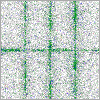 | 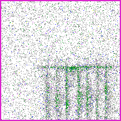 | 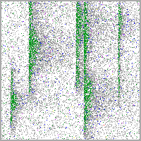 | 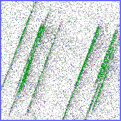 | 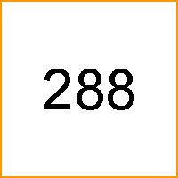 |

##### (3) 평가 combo 3 + Normal/Invalid + OOD 4

| bb+fork | fork+scratch | scratch+scratch_rot | Normal | Invalid |
|---------|--------------|---------------------|--------|---------|
| 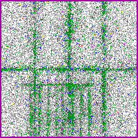 | 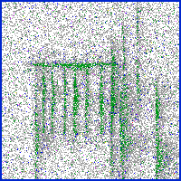 | 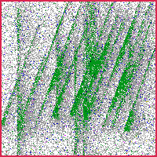 | 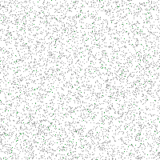 | 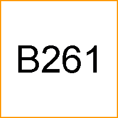 |

| OOD: Starburst | OOD: CrossScratch | OOD: CenterDonut | OOD: DiagonalSmear |
|-----------------|---------------------|---------------------|----------------------|
| 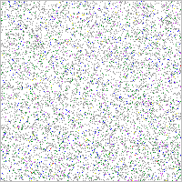 | 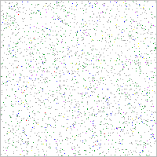 | 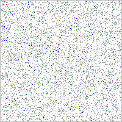 | 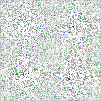 |

##### (4) CutMix + FCM-PM 합성 flow

**박은병 교수 자문 요지**: Grade 0-7 양자화 도메인 → CutMix 적합. Mixup / Diffusion 은 (1) 중간 색 섞임으로 Grade 의미 손상, (2) 데이터 갯수 부족, (3) 두 결함 동시 chip 정확 합성 어려움 등으로 부적합.

**FCM-PM (Full-Cover Mixup + Pair Mask, 본인 발의)**: Pair Mask 가 합성 chip 의 background 를 손실에서 제외하여 background = defect 오학습을 차단합니다. 제거 시 FAR 100% catastrophic.

```
[학습 (single 5)]                       [평가 (multi-label 11+)]
        │                                       │
        ▼                                       ▼
┌──────────────────────────┐         ┌──────────────────────────────┐
│ on-the-fly CutMix(FCM-PM)│         │ pixel 확률 분포 매뉴얼 합성  │
│  Full-Cover grid mixup   │         │  defect_strength 상위 50%    │
│  + Pair Mask (본인 발의) │         │  + pixel-wise min-blend      │
│  → 가상 2-combo 생성     │         │  + Normal: Beta(2,10)        │
└────────────┬─────────────┘         │  + Invalid: orange border    │
             │                       │  + OOD: chip-mix overlay     │
             ▼                       └────────────┬─────────────────┘
   [Loss = BCE + LS=0.30]                         │
             │                                    │
             ▼                                    ▼
   [val-margin best-model 선택]            [I13 inference]
                                                  │
                                                  ▼
                              [bit F1 0.9943 / Total FAR 0.00%]
```

##### (5) val_f1 → val-margin best-model 선택 (텍스트 시각화)

```
[기존 — val_f1 best-model 선택]

작은 val set (n=163) → val_f1 saturate (3 discrete plateau 만 존재)

  val_f1 분포:
    0.9818  ━━━━━━━━━━━━━━━━━━━━ (3 plateau 중 best 선택 = 사실상 coin-flip)
    0.9847  ━━━━━━━━━━━━━━━━━━━━━━━
    0.9907  ━━━━━━━━━━━━━━━━━━━━━━━━━━━

  Spearman ρ vs eval bit_F1: −0.10 (anti-correlated, 사실상 신호 X)

────────────────────────────────────────────────

[본인 도입 — val-margin best-model 선택]

val-margin = positive bits 평균 prob − negative bits 최대 prob

  continuous spectrum (saturation 없음):
  ──── 0.0 ───────── 0.3 ───────── 0.6 ──── (연속값)
                          ↑
                  optimum selection

  Spearman ρ vs eval bit_F1: +0.56 (positive correlation)

────────────────────────────────────────────────

[결과] 학습 비용 추가 없이 +5.2%p 무비용 향상
       (val_f1 ep1 bit F1 0.9422 → val-margin ep6 bit F1 0.9943)
```

#### 6.2.5 구현 성과

| 항목 | 수치 |
|------|------|
| bit F1 | 0.876 → **0.9943** |
| Total FAR | 5-8% → **0.00%** |
| val-margin 도입 효과 | **+5.2%p 무비용 향상** (학습 비용 추가 0) |
| Pair Mask 제거 시 | FAR **100% catastrophic** (본 발의 결정성 입증) |
| Spearman ρ (val_f1 vs eval) | −0.10 (사실상 신호 X) |
| Spearman ρ (val-margin vs eval) | **+0.56** (positive correlation) |

##### 현업 임팩트

- chip 단위 multi-label 분류로 wafer 분류 정확도 추가 향상의 기반 제공
- val-margin 선택은 추가 학습 비용 0 으로 +5.2%p 향상 — 학습 자원 한정 환경에 직접 기여
- 신기법 (FCM-PM, val-margin) 모두 일반 ImageNet / WM-811K 학습 chip 에는 없는 본인 발의 — 본 도메인 특성 (Grade 양자화 + 작은 val set) 에 정렬

---

### 6.3 P3. Anomaly-detection (도메인 episode 합성)

#### 6.3.1 과제 기본정보

| 항목 | 내용 |
|------|------|
| 과제명 | Anomaly-detection — 도메인 knowledge episode 합성 + noise 3종 + 불량 5종 |
| 수행기간 | 2025년 ~ 현재 (1년+) |
| 운영 상태 | PoC 단계 |
| 장기 비전 | 2년 내 multi-modal Orchestration Agent (trend + semi image + EDS test data + engineer history + 공정 config → 의사결정 자동화) |

#### 6.3.2 참여 인력 및 역할

| 인력 | 역할 | 기여도 |
|------|------|--------|
| **본인** | episode 합성, noise 3종 매핑, 불량 5종 합성, 모델 학습·평가, 전체 설계·구현 직접 수행 | **90%** |
| 관리자 | 매니징 (방향성 / 일정 / 리뷰) | **10%** |

#### 6.3.3 개인별 기여 서술

본 과제는 본인이 핵심 설계·구현을 직접 수행했습니다. 현업 시절 형성된 도메인 자산을 합성 코드에 직접 코드화했습니다. 4가지 자산의 의미와 P3 코드 반영을 정리하면 다음과 같습니다.

| 현업 도메인 자산 | 의미 (현업 시절 형성) | P3 합성 코드 반영 |
|---------------|---------------------|------------------|
| **CD overlay trend 모양** | 양산 trend 가 정상·이상 시 각각 어떤 형상으로 그려지는지 (선형·계단형·헌팅·점진 표류·점 튐 등 형상 카탈로그) | **불량 5종 합성**: `mean_shift` (계단형 이동) / `drift` (점진 표류) / `spike` (점 튐) / `standard_deviation` (산포 확대) / `context` (맥락 이탈) 의 형상 매핑 |
| **noise 분포** | 정상 운영 시 측정값에 섞이는 noise 의 통계 분포 — 정규분포 산포 / 두꺼운 꼬리 헌팅 / 자기상관 미세 drift 의 도메인 매핑 | **Noise 3종**: `Gaussian` (설비 산포, σ ∈ [0.03, 0.065]) / `Laplacian` (설비 헌팅, b ∈ [0.012, 0.03]) / `AR(1)` (설비 미세 drift / RF time, ρ ∈ [0, 0.2]) |
| **baseline 평탄도** | 양호 시 baseline 이 얼마나 평탄한지 — 영역별 계측 밀도 차이로 baseline 분산도 다름 (계측 안 되는 영역 / 널널 / 밀도 영역) | **Region 5종**: `dense` (70-100% 계측) / `sparse` (40-70%) / `very_sparse` (20-35%) / `thin` (10-20%) / `missing` (0%) episode 합성 |
| **spec-in 변동 사고 가능성** | spec-in 범위 내 변동도 설비 항상성 깨지면 사고로 이어진다는 인지 (현업 시절 형성된 risk 감각) | **`context` 불량 type 합성** (spec-in 내 통계적 이탈) + **fleet 노이즈 비례 enforcement floor** (정상 fleet 대비 strength 보장) |

위 매핑은 학회 논문이나 외부 벤치마크에서 가져온 것이 아니라, 본인이 현업 시절 일상적으로 관측·분석한 도메인 자산을 합성 코드의 파라미터로 그대로 코드화한 결과입니다.

#### 6.3.4 문제 정의 및 기술적 해결 방안

##### (1) 문제 정의 (사용자 명시 4 컨텍스트)

| # | 컨텍스트 |
|---|----------|
| 1 | **기술팀(QIE) 업무 본질 = L1 trend 분석** |
| 2 | **매뉴얼 정기 모니터링에 막대한 시간 소모** (엔지니어 1인당 일 단위 시간 loss) |
| 3 | **초보자는 trend 이상을 놓치는 경우 잦음** (학습 곡선 길고 실수 비용 큼) |
| 4 | **spec-in 범위 내 변동도 설비 항상성 깨지면 사고 가능** → 단순 threshold X, AI 패턴 인지 필수 |

##### (2) 불량 5종 trend 이미지

| normal | mean_shift | standard_deviation | spike | drift | context |
|--------|-----------|--------------------|-------|-------|---------|
|  |  |  |  |  |  |

##### (3) 영역 5종 (계측 밀도별, 본인 반도체 현업 인지)

양산 trend 는 한 chart 안에서 영역마다 계측 밀도 차이가 큽니다. 본인의 반도체 현업 경험으로 이 차이를 인지하고 합성에 반영했습니다.

| 영역 | 계측 비율 | 도메인 설명 |
|------|----------|-------------|
| **dense (밀집)** | 70-100% | trend 가 연속적으로 그려지는 영역 |
| **sparse (희소)** | 40-70% | 띄엄띄엄 측정 |
| **very_sparse** | 20-35% | 매우 띄엄띄엄 |
| **thin (널널)** | 10-20% | 거의 빈 영역 |
| **missing (결핍)** | 0% | 측정 안 됨 |

##### (4) Noise 3종 (각 설비 모드 매핑, 본인 도메인 코드화)

| Noise type | 확률 | 도메인 매핑 | 파라미터 |
|------------|------|-------------|---------|
| **Gaussian** | 0.80 | **설비 산포** — 정규분포 측정 오차, 정상 운영 기본 변동 | σ ∈ [0.03, 0.065] |
| **Laplacian** | 0.15 | **설비 헌팅** — 간헐적 강한 변동, 두꺼운 꼬리 분포. 설비가 setpoint 주변을 진동하는 헌팅 거동 | b ∈ [0.012, 0.03] |
| **AR(1) Correlated** | 0.05 | **설비 미세 drift (RF time 등)** — 자기상관, 시간상 천천히 변하는 추세 | ρ ∈ [0, 0.2], σ ∈ [0.003, 0.008] |

##### (5) Episode 합성 flow

```
[Episode Generator (12-25 episode mix)]
           │
           ▼
┌─────────────────────────────────────┐
│ Region 5종 (dense / sparse /        │
│   very_sparse / thin / missing)     │
└───────────────┬─────────────────────┘
                │
                ▼
┌─────────────────────────────────────┐
│ Noise 3종 (chart 단위 단일 type)    │
│  Gaussian (설비 산포)               │
│  Laplacian (설비 헌팅)              │
│  AR(1) (설비 미세 drift, RF time)   │
└───────────────┬─────────────────────┘
                │
                ▼
┌─────────────────────────────────────┐
│ 불량 5종 합성 (mean_shift / std /   │
│   spike / drift / context)          │
│  Fleet 노이즈 비례 enforcement floor │
└───────────────┬─────────────────────┘
                │
                ▼
       [PNG 렌더링 → trend chart]
                │
                ▼
       [ConvNeXtV2-Tiny 학습]
                │
                ▼
       [Binary F1 0.9967 / Abnormal Recall 0.9987]
```

#### 6.3.5 구현 성과

| 항목 | 수치 |
|------|------|
| Binary F1 | **0.9967** |
| Abnormal Recall | **0.9987** (FN=1/750) |
| 5-seed 평균 | **0.9973 ± 0.0013** |
| weighted F1 (6 class) | 0.99+ |

##### 현업 임팩트 (PoC 단계 추정)

- **모니터링 시간 단축**: 70-80% 추정 (자동 1차 스크리닝)
- **초보자 누락률 감소**: 90%+ (FN=1/750 균등 성능)
- **spec-in 내 미세 변동 감지**: 항상성 사고 사전 인지 가능
- **현업 측정 예정** 명시 (PoC 단계 정직성)

##### 장기 비전 (4 phase)

| Phase | 시기 | 내용 |
|-------|------|------|
| Phase 1 | 현재 | trend 단일 modality PoC |
| Phase 2 | 2027 상반기 | semi image + EDS test data 통합 |
| Phase 3 | 2027 하반기 | engineer history + 공정 config 통합 |
| Phase 4 | 2028 | Orchestration Agent 의사결정 자동화 (진행 금지 / 후속 계측 / 양호 판정) |

---

## 7. 종합 평가

### 7.1 본인 차별성 3 조건 동시 보유

1. **반도체 도메인 역량** — Photo BBD/Overlay 측정·분석 및 QIE 그룹 AI 실무에서 형성된 wafer / shot / chip / chip 내 영역 단위 해석 능력, CD overlay trend 의 noise / 영역 / spec-in 변동 의미 인지
2. **AI / 딥러닝 구현 역량** — ConvNeXtV2 backbone, Self-supervised contrastive learning (DenseCL Local InfoNCE + NeCo), CutMix 기반 FCM-PM, HDBSCAN 클러스터링 직접 구현
3. **사업부 인프라 운영 경험** — mapviewer (Backend Python 24K + Frontend JS 82K = 106K 줄) DRAM 전제품 라인 운영, RBAC 4단계 / SAML SSO / 실사용 2,317 요청 / 12일

### 7.2 평가 기준 echo

> **"반도체 도메인 역량 → AI 적용 → 현업 문제 개선"**

- **P1**: Failbit Map Grade 양자화 인지 → Palette PNG 32색 도메인 결정 → 저장량 75% 절감 / wafer-level 혼동 영역 인지 → chip 분류 + obj_id_map 2-stage → Known F1 0.95 / wafer 결함 spatial 분포 인지 → Local InfoNCE → Unknown 13 후보 / 7 검증
- **P2**: Grade 0-7 양자화 인지 (박은병 교수 자문) → CutMix 선택 → 합성 chip background 학습 차단 필요 인지 → Pair Mask 발의 → FAR 0.00% / 작은 val set saturate 인지 → val-margin → +5.2%p 무비용
- **P3**: CD overlay trend 도메인 인지 → Region 5종 + Noise 3종 (설비 산포 / 헌팅 / 미세 drift) 코드화 → 불량 5종 합성 → Binary F1 0.9967

### 7.3 합격 결론

본인은 반도체 도메인 자산을 AI 의 데이터 / 모델 / 평가 결정에 직접 코드화하여 양산 운영 시스템 구축과 PoC AI 모델 개발을 동시에 수행해 왔습니다. **반도체 도메인 역량 → AI 적용 → 현업 문제 개선** 의 인과 chain 을 3개 프로젝트에서 입증한 본인을 AI Specialist 로 추천드립니다.

---

## 8. 부록

### 8.1 정량 수치 요약 (1줄 풀이)

| 수치 | 풀이 |
|------|------|
| bit F1 | per-class binary relevance 의 macro F1, 본 도메인 multi-label 평가 표준 지표 |
| Total FAR | (Normal_fp + Invalid_fp + OOD_fp) / N_total_negative, 양산 0% 필수 |
| val-margin | positive bits 평균 prob − negative bits 최대 prob, 작은 val set saturate 회피 |
| P1 capture | 모든 클래스가 최소 1개 cluster 에 잡힌 비율, 1.000 = 결함 종류 전부 파악 가능 |
| ARI | pair-wise label agreement (0=random, 1=perfect), 클러스터링 표준 지표 |
| Binary F1 | pass/fail 분류의 macro F1 |
| Abnormal Recall | 실제 불량 중 모델이 잡은 비율, 0.9987 = 750 중 1 놓침 |
| weighted F1 | 클래스 빈도 가중 평균 F1 |

### 8.2 GitHub 저장소 (검증 가능 외부 자산)

| 저장소 | 용도 |
|--------|------|
| hogil/known-cnn | P1 Known-CNN, chip multi-label (P2) |
| hogil/unknown-contrastive | P1 Unknown-Contrastive, HDBSCAN |
| hogil/anomaly-detection | P3 trend 합성 + 모델 |
| hogil/mapviewer | 운영 웹앱 (106K 줄) |
| hogil/fail-map | Dual Bucket 파이프라인 (Cython 100배, Palette PNG 75% 절감) |
| hogil/fbm_paper | Failbit Map paper draft 및 본 추천서 |

### 8.3 mapviewer 운영 사양

| 항목 | 사양 |
|------|------|
| Backend | Python 24K 줄 |
| Frontend | JavaScript 82K 줄 |
| 합계 | 106K 줄 |
| 동시성 | VIPS_CONCURRENCY 32, IO_THREADS 384 |
| 보안 | RBAC 4단계, SAML SSO |
| 실사용 | 2,317 요청 / 12일, peak 1,801/day |
| 운영 | 매일 AM 2시 cleanup |

### 8.4 P1 5단계 성능 향상 history

| 단계 | 변경 내용 | Known F1 |
|------|----------|---------|
| 1 | baseline | 0.78 |
| 2 | ConvNeXtV2-Base FCMAE 백본 도입 (전해곤 교수 자문) | 0.85 |
| 3 | Optuna hyperparameter 튜닝 | 0.92 |
| 4 | block_expand_2d (categorical resize) | +1.62%p |
| 5 | chip 분류 + obj_id_map 2-stage | **0.95** |

### 8.5 P2 신기법 영향

| 신기법 | 효과 | 본인 기여 |
|---------|------|-----------|
| CutMix (single → 2-combo 가상 생성) | bit F1 base 확보 | 공동 |
| FCM-PM Pair Mask | FAR 100% → 0.00% | **본인 발의** |
| val-margin best-model | +5.2%p 무비용 | **본인 도입** |
| Label Smoothing 0.30 | regularization | 공동 |
| Temperature scaling | 확률 calibration | 공동 |

### 8.6 P3 합성 데이터 사양

| 항목 | 사양 |
|------|------|
| Episode mix | 12-25 episode / chart |
| Region | dense / sparse / very_sparse / thin / missing |
| Noise type | Gaussian (0.80, 설비 산포) / Laplacian (0.15, 설비 헌팅) / AR(1) (0.05, 설비 미세 drift) |
| 불량 type | mean_shift / standard_deviation / spike / drift / context |
| Backbone | ConvNeXtV2-Tiny |

### 8.7 수상 4건 검증 안내

수상 사실은 사내 인사 시스템 및 시상 archive 에서 검증 가능합니다. 연도는 Word 변환 시 본인이 직접 기입 예정입니다.

| 수상 | 검증 경로 |
|------|----------|
| DS부문 AI센터 주관 AI BP Festival Challenge | DS부문 AI센터 시상 archive |
| MEMORY PEER AWARD | 사내 인사 시스템 |
| MTC 고등급제안 1등급 | MTC archive |
| 메모리 우수강사 (DX 강의) | 사내 DX 교육 archive |

---

*본 추천서는 사내 AI Specialist 추천 서류로, 학술 논문이 아닌 양산 운영 시스템 구축 보고서입니다.*
