## 1. AI 프로젝트 수행 전체이력

| 기간 | 과제명 | 리딩 규모 | 담당업무 | 과제관리 | 설계 | 개발비중 |
|------|--------|-----------|----------|----------|------|----------|
| 2024년 10월 ~ 현재 | P1. Failbit Map Known & Unknown 불량 분석 아키텍처 | 3인 협업. 운영 뷰어는 DRAM 전제품 라인 양산 운영 (일 약 2만 wafer 처리), Known / Unknown 모델은 GPU 할당 대기 | 데이터 파이프라인 설계 및 구현, Failbit Map 이미지 변환 최적화, 운영 뷰어 연동, Known 2-stage 모델 개발 및 튜닝, Unknown self-supervised 검출 구조 설계, 현업 검증 flow 구축 | 20% | 35% | 45% |
| 2025년 3월 ~ 현재 | P2. Chip Multi-label Classification (FCM-PM, val_margin) | 2인 PoC. 16+ class × 약 3,850 chip controlled synthetic benchmark | multi-label 학습 데이터 설계, FCM-PM augmentation 설계, Pair Mask loss masking 구현, val_margin 기반 best-model selection, Normal / Invalid / OOD negative 평가셋 설계, threshold gate / ensemble / Knowledge Distillation 후속 검토 | 20% | 40% | 40% |
| 2026년 1월 ~ 현재 | P3. Trend Episode 데이터 생성 기반 Anomaly-detection 검증 PoC | 3인 PoC. normal 3,500 + abnormal 3,500 = 총 7,000개 trend sample 구성 | trend episode generator 설계, 도메인 parameter (Region 5종 / Noise 3종 / Anomaly 5종) 정의, 합성 normal / abnormal sample 생성, 정상 산포 보정 수식 설계, 1차 Binary gate baseline 검증, 현업 적용 전 PoC 검증 | 20% | 45% | 35% |

## 2. 대표 과제 상세 기술서

**ㅁ P1. Failbit Map Known & Unknown 불량 분석 아키텍처**

**ㅁ 과제 기본정보**

| 항목 | 내용 |
|------|------|
| 과제명 | Failbit Map Known & Unknown 불량 분석 아키텍처 |
| 수행기간 | 2024년 10월 ~ 현재 |
| 참여인원 | 본인 / 현업 엔지니어 / 관리자 |

**P1 핵심 요약**: 대량 Failbit Map 조회 한계 (한 번에 약 48매) 와 담당자 수작업 판정 부담을 줄이기 위해 EDS raw log → wafer image 운영 파이프라인 (Cython 약 **100배** 가속 / palette PNG 약 **75%** 절감 / 일 약 **2만 wafer / 1시간 주기** 처리) 을 먼저 구축하고, 그 위에 Known 2-stage 분류 (weighted F1 **0.95**) 와 Unknown self-supervised grouping (13 후보 중 **7건 실제 불량** 확인) 을 결합한 운영형 AI 시스템입니다. **DRAM D1a/b/c/d 분석 파트에서 매일 사용 중**이며 **공수 약 90% 절감 (연 약 26억 효과)** 과 **수율 +0.02% 개선 (P3WN 1건 약 97억 효과)** 의 현업 임팩트와 함께, **AI 센터 주관 DS AI Best Practice Good Challenger 상** 과 **MTC 고등급 제안 1등급** 수상으로 사내 성과를 인정받았습니다.

**ㅁ 과제 참여 인력 및 역할**

| NO | 성명 | Knox Id | 소속 | 역할 | 기여도 |
|----|------|---------|------|------|--------|
| 1 | 최호길 | 개인정보 비공개 | 메모리제조센터 QIE그룹 | FBM 데이터 파이프라인, 운영 뷰어 연동, Known CNN → ROI-YOLO 2-stage, Unknown contrastive 학습, 후속 chip-CNN obj-id map 보정 구조의 설계 / 구현 주도 | 60% |
| 2 | 현업 엔지니어 | 개인정보 비공개 | 관련 현업부서 (공식 기록 대조) | 아이디어 발의, Failbit Map 의미 및 불량 분석 교육 | 20% |
| 3 | 관리자 | 개인정보 비공개 | 관리조직 (공식 기록 대조) | 방향성, 일정, 리뷰 매니징 | 20% |

**ㅁ 개인별 기여 서술**

**[본인이 독자적으로 수행한 핵심 모듈]**

- **과제 내에서 타 구성원과 차별화되는 본인만의 구체적 담당 영역**

본인은 wafer 단위 분석 경험을 바탕으로 현업 엔지니어로부터 Failbit Map 분석법을 직접 교육받고 AI 설계에 착수했고, 본 과제에서 raw log → wafer 이미지 변환 / 저장 / 조회 파이프라인 (fail-map), 사내 운영 뷰어 web app, Known 2-stage 분류, Unknown self-supervised 검출, 후속 chip-CNN object-id map 보정 구조까지 전 영역의 설계 / 구현 / 검증을 직접 주도한 담당자입니다. AI 모델의 전수 자동 추론은 AI 센터 GPU 할당 (**2026년 9월**) 후 전면 적용합니다.

- **본인의 기술적 해결책이 과제 성패에 미친 영향**

raw log → wafer image 파이프라인에서 wafer 한 장 약 1,000만 cell 의 hex 값을 Grade 0-7 로 풀어내는 변환 루프를 Cython 으로 재구성해 속도를 약 **100배** 증가시켰고, 32색 palette indexed PNG 양자화로 저장 용량 약 **75%** 절감을 통해 **일 약 2만 장 / 1시간 주기** 양산 운영 적재 흐름을 가능하게 했습니다. Known 2-stage 는 ConvNeXtV2 backbone 교체와 ROI YOLO cascade 결합으로 **[실전 현업 데이터]** weighted F1 **0.78 → 0.95** ladder 를 달성했고, Unknown 측면은 self-supervised contrastive embedding 과 HDBSCAN grouping 으로 **[실전 현업 데이터]** 13개 후보 group 중 **7개 불량 확인**까지 검증했습니다. chip-CNN object-id map 과 Unknown synthetic benchmark 는 현재 후속 개발 단계입니다.

**ㅁ 문제정의**

**[현장 난제 및 해결 목표]**

- **기존 방식의 한계 및 AI 도입의 구체적 배경**

wafer Failbit Map 분석이 한 번에 약 48매까지 로드되어 제품 / 시간 단위 대량 wafer 누적 분석이 어렵고, wafer Failbit Map 판정 자체가 분석 엔지니어 수작업에 의존해 누락 위험과 모니터링 시간 부담이 누적되었습니다. AI 기반 자동 분석 / 분류를 활용해, Known 16 class 분류는 자동화하고 Unknown 신규 패턴은 후보 group 까지 자동으로 검출하는 시스템이 필요했습니다.

- **과제 수행 시 해결해야 했던 기술적 / 환경적 제약 조건**

데이터 측면은 hex → Grade 변환이 wafer 당 약 1,000만 cell 의 Python loop 로 wafer 한 장 처리 시간이 오래 걸렸고, 메모리 제약으로 동시 조회가 약 48매까지 되어 적재 / 조회 비용 압박이 있었습니다. 학습 측면은 Known 의 label 이 16 class / 1,500 장 으로 supervised 학습 데이터가 부족하고, Unknown 측면은 운영 환경에 다수의 unknown failure group 과 noise group 이 존재해 supervised 정량 metric 이 현 상황에는 맞지 않았습니다. 운영 측면에서는 일 약 2만 장 wafer 의 1시간 주기 적재와 운영 뷰어 응답성을 만족시키면서 모델 / 적재 / 조회 비용까지 낮춰야 했습니다.

**ㅁ 기술적 해결 방안**

**[본인이 직접 수행한 핵심 로직]**

- **데이터**: 데이터 수집 경로, 전처리 기법 및 피처 엔지니어링 근거

raw EDS Test log (wafer 당 약 1,000만 cell) 의 Failbit hex 표현을 Cython 변환 루프로 약 100배 가속해 Grade(0-7) 로 양자화합니다. **본 wafer image 는 자연 현상의 다양한 색채 이미지가 아닌 EDS Test 의 8단계 이산 측정값** 이라 32색 palette indexed PNG 로 **무손실** 양자화가 가능했고, 이 도메인 특성을 활용해 저장 용량을 약 **75%** 절감했습니다. 결과로 6400×6400 wafer 이미지 + 32×32 chip grid (1,024 chip / wafer, chip 당 200×200 pixel) + chip positions JSON 이 산출되고, chip positions JSON 은 Stage 2 ROI YOLO 와 후속 chip-CNN object-id map 입력 좌표로 그대로 재사용됩니다.

- **알고리즘**: 선정한 모델 아키텍쳐와 선택 사유 (Logic Flow 중심)

모델 선택과 결합 구조는 본 과제 데이터 특성에 맞춰 다음과 같이 설계했습니다. P1 end-to-end 파이프라인은 raw log → wafer 이미지 변환 → 좌표 JSON → 운영 뷰어 노출 → Known 분류 / Unknown 검출 → 현업 검증 까지로 설계했고, 모듈은 아래와 같습니다.

```
+------------------------------------------------------------------------------+
|  [SOURCE]  EDS Test raw log (Failbit hex per Memory Cell Block)              |
|            wafer ~10M cells, all DRAM product lines                          |
+------------------------------------------------------------------------------+
                                    |
                                    v
+------------------------------------------------------------------------------+
|  [PIPELINE]  fail-map conversion module (designed/implemented by author)     |
|  - Cython hex -> Grade(0..7) loop + Numba JIT  -> ~100x speed-up             |
|  - 32-color palette indexed PNG via pyvips    -> ~75% storage reduction      |
|  - output wafer image: 6400 x 6400 palette PNG (8-bit, 32 colors)            |
|  - chip grid 32 x 32 (1,024 chips / wafer, 200 x 200 px per chip)            |
|  - chip positions JSON -> coordinates fixed (reused by chip-CNN downstream)  |
+------------------------------------------------------------------------------+
                                    |
                                    v
+------------------------------------------------------------------------------+
|  [VIEWER]  internal viewer Web App (bulk wafer query + analysis utilities)   |
|  - FastAPI backend + Vanilla JS / WebGL2 frontend                            |
|  - RBAC + SAML SSO + in-house authentication integration                     |
|  - ~20,000 wafers / day, 1-hour batch interval                               |
|  - replaces manual ~48-wafer-per-query workflow with bulk + analysis tools   |
+------------------------------------------------------------------------------+
                                    |
                +-------------------+-------------------+
                v                                       v
+--------------------------------------+   +--------------------------------------+
|  Known branch                        |   |  Unknown branch                      |
|  (16 registered classes)             |   |  (unregistered pattern discovery)    |
+--------------------------------------+   +--------------------------------------+
|  ConvNeXtV2 wafer classifier         |   |  Self-supervised embedding           |
|       v confidence < gate            |   |       v                              |
|  ROI YOLO refinement                 |   |  HDBSCAN candidate grouping          |
|       v                              |   |       v                              |
|  weighted F1 0.95                    |   |  13 groups -> 7 real failures        |
+--------------------------------------+   +--------------------------------------+
                |                                       |
                +-------------------+-------------------+
                                    v
+------------------------------------------------------------------------------+
|  [REVIEW]  viewer overlays results + on-site engineer verification loop      |
|  - new failure candidates added to catalog                                   |
|  - Known classifier training samples refreshed                               |
+------------------------------------------------------------------------------+
```

**(1) Stage 1 Backbone — ConvNeXtV2 선택과 fine-tune 설계**

먼저 Transformer 와 CNN 을 같은 split 에서 비교했습니다.

- **도메인 판단**: ViT, Swin 같은 전역 attention 기반 backbone 은 wafer 전체 구조를 보는 데 강합니다. 다만 본 과제의 결함은 특정 zone 이나 국소 chip 영역에 몰리는 경우가 많아, CNN 계열의 local receptive field 와 계층적 feature extraction 이 더 어울린다고 판단했습니다 (자문: 연세대학교 인공지능학과 전해곤 교수).
- **비교 결과**: 동일 4:1 stratified split / 동일 학습 조건으로 backbone 만 바꿔 baseline 성능을 측정했습니다. 결과는 ViT 0.81 / Swin 0.84 / EffNetV2 0.85 / MaxViT 0.87 / ConvNeXtV2 0.87 로, 본 과제 결함이 국소 영역에 몰리는 특성에 맞는 ConvNeXtV2 를 최종 backbone 으로 채택했습니다.
- **최종 선택**: ConvNeXtV2 는 MaxViT 와 동일한 F1 0.87 을 유지하면서 파라미터 26% (119.5M → 88.6M), FLOPs 39% (74.2G → 45.1G) 감소로 양산 inference 비용 측면에서 효율이 좋아 최종 backbone 으로 채택했습니다.

**(2) Stage 2 ROI 보정 — cascade gate 와 보정 결정 로직**

Stage 1 만으로는 center 영역처럼 결함이 겹치는 영역의 class 들을 잘 분류하지 못하여, wafer 신뢰도가 낮은 difficult sample 만 Stage 2 (ROI YOLO) 로 다시 보내도록 cascade gate 를 두었습니다. 신뢰도가 임계값 이상인 wafer 는 Stage 2 를 skip 하기 때문에 throughput 부담 없이, confidence 가 낮은 sample 만 다시 분류해 정확도를 향상시키는 구조입니다.

| Stage 1 (raw wafer) | Stage 2 ROI 영역 | Stage 2 chip 단위 box + class |
|:-------------------:|:----------------:|:-----------------------------:|
|  |  |  |

좌측 raw wafer 는 Stage 1 wafer-level CNN 만 보면 비슷한 형상의 class 로 오인되는 사례입니다. Stage 2 ROI YOLO 는 ROI 영역에서 chip 단위 object detection 으로 각 chip 의 불량 class 를 분류한 뒤, 그 chip class 분포로 wafer 의 최종 class 를 예측하는 구조입니다.

**(3) 후속 보정 — chip-CNN object-id map 재구성 (개발 중)**

ROI-YOLO 는 wafer 전체 이미지에서 chip 위치를 bounding box 로 detection 해야 해 추론 비용이 크고, wafer 이미지에서는 chip 내 결함이 작게 보여 성능에 한계가 있습니다. 반면 chip-CNN object-id map 은 이미 산출한 chip 좌표로 작은 chip crop 만 분류하므로 추론 비용이 낮고, chip 이미지에서는 결함이 크게 보여 분류 성능도 좋습니다. Stage 2 후보를 대체하기 위해 개발 중이며, 현재 성능은 val_f1 **0.9946** / test_f1 0.9872 / 5-seed 평균 0.9838 ± 0.0092 입니다.

<table>
  <thead>
    <tr>
      <th colspan="2" align="center">raw wafer map</th>
      <th colspan="2" align="center">chip-CNN obj-id map</th>
    </tr>
    <tr>
      <th align="center">center 결함 (class A)</th>
      <th align="center">center 결함 (class B)</th>
      <th align="center">center 결함 (class A)</th>
      <th align="center">center 결함 (class B)</th>
    </tr>
  </thead>
  <tbody>
    <tr>
      <td width="25%" align="center"></td>
      <td width="25%" align="center"></td>
      <td width="25%" align="center"></td>
      <td width="25%" align="center"></td>
    </tr>
  </tbody>
</table>

chip-CNN object-id map 의 내부 흐름을 식으로 정리하면 다음과 같습니다.

```
c_{u,v}    = crop(x, pos_{u,v})          -- chip crop at coord (u, v)
q_{u,v}    = softmax(h_phi(c_{u,v}))     -- class probability per crop
M_obj(u,v) = argmax_k q_{u,v,k}          -- chip-wise id, placed by coord = object-id map
```

chip 좌표 `(u, v)` 마다 crop 을 잘라 분류기에 통과시켜 class 확률을 얻고 argmax 로 chip 별 id `M_obj(u, v)` 를 결정한 뒤, 이 id 들을 chip 좌표 위치에 그대로 배치하면 wafer 한 장의 **32×32 object-id map** 이 완성됩니다. chip-CNN 분류기를 학습시키고 wafer 단위로 이 object-id map 을 산출하는 구조로 ROI-YOLO 를 최종 대체합니다.

- **최적화**: 성능 향상을 위해 본인이 직접 시도한 기술적 해법

Known 2-stage 성능을 실전 현업 데이터 (16 class / 1,500 labeled / 4:1 stratified split) 로 baseline 부터 단계별로 다음과 같이 향상시켰습니다.

- **baseline**: 일반 ImageNet 사전학습 CNN 으로 시작한 1차 학습이 weighted F1 **0.78** 정도였습니다. 16 class 중 center 영역처럼 결함이 겹치는 영역의 class 들이 서로 헷갈리는 사례가 가장 컸습니다.
- **backbone 교체**: ViT / Swin / EffNetV2 / MaxViT / ConvNeXtV2 를 동일 split 에서 비교한 뒤, 본 과제 결함이 국소 영역에 몰리는 특성에 맞는 ConvNeXtV2 로 교체해 **0.87** 까지 향상시켰습니다.
- **Optuna hyperparameter 정렬 + LR schedule**: learning rate, weight decay, augmentation 강도, class weight, batch size 를 Bayesian sweep 으로 정렬하고, 학습률은 LinearLR warmup (시작 LR 을 base 의 0.05 부터 5 epoch 에 걸쳐 base 까지 올림) 뒤 CosineAnnealing (base → 1e-6) 으로 감쇠시키는 schedule 을 적용해 **0.92** 에 도달했습니다.
- **2-stage cascade**: confidence 가 낮은 wafer 만 ROI YOLO 로 다시 보내 다시 분류하게 했고, 이 단계가 붙으면서 최종 weighted F1 **0.95** 까지 올라갔습니다.

Unknown 검출은 정답 label 이 없는 운영 환경이라 정량 ladder 가 의미가 없어, production 학습 구성요소와 단일 anchor (13 → 7) 만 적어둡니다. production 학습은 TAPT 한 ConvNeXtV2 backbone 위에 다음을 얹은 구조입니다.

- **Global InfoNCE**: 같은 wafer 의 두 augmentation view 는 positive, 다른 wafer 는 negative.
- **Queue (size 16384)**: 직전 batch 들의 representation 을 negative pool 로 누적 (한 batch 안의 좁은 negative 다양성 보강).
- **Negative similarity filter (cos > 0.72 제외)**: queue 안에서 anchor 와 너무 유사한 wafer 는 사실 같은 class 일 가능성이 있어 negative 에서 제외 → false negative 차단.
- **Local InfoNCE (grid36_full, window=4)**: wafer 안 36 개 anchor 위치마다 patch-level positive 까지 같이 학습해 sub-pattern (edge ring 각도 등) 분리력 보강.
- **HDBSCAN**: 학습된 embedding 위에서 자동 grouping → 후보 group 산출 (운영 검출력 13 → 7 은 **[구현 성과]** 참고).

SOTA recipe ablation 은 별도 synthetic benchmark 트랙 (**[구현 성과]** 참고).

```
+--------------------------------------------------------------------------+
|  Stage 1: ConvNeXtV2 wafer classifier (16 classes)                       |
|  - backbone scan ViT 0.81 / Swin 0.84 / EffV2 0.85 / MaxViT 0.87         |
|                  / ConvNeXtV2 0.87                                       |
|  - vs MaxViT: params -26%, FLOPs -39%                                    |
|  - ladder 0.78 -> 0.87 (backbone) -> 0.92 (Optuna) -> 0.95 (cascade)     |
+---------------------------------+----------------------------------------+
                                  |
                                  v
       +-----------------------------------------------------+
       |  cascade gate: confidence < gate (difficult sample) |
       +-----------------------------------------------------+
                  conf >= gate                  conf < gate
                       |                            |
                       v                            v
+--------------------------+  +--------------------------------------------+
|  Stage 1 only            |  |  Stage 2 (operational module selection)    |
|  (skip Stage 2,          |  |  (A) ROI-YOLO [in production]              |
|   ~zero throughput cost) |  |      - bbox + coord regression + class+NMS |
|                          |  |  (B) chip-CNN obj-id map [in development]  |
|                          |  |      - ~256x256 crop classification only   |
|                          |  |      - val_f1 0.9946 / test_f1 0.9872      |
+--------------------------+  +----------------------+---------------------+
                |                                    |
                +------------------+-----------------+
                                   v
+--------------------------------------------------------------------------+
|  OUTPUT: Known weighted F1 0.95 (16 class / 1,500 labeled / 4:1 split)   |
|  - ladder 0.92 -> 0.95 (+0.03, cascade gain)                             |
|  - operational guard: skip-wafer daily sampling re-check                 |
|                       + Stage 1 distribution drift monitoring            |
|                       -> gate periodic re-tuning (blocks FN accumulation)|
+--------------------------------------------------------------------------+
```

생성 wafer 이미지 예시:

| Edge-Top Scratch | Edge-Ring Scratch_rot | Center Bank-Boundary (신규) |
|:----------------:|:---------------------:|:---------------------------:|
|  |  |  |
| **BrokenRing** | **RingDots** | **CrescentArc (신규)** |
|  |  |  |

후속 chip-CNN object-id map 재구성 흐름은 다음과 같습니다.

```
+--------------------------------------------------------------------------+
|  INPUT: wafer 6400 x 6400 PNG + chip positions JSON (32 x 32 grid)       |
|  chip coordinates created at image-generation time -> no detection step  |
+---------------------------------+----------------------------------------+
                                   v
+--------------------------------------------------------------------------+
|  chip-CNN object-id map reconstruction                                   |
|  c_{u,v}   = crop(x, pos_{u,v}), ~256x256 input                          |
|  q_{u,v}   = softmax(h(c_{u,v}))           <- chip classification only   |
|  M_obj(u,v) = argmax_k q_{u,v,k}           <- 32x32 object-id map        |
|  metrics   val_f1 0.9946 / test_f1 0.9872 / 5-seed 0.9838 +/- 0.0092     |
+---------------------------------+----------------------------------------+
                                   v
+--------------------------------------------------------------------------+
|  M_obj feeds Stage 2 posterior p_chip_obj(y | crop(x))                   |
|  Deploy decision: ROI-YOLO (in production) OR chip-CNN (in development)  |
|  picked at Stage 2 slot after validation passes operational checks       |
+--------------------------------------------------------------------------+
```

**ㅁ 구현 성과**

**[정량적/정성적 성과]**

- **기술 지표**
  - **[실전 현업 데이터]** Known 2-stage weighted F1 **0.95** (16 class / 1,500 labeled samples / 4:1 stratified split). label 이 부족한 조건에서는 backbone 교체와 cascade 두 가지가 가장 크게 작용했습니다.
  - **[실전 현업 데이터]** Unknown 검출은 특정 제품 실전 데이터 1만 장으로 학습한 뒤, 학습에 쓰지 않은 별도 2,000장에 적용해 13개 후보 group 중 **7개 불량을 현업에서 확인**했습니다. 정답 label 이 없는 환경이라 정량 metric 대신 현업 검토 결과를 검출력 판단 근거로 썼습니다.
  - **[Unknown 추가 생성 데이터, 개발 중]** 현업 데이터와 최대한 유사하게 구성한 별도 평가셋에서 신규 class **capture 1.000 (38/38 발견)** / **noise 0.00%** / **Completeness 0.9938** / **Silhouette 0.781** 까지 측정했습니다 (실전 운영 13/7 검증과 별도, 개발 단계 보조 지표).
  - **[Known 추가 생성 chip 데이터, 개발 중]** chip-CNN object-id map 보정 구조는 Stage 2 ROI-YOLO 자리를 대체할 후속 모듈로 개발 중이며 (test_f1 **0.9872**), 양산 적용은 실제 현업 데이터에 적용해 본 뒤 결정합니다.

  **Unknown contrastive 구성요소 성능표 [생성 데이터로 개발]**

  | # | Recipe (per class 500, normal 2000) | M1 (capture) | M2 (noise %) | M3 (Completeness) | M4 (Homogeneity) | ARI | AMI | Sil |
  |---|--------|--------------|--------------|-------------------|------------------|-----|-----|-----|
  | 1 | Global InfoNCE only (baseline) | 1.000 | 6.20% | 0.9602 | 0.9290 | 0.823 | 0.929 | 0.582 |
  | 2 | + Local DenseCL (LW=0.5) | 1.000 | 3.93% | 0.9665 | 0.9351 | 0.851 | 0.939 | 0.514 |
  | 3 | + MoCo Queue 4096 | 1.000 | 1.31% | 0.9828 | 0.9365 | 0.846 | 0.950 | 0.573 |
  | 4 | + NV-Retriever NEG 0.72 | 1.000 | 0.52% | 0.9852 | 0.9439 | 0.861 | 0.956 | 0.611 |
  | 5 | + NeCo 0.2 (5-tool full) | 1.000 | 0.96% | 0.9801 | 0.9403 | 0.8564 | 0.9503 | 0.6104 |
  | 6 | 최종 recipe (Local DenseCL 제외 4-tool) | 1.000 | 1.48% | 0.9938 | 0.9424 | 0.859 | 0.960 | 0.781 |
  | 7 | 최종 recipe + 후처리 (noise 임계 τ=0.5) | 1.000 | 0.00% | 0.9938 | 0.9424 | 0.868 | 0.960 | 0.781 |


- **현업 임팩트**: 설비 불량 조기 감지 및 불량 wafer list 확보가 가능해집니다. 운영 뷰어는 2025년 5월부터 DRAM 전제품 라인 양산 운영 중이며 **DRAM D1a/b/c/d 분석 파트에서 매일 사용 중**, **공수 약 90% 절감 (연 약 26억 효과)** 과 **수율 +0.02% 개선 (P3WN 1건 약 97억 효과)** 의 비즈니스 효과를 창출했습니다. Known / Unknown 모델 전수 자동 추론은 AI 센터 GPU 할당 (2026년 9월) 후 전면 적용합니다.

**ㅁ P2. Chip Multi-label Classification (FCM-PM, val_margin)**

**ㅁ 과제 기본정보**

| 항목 | 내용 |
|------|------|
| 과제명 | Chip Multi-label Classification (FCM-PM, val_margin) |
| 수행기간 | 2025년 3월 ~ 현재 |
| 참여인원 | 본인 / 관리자 |

**P2 핵심 요약**: single failure 학습만으로는 약했던 multi-label 검출과 일반 CutMix 의 false alarm 한계를 풀기 위해, 현업 EDS Failbit Map 에서 관찰되는 single failure 형태를 기준으로 4 class 를 구성하고 2-combo 6 종을 FCM-PM (Full-Cover CutMix + Pair Mask) 으로 합성해, val_margin best-model selection 까지 묶어 학습했습니다. 단일 모델 **bit_F1 0.9927 / Total FAR 0.00%** 를 달성했고, FCM-PM 위에서 Pair Mask 만 제거하면 Total FAR **100%** 로 올라가 background loss 분리 효과를 확인했습니다.

**ㅁ 과제 참여 인력 및 역할**

| NO | 성명 | Knox Id | 소속 | 역할 | 기여도 |
|----|------|---------|------|------|--------|
| 1 | 최호길 | 개인정보 비공개 | 메모리제조센터 QIE그룹 | chip single / 2-combo 합성, CutMix 계열 선정, Pair Mask loss masking 설계, FCM-PM 본 과제 신규 적용, val_margin 기반 best-model selection, Temperature Scaling, pos/neg target asymmetry sweep, max-prob threshold gate, bit-level majority voting ensemble, Knowledge Distillation 압축 후보 검토 | 80% |
| 2 | 관리자 | 개인정보 비공개 | 관리조직 (공식 기록 대조) | 방향성, 일정, 리뷰 매니징 | 20% |

**ㅁ 개인별 기여 서술**

**[본인이 독자적으로 수행한 핵심 모듈]**

- **과제 내에서 타 구성원과 차별화되는 본인만의 구체적 담당 영역**

본인은 chip multi-label failure 검출 과제 전체 — 합성 데이터 설계, FCM-PM 학습 구조, val_margin 기반 best-model selection, Temperature Scaling, max-prob threshold gate, bit-level majority voting ensemble, Knowledge Distillation 압축 후속 검토까지 — 를 본인 80% 리딩으로 직접 주도한 담당자입니다. Normal / Invalid / OOD negative 평가셋도 현업 분포에 가깝게 본인이 직접 설계했습니다.

- **본인의 기술적 해결책이 과제 성패에 미친 영향**

기존 BCE / Focal / ASL 단순 loss 변형만으로는 2-combo recall 과 false alarm 억제를 동시에 만족시키기 어려웠던 한계를, 현업 EDS Failbit Map 에서 관찰되는 single failure 형태를 기준으로 한 4 class 구성 + 부족한 2-combo 6 종 도메인 분포 기반 합성 + FCM-PM (Full-Cover CutMix + Pair Mask) + val_margin best-model selection 결합 설계로 풀었습니다. FCM-PM 위 Pair Mask 제거 ablation 에서 Total FAR 이 **100%** 까지 올라가 background loss masking 이 false-positive 억제의 핵심 요인임을 정량으로 확인했고, 최종 FCM-PM val_margin 단일 모델 **bit_F1 0.9927 / Total FAR 0.00%** 를 controlled benchmark 위에서 달성했습니다. bit-level majority voting ensemble 은 single model 의 현업 안정성에 대비해 함께 개발했고, Knowledge Distillation single student 는 ensemble 판단을 single model 수준 추론 비용으로 압축하기 위해 이어서 개발했습니다.

**ㅁ 문제정의**

**[현장 난제 및 해결 목표]**

- **기존 방식의 한계 및 AI 도입의 구체적 배경**

한 chip 에 여러 failure 가 같이 나타나면 test 수치만으로는 구분이 어렵고 Failbit Map 이미지로 봐야 패턴이 드러납니다. 운영에서는 single 4 class 와 2-combo 6 종이 동시에 검출되어야 하고, Normal / Invalid / OOD 까지 false alarm 없이 분리해야 했기 때문에, 이미지 기반 multi-label classification 으로 자동 구분하면서도 false alarm 을 동시에 잡아내는 AI 도입이 필요했습니다.

- **과제 수행 시 해결해야 했던 기술적 / 환경적 제약 조건**

학습 데이터 측면은 2-combo label 이 현업에서 충분히 확보되지 않아 합성으로 보강해야 했고, 일반 CutMix 는 일부 영역만 잘라 붙이는 방식이라 failure signal 이 잘려 버리거나 background 가 failure 로 학습되어 Normal / Invalid / OOD negative 평가에서 false-positive 가 운영에 쓰기 어려운 수준까지 올라갔습니다. 평가 측면은 작은 validation set 의 best epoch plateau 와 OOD / negative false-positive 억제를 같이 잡아야 했고, 운영 측면은 압축 후보의 1× inference cost 제약 안에서 답을 만들어야 했기 때문에, 데이터 합성 설계 / loss 제어 / best-model selection / 추론 단계 보강을 단일 학습 구조 안에서 함께 풀어야 했습니다.

**ㅁ 기술적 해결 방안**

**[본인이 직접 수행한 핵심 로직]**

- **데이터**: 데이터 수집 경로, 전처리 기법 및 피처 엔지니어링 근거

현업 EDS Failbit Map 에서 관찰되는 single failure 형태를 기준으로 4 class 를 구성하고, 두 failure 가 동시에 나타나는 조합 상황을 모사하기 위해 2-combo 6 종을 도메인 분포에 맞춰 합성해 학습 / 평가 데이터를 만들었습니다. 합성 chip 은 failure 영역의 grade 0-7 픽셀을 확률 분포 기반 categorical sampling 으로 생성하고, noise 와 밀도까지 도메인 통계에 맞춰 control 했습니다. negative 측면은 Normal / Invalid / OOD 까지 같이 두어 약 3,850 chip 의 controlled benchmark 를 갖췄습니다.

data leakage 방지를 위해 single failure chip 원천을 chip 단위로 먼저 train / test 로 split 한 뒤, 2-combo 와 Pair Mask 합성은 train 원천 chip 만 사용했습니다. test 원천 chip 은 합성 과정에서 완전히 배제해, train / test 사이 chip 단위 누수가 없도록 정리했습니다.

**[P2 수식 요약]**

```
p_k = sigmoid(z_k),  k = 1..K

L_BCE = -Σ_k [y_k log p_k + (1-y_k) log(1-p_k)]

x_mixed   = paste B grid cells onto A   (Full-Cover CutMix)
y_mixed   = y_A ∨ y_B                    (label union)
x_masked  = mask B-pasted cells of A     (paired aug.)
y_masked  = y_A                          (A-only label)

L_total   = L_BCE(x_mixed, y_mixed)
          + w · L_BCE(x_masked, y_masked)

val_margin = mean_{k in P+}(p_k) - max_{j in P-}(p_j)

FAR = FP_negative / N_negative
```

single 4 class 생성 이미지 예시:

| bank_boundary | fork | scratch | scratch_rot |
|:-------------:|:----:|:-------:|:-----------:|
|  |  | 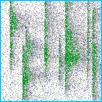 | 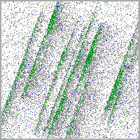 |

single 4 class 의 모든 2조합으로 만든 2-combo eval 이미지 예시:

| bb + fork | bb + scratch | bb + scratch_rot | fork + scratch | fork + scratch_rot | scratch + scratch_rot |
|:---------:|:------------:|:----------------:|:--------------:|:------------------:|:---------------------:|
| 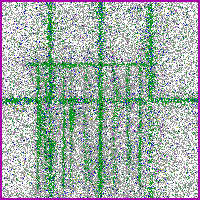 | 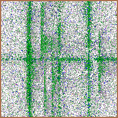 | 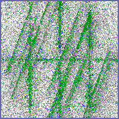 | 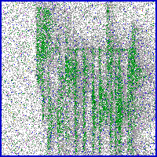 | 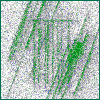 | 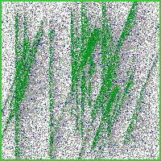 |

Normal / Invalid / OOD negative eval 생성 이미지 예시:

| Normal | Invalid | OOD Starburst | OOD CenterDonut | OOD CrossScratch | OOD DiagonalSmear |
|:------:|:-------:|:-------------:|:---------------:|:----------------:|:-----------------:|
| 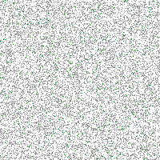 | 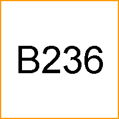 | 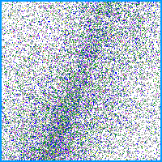 | 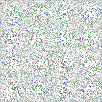 | 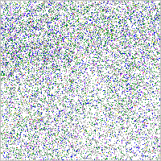 | 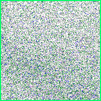 |

- **알고리즘**: 선정한 모델 아키텍쳐와 선택 사유 (Logic Flow 중심)

본 과제는 chip 한 장에 single failure 와 2-combo failure 가 동시에 나타날 수 있어, mutually exclusive 분류기인 softmax 대신 **sigmoid multi-label head** 를 채택했습니다. backbone 은 P1 backbone scan 에서 검증된 **ConvNeXtV2 (FCMAE pretrained)** 를 가져와 chip 이미지로 downstream task fine-tuning 을 다시 수행해 wafer-level 분류 기반과 일관성을 유지했습니다. 전체 단계 logic flow 는 아래와 같고, 단계별 성능 향상 기법은 **[최적화]** 에 정리합니다.

```
+--------------------------------------------------------------------------+
|  SOURCE: real production single-failure chips, 4 classes (Grade 0..7)    |
|  - chip-wise train / test split first -> no synthesis leakage            |
+--------------------------------------------------------------------------+
                                    |
                                    v
+--------------------------------------------------------------------------+
|  Step 1-2: pick CutMix family + diagnose its limits                      |
|  - Mixup / Diffusion blend pixels -> Grade meaning lost -> not usable    |
|  - CutMix is region-based -> Grade preserved (advice: Prof. E. Park)     |
|  - random CutMix issue: signal cut + background -> false positives rise  |
+--------------------------------------------------------------------------+
                                    |
                +-------------------+-------------------+
                v                                       v
+-----------------------------------+  +-----------------------------------+
|  Step 3a: Full-Cover CutMix       |  |  Step 3b: Pair Mask               |
|  - GRID x GRID grid cut           |  |  - mask B-pasted cells with       |
|  - half cells overwritten by B    |  |    corner / white / noise fill    |
|    -> full chip cover, no gap     |  |  - paired chip with A label only  |
|  - sanity ratio >= max(d_i)-0.01  |  |    -> B class blocked on bg fill  |
+-----------------------------------+  +-----------------------------------+
                |                                       |
                +-------------------+-------------------+
                                    v
+--------------------------------------------------------------------------+
|  Step 4-5: FCM-PM training + val_margin checkpoint selection             |
|  - val_margin = mean(pos bit score) - max(neg bit score)                 |
|  - Spearman(epoch, test_f1): val_margin +0.56 vs val_f1 -0.10            |
|  - target pos 0.85 / neg 0.15 (symmetric)                                |
+--------------------------------------------------------------------------+
                                    v
+--------------------------------------------------------------------------+
|  Step 6: Inference-stage operational safeguards                          |
|  - max-prob gate: max-prob < 0.55 -> Normal (ops mix is ~80% Normal)     |
|  - bit-level majority voting (vote_majority_bits, 3 models):             |
|    bit_F1 0.9956 / Total FAR 0.00%                                       |
|  - Knowledge Distillation: compress ensemble -> single student (1x cost) |
+--------------------------------------------------------------------------+
```

- **최적화**: 성능 향상을 위해 본인이 직접 시도한 기술적 해법

본인 80% 리딩으로 직접 시도한 단계별 성능 향상 기법은 다음 4 단계입니다.

**(1) 합성 — CutMix 계열 채택과 Full-Cover CutMix 확장**

Grade 0-7 양자화 chip 이미지에서는 생성 방식 선택이 곧 label 의미 보존 문제였습니다.

- **Mixup 배제**: 입력 / label 동시 보간이 실재하지 않는 중간 grade 를 만들어 noise 학습 위험.
- **Diffusion 보류**: 실제 2-combo 분포 부족 상황이라 생성 품질 확보가 어려움.
- **CutMix 계열 채택**: 영역 단위 원값 보존이 양자화 의미 보존에 적합 (자문: 연세대학교 인공지능학과 박은병 교수).
- **Full-Cover CutMix 확장**: chip 전체 grid 를 cover 해 일반 CutMix 의 failure signal 잘림 위험 해소 (wafer 전 영역 cover 가 필요하다는 현업 Overlay dynamic sampling 경험을 반영).
- **Pair Mask 보강 augmentation**: FCM mixed chip 의 single class 단독 패턴 약화를 paired forward (B 영역 mask 한 추가 augmentation chip) 로 보강. FCM-PM 위 Pair Mask 제거 시 Total FAR 이 **100%** 까지 올라가는 ablation 이 본 설계의 직접 근거.

FCM-PM 학습 augmentation 을 실제 chip 이미지에 적용한 예시입니다.

| chip A: scratch | chip B: scratch_rot | FCM mixed (A label) | FCM mixed (B label) | Pair Mask (A-only) | Pair Mask (B-only) |
|:---------------:|:-------------------:|:-------------------:|:-------------------:|:------------------:|:------------------:|
| 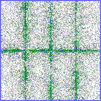 | 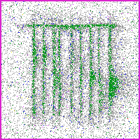 | 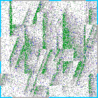 | 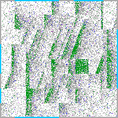 | 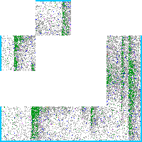 | 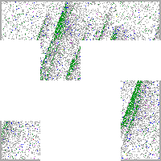 |

FCM-PM 은 chip grid 를 complementary partition 으로 나누어 두 single failure chip 을 조합합니다. FCM mixed 는 multi-label 을 만들고, Pair Mask 는 A-only / B-only augmentation 으로 single label 이며 background false-positive 를 억제합니다.

**(2) checkpoint 선택 — val_margin**

val_margin 은 positive bit 평균 score 와 negative bit 최대 score 의 차이로 정의했습니다. val_f1 보다 test bit_F1 과의 일관성이 높았습니다.

```
       [chip image]
            ↓
    [classifier 출력 bit score]
            │
   ┌────────┴────────┐
   ▼                 ▼
positive bits     negative bits
(실제 결함)        (정상 bit)
   │                 │
 평균 score        최대 score  ← false-positive 위험점
   │                 │
   └────────┬────────┘
            ▼
   val_margin = mean(positive) − max(negative)
            ↓
   클수록 결함과 정상 분리가 안정적
```

**(3) 추론 단계 보강 — Threshold gate / Ensemble / Knowledge Distillation**

운영 환경 약 80% Normal 분포에 대응해 max-prob < 0.55 입력을 Normal 로 강제하는 threshold gate 로 false-positive 를 줄였습니다. bit-level majority voting ensemble 은 single model 과적합에 대비한 robust 아키텍처고, Knowledge Distillation single student 는 ensemble 의 단점인 pred 갯수 증가 문제를 해결하는 방식입니다.

**(4) 학습 hyperparameter sweep — grid 분할 / pos / neg target**

합성은 CutMix → CutMix + Pair → FCM-PM 순서로 직접 비교했고, false-positive 와 bit_F1 의 trade-off 가 어느 조합에서 깨지는지는 **[구현 성과]** ablation 표를 보면 됩니다.

- **cover grid sweep**: chip 분할 그룹 수 (partition count) 와 그룹 내 cell 세분화 배수 (grid multiplier) 를 범위로 sweep, **partition=3 / multiplier=1 조합이 bit_F1 0.9960** 으로 최적이었습니다.
- **분할 선택 근거**: partition 수를 늘리면 chip 이 더 잘게 분할되어 공간 다양성은 증가하지만, partition≥4 부터는 failure 영역 자체가 너무 잘게 쪼개져 학습 모델이 failure 형태를 인식하기 어려워지면서 **분류 정확도가 오히려 감소합니다**. partition=3 부근이 본 과제 데이터에 최적이었습니다.
- **pos / neg target 선택**: 본 데이터에서는 positive target 0.85 / negative target 0.15 (symmetric) 가 bit_F1 과 FAR 안정성을 동시에 만족했습니다. 비대칭 positive target 0.95 / negative target 0.30 trial 은 별도로 검토했지만 Normal / Invalid / OOD negative 평가에서 FAR collapse 가 확인되었습니다.

**ㅁ 구현 성과**

**[정량적/정성적 성과]**

- **기술 지표** (단계별 적용 효과):
  - 학습 ladder: BCE+Label Smoothing → Focal / ASL loss 변형 → 단순 CutMix → **FCM-PM (Full-Cover CutMix + Pair Mask) + val_margin best-model selection** 순으로 단계별 적용해 bit_F1 0.1093 → **0.9927** / Total FAR 99.47% → **0.00%** 까지 향상시켰습니다.
  - Pair Mask ablation: 제거하면 Total FAR 이 **100%** 까지 올라가, background loss 분리가 false-positive 발생을 억제했습니다.
  - val_margin 기반 best-model selection 이 val_f1 보다 실제 test bit_F1 을 훨씬 정확히 예측 (Spearman ρ **+0.56 vs −0.10**) — best epoch 안정성 확보.
  - 추론 단계 보강: max-prob threshold gate + bit-level majority voting ensemble (champion `vote_majority_bits` bit_F1 0.9956 / Total FAR 0.00%) + Knowledge Distillation single student (bit_F1 **0.9799** / Total FAR 0.00%, 1x latency/throughput/params 운영 배포 후보).

  **[평가 지표]** single F1 은 single failure class 별 F1 의 평균입니다. bit_F1 은 한 chip 의 label 을 `[0, 1, 1, 0]` 같은 4-bit vector 로 보고 각 bit 를 독립적으로 측정한 뒤 모든 bit (chip × class) 를 micro-averaged 로 합쳐낸 값입니다.

  **Multi-label 학습 recipe 성능표 (per class 2000) [현업 failure chip 원천 + 도메인 확률분포 기반 생성/검증]**

  | # | Recipe (per class 2000) | bit_F1 | single | 2combo | FAR | NI-FAR | OOD-FAR | Latency | Throughput | Params |
  |---|--------|--------|--------|--------|-----|--------|---------|---------|------------|--------|
  | 1 | BCE + Label Smoothing | 0.1093 | 0.1896 | 0.0668 | 99.47% | 99.65% | 98.91% | 1x | 1x | 1x |
  | 2 | Sigmoid Focal Loss | 0.7980 | 0.8724 | 0.7050 | 45.72% | 35.55% | 77.50% | 1x | 1x | 1x |
  | 3 | Asymmetric Loss (ASL) | 0.6435 | 0.5379 | 0.7320 | 100% | 100% | 100% | 1x | 1x | 1x |
  | 4 | CutMix (random rectangle) | 0.9359 | 0.9566 | 0.9070 | 42.05% | 37.00% | 57.81% | 1x | 1x | 1x |
  | 5 | CutMix + Pair Mask | 0.9491 | 0.9728 | 0.9281 | 24.62% | 21.55% | 34.22% | 1x | 1x | 1x |
  | 6 | FCM-PM + val_f1 selection | **0.9652** | 1.0000 | 0.9517 | 0.15% | 0.00% | 0.62% | 1x | 1x | 1x |
  | 7 | **FCM-PM + val_margin selection** | **0.9927** | **0.9996** | **0.9871** | **0.00%** | 0.00% | 0.00% | 1x | 1x | 1x |
  | 8 | vote_majority_bits Ensemble (champion) | **0.9956** | **1.0000** | **0.9921** | **0.00%** | 0.00% | 0.00% | 5x | 1/5x | 5x |
  | 9 | Knowledge Distillation (single student) | **0.9799** | 1.0000 | 0.9638 | **0.00%** | 0.00% | 0.00% | 1x | 1x | 1x |

  본 표는 주요 학습 recipe 별 성능 차이를 비교한 결과입니다. 대표 single model 은 FCM-PM + val_margin 이며, bit_F1 **0.9927** / Total FAR **0.00%** 를 달성했습니다.

- **현업 임팩트**: 실제 chip 불량률 계산 및 trend 분석이 가능해지고, P1 chip-CNN object-id map 후속 단계 기반으로 이어집니다.


**ㅁ P3. Trend Episode 데이터 생성 기반 Anomaly-detection 검증 PoC**

**ㅁ 과제 기본정보**

| 항목 | 내용 |
|------|------|
| 과제명 | Trend Episode 데이터 생성 기반 Anomaly-detection 검증 PoC |
| 수행기간 | 2026년 1월 ~ 현재 |
| 참여인원 | 본인 / 관리자 / 동료 엔지니어 (공동 연구자) |

**P3 핵심 요약**: 실전 abnormal label 부족으로 trend anomaly 모델 검증이 막혀 있던 한계를 풀기 위해, 본인 BBD / Overlay / CD 담당 **10년** trend 판정 경험을 generator parameter (Region 5종 / Noise 3종 / Anomaly 5종) 로 옮겨 합성 trend sample **약 7,000개** (normal 3,500 + abnormal 3,500) 를 만들고, 1차 Binary gate baseline 으로 **Binary F1 0.9967** 까지 확인한 PoC 입니다. 현재 실제 현업 데이터 적용 직전 단계입니다.

**ㅁ 과제 참여 인력 및 역할**

| NO | 성명 | Knox Id | 소속 | 역할 | 기여도 |
|----|------|---------|------|------|--------|
| 1 | 최호길 | 개인정보 비공개 | 메모리제조센터 QIE그룹 | trend episode 합성 generator 설계, Region 5종 / Noise 3종 / trend 불량 4종 + context 1종 parameter 코드화, 합성 normal 산포의 상한 / 하한을 같이 잡는 두 가지 수식 설계, 1차 Binary gate 검증 PoC 설계 / 구현 | 70% |
| 2 | 관리자 | 개인정보 비공개 | 관리조직 (공식 기록 대조) | 방향성, 일정, 리뷰 매니징 | 20% |
| 3 | 동료 엔지니어 (공동 연구자) | 개인정보 비공개 | 관련 엔지니어 조직 (공식 기록 대조) | AI 모델 실행, 데이터 정리, 실험 결과 취합 | 10% |

**ㅁ 개인별 기여 서술**

**[본인이 독자적으로 수행한 핵심 모듈]**

- **과제 내에서 타 구성원과 차별화되는 본인만의 구체적 담당 영역**

본인은 P3 trend anomaly 검증 PoC 전체 — trend episode generator 설계, 도메인 parameter (Noise 3분포 / 계측 밀도 Region 5단계 / Anomaly 5종) 정의, 합성 normal / abnormal sample 생성, 정상 산포 보정 수식 설계, 1차 Binary gate baseline 검증까지 — 를 본인이 직접 주도한 담당자입니다. BBD / Overlay / CD 담당 **10년간** trend chart 를 직접 판정해 온 본인 경험을 generator parameter 에 그대로 옮긴 것이 본 과제 차별성의 핵심입니다.

- **본인의 기술적 해결책이 과제 성패에 미친 영향**

실전 abnormal label 이 부족해 막혀 있던 anomaly 검증을 본인 trend 판정 경험 기반 generator 로 풀었습니다. 본인 10년 경험에서 어떤 강도의 mean shift / standard deviation / spike / drift / context 가 실제 불량으로 이어지는지 기준을 정해 generator parameter 로 코드화하고, **Noise 3분포** (Gaussian / Laplacian / Correlated) 와 **계측 밀도 Region 5단계** (dense / sparse / very_sparse / thin / missing) 를 정의해 합성 normal baseline 을 실전 환경에 맞췄으며, normal 산포 상한 / 하한 두 가지 수식까지 직접 설계해 **normal 3,500 + abnormal 3,500 = 총 7,000개** trend sample 을 만들었습니다. 1차 Binary gate baseline 에서 **Binary F1 0.9967 / Abnormal Recall 0.9987** (test 1,500 / threshold = 0.9) 로 생성 데이터만으로도 정상과 이상이 안정적으로 구분됨을 확인했고, 현재 **현업 데이터 적용 직전** 단계까지 진행했습니다.

**ㅁ 문제정의**

**[현장 난제 및 해결 목표]**

- **기존 방식의 한계 및 AI 도입의 구체적 배경**

trend 이상 감지는 단순 수작업 판단만으로는 한계가 있고, 설비 산포 / hunting / 미세 drift / baseline 흔들림 / 불량 위험까지 같이 봐야 합니다. 현장 trend 판정이 수작업 chart 판독에 의존하다 보니 초보 담당자 누락과 모니터링 시간 부담이 누적되었고, 이를 줄이기 위해 trend 모니터링 자동화를 위한 AI 도입이 필요했습니다.

- **과제 수행 시 해결해야 했던 기술적 / 환경적 제약 조건**

학습 데이터 측면은 실전 abnormal data 의 양과 label 균형 확보가 어려워, trend domain knowledge 를 합성 데이터 parameter 로 옮기는 단계가 먼저 풀려야 뒤 학습 / 검증이 가능했습니다. 합성 정상성 측면은 normal 산포가 실전 baseline 통계 안에 들어와야 하고 abnormal 강도가 정상 산포에 묻히지 않도록 데이터 측면 / 학습 측면 제약을 동시에 잡아야 했습니다.

**ㅁ 기술적 해결 방안**

**[본인이 직접 수행한 핵심 로직]**

- **데이터**: 데이터 수집 경로, 전처리 기법 및 피처 엔지니어링 근거

trend chart 판정 경험을 generator parameter 로 옮겨 합성 trend sample 약 7,000개 (normal 3,500 + abnormal 3,500) 를 만들었습니다. 계측 밀도 Region 5단계 (dense / sparse / very_sparse / thin / missing), Noise 3분포 (Gaussian / Laplacian / Correlated), Anomaly 5종 (mean shift / standard deviation / spike / drift / context) 을 generator parameter 에 반영했습니다.

Trend 합성 데이터 생성 설계 (계측 밀도, Noise, Anomaly 수식):

| Trend 합성 데이터 생성 설계 |
|:---------------------------:|
| 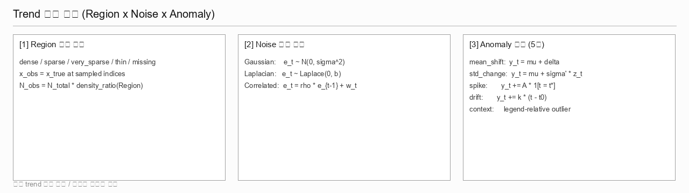 |

합성 trend chart 예시 (정상 + 일반 trend 불량 4종 + context 1종):

| Normal | Mean Shift | Standard Deviation Change |
|:------:|:----------:|:-------------------------:|
| 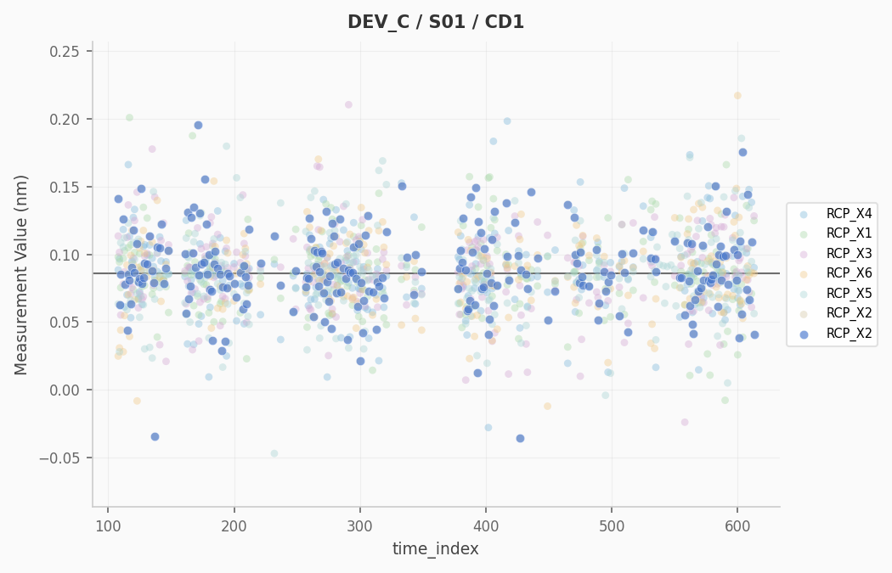 | 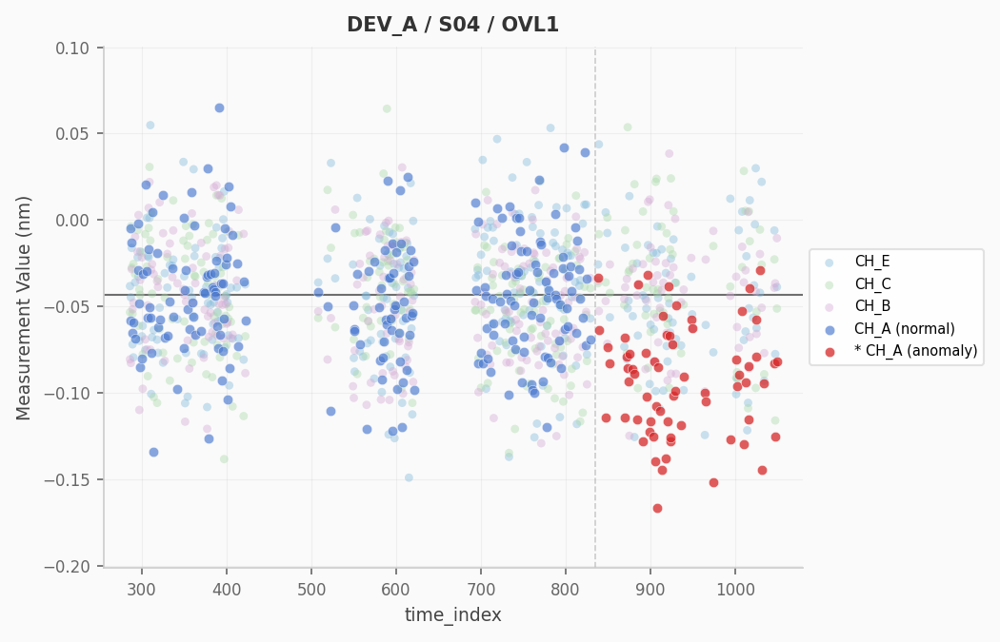 | 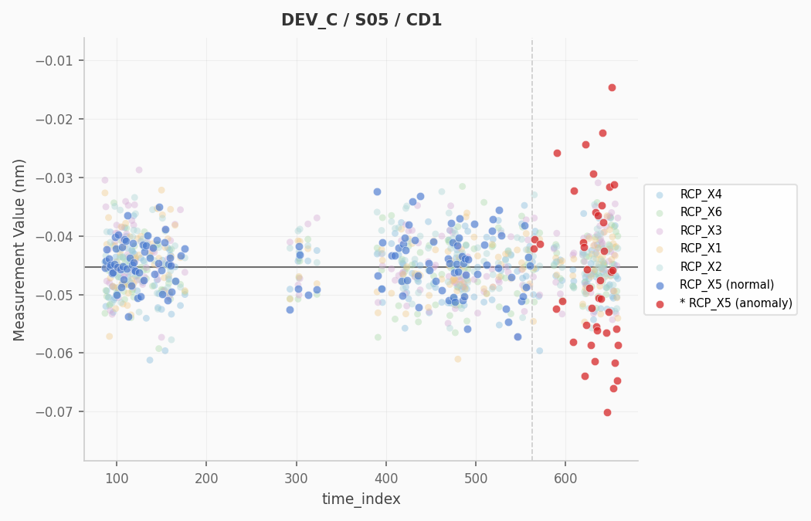 |
| **Spike** | **Drift** | **Context** |
| 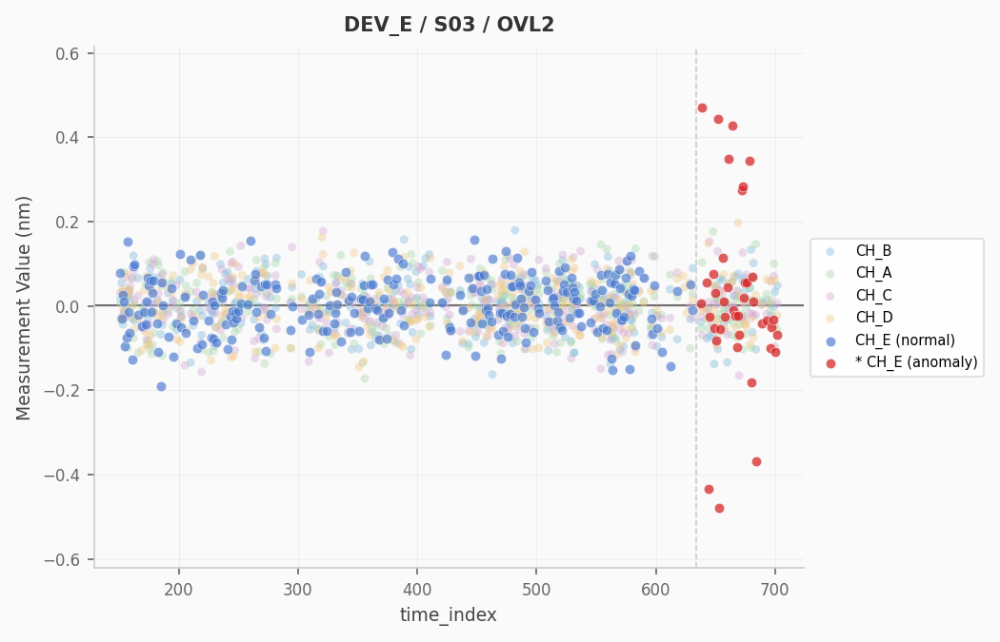 | 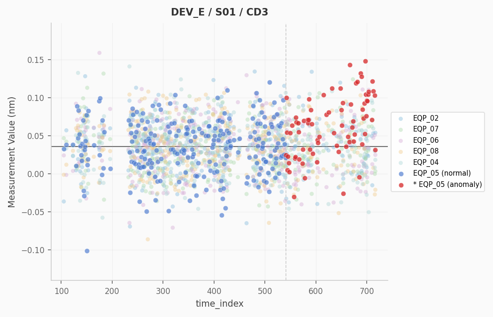 | 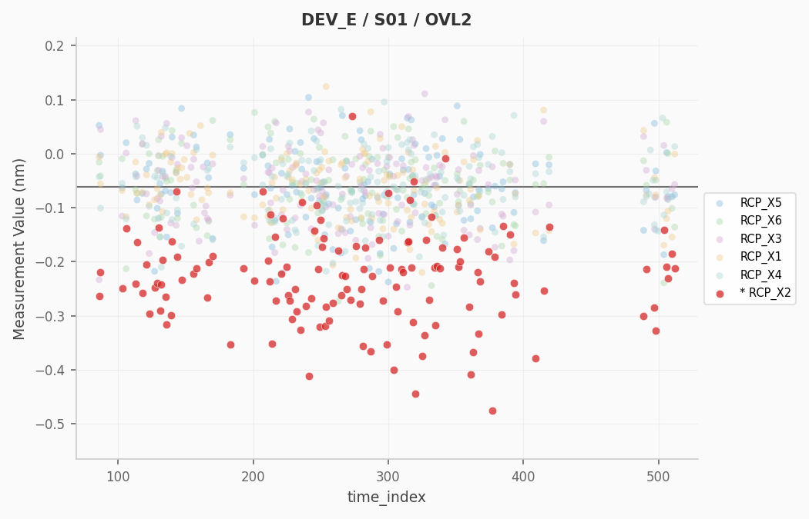 |

- **알고리즘**: 선정한 모델 아키텍쳐와 선택 사유 (Logic Flow 중심)

합성 trend sample 을 normal / abnormal 두 class 로 학습하는 1차 Binary gate baseline 분류기로 시작했습니다. P3 는 데이터 생성이 주 성과인 PoC 라 모델은 단순 baseline 으로 두고, 전체 단계는 아래 logic flow 와 같습니다.

```
+---------------------------------------------------------------------------+
|  [SOURCE]  10-year BBD / Overlay / CD trend-judgment experience           |
|  criteria (scatter / hunting / drift / spec-out risk) -> generator        |
|  parameters: this coding step is the core asset of the project            |
+---------------------------------------------------------------------------+
                                    |
                                    v
+---------------------------------------------------------------------------+
|  [SYNTHESIZE]  encode domain distribution + bounded synthetic-normal      |
|  (Region density 5 / Noise 3 / Anomaly 5)                                 |
|  -> 224x224 PNG, 3,500 normal + 3,500 abnormal = 7,000 samples            |
+---------------------------------------------------------------------------+
                                    |
                                    v
+---------------------------------------------------------------------------+
|  [VALIDATE]  Binary gate baseline (normal / abnormal)                     |
|  - F1 0.9967 (TN/FN/FP/TP = 746/1/4/749), normal threshold 0.9            |
|  - 5-seed best F1 0.9987 (TN/FN/FP/TP = 748/0/2/750)                      |
+---------------------------------------------------------------------------+
                                    |
                                    v
+---------------------------------------------------------------------------+
|  [OUTPUT]  synthetic trend dataset is learnable (PoC confirmed)           |
+---------------------------------------------------------------------------+
```

- **최적화**: 성능 향상을 위해 본인이 직접 시도한 기술적 해법

합성 normal 산포가 실전 baseline 통계 안에 들어오게 하면서 abnormal 강도는 정상 산포에 묻히지 않도록 데이터 측 + 학습 측 두 축으로 제어했습니다.

데이터 측 정상성 제어
- **정상성 하한 보장**: `target_baseline_std = max(baseline_std, 0.01)` — baseline 산포가 너무 작아질 때 최소 0.01σ 로 묶어 합성 normal 이 무리하게 평탄해지지 않도록 했습니다.
- **정상성 상한 정렬**: `target_std ≤ fleet_within_std × 1.2` — 같은 설비군 산포 대비 1.2 배 이내로 상한을 두어 합성 normal 이 실전보다 과도하게 흔들리는 케이스를 차단했습니다.

학습 측 안정화 및 stack 선택
- **학습 stack**: ConvNeXtV2-Tiny (ImageNet-22k→1k pretrained) backbone + AdamW + **FocalLoss** (FN 최소화 목적 운영 gate 에 맞는 손실) + **EMA** (Exponential Moving Average) 로 weight 흔들림 억제.
- **checkpoint 안정화**: val-F1 median smoothing + val-loss spike guard 로 일시 spike 에 best checkpoint 선택이 흔들리지 않도록 보강했습니다.
- **normal_threshold sweep**: binary gate 의 FN / FP trade-off 를 sweep 해 **normal_threshold = 0.9** 채택 (보수적 gate 로 불량 chart 가 normal 로 빠져나가지 않도록).
- **5-seed 검증**: seed 변화에 따른 학습 안정성을 확인했습니다.
- **후속 확장 방향**: Binary gate 이후 anomaly type 세분화 분류로 이어지는 구조입니다.

**ㅁ 구현 성과**

**[정량적/정성적 성과]**

- **기술 지표** (단계별 적용 효과, P3 성과는 모두 **[합성 trend chart, PoC]** 기반이며 주 성과는 데이터 생성 자체입니다):
  - 데이터: **normal 3,500 + abnormal 3,500 = 총 7,000개** trend sample, test split 1,500 (normal 750 / abnormal 5종 각 150).
  - 도메인 코드화: Region 5단계 (계측 밀도) × Noise 3분포 (Gaussian / Laplacian / Correlated) × 불량 5종 (mean shift / standard deviation / spike / drift / context) 를 generator parameter 로 직접 구현.
  - 정상성 보정: `target_baseline_std = max(baseline_std, 0.01)` + `target_std ≤ fleet_within_std × 1.2` 두 식으로 합성 normal 통계는 실전 baseline 에 맞추고 abnormal 강도는 정상 산포에 묻히지 않게 분리.
  - Binary gate baseline: test 1,500건 / normal threshold=0.9 기준 **Binary F1 0.9967 / Abnormal Recall 0.9987** (TN/FN/FP/TP=746/1/4/749), 5-seed best **F1 0.9987**, threshold sweep 임계 둔감 확인.

- **현업 임팩트**: L1 trend 모니터링 1차 스크리닝으로 누락 / 불량 누설 위험을 줄이고, 새 공정 / trend 유형이 들어와도 같은 generator 로 데이터를 빠르게 늘릴 수 있습니다 (현업 데이터 적용 직전).
